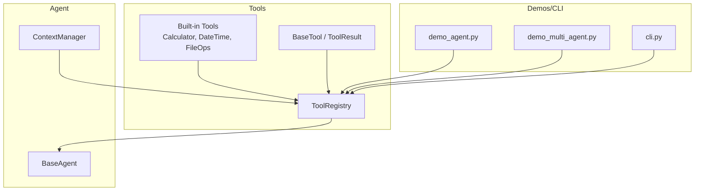
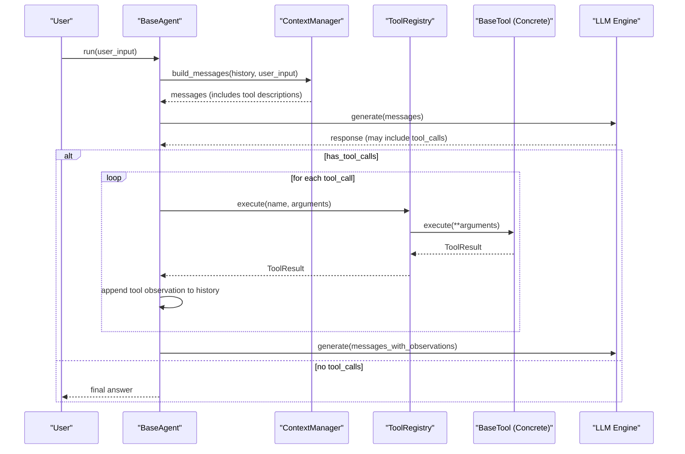
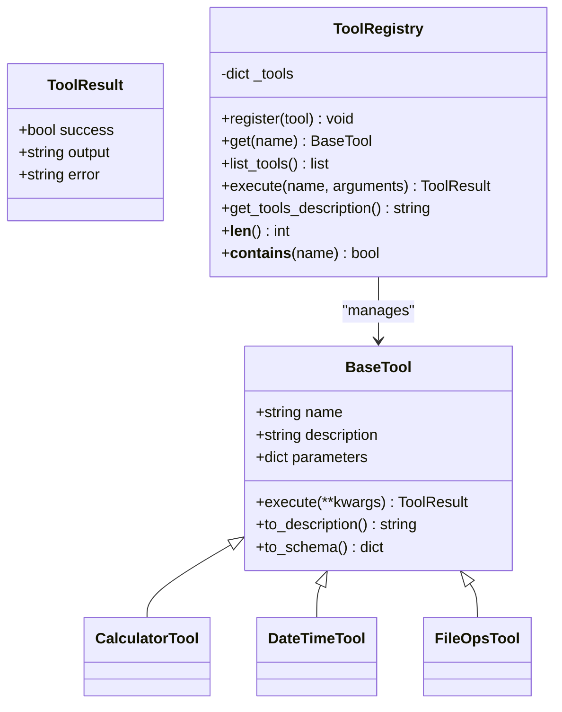
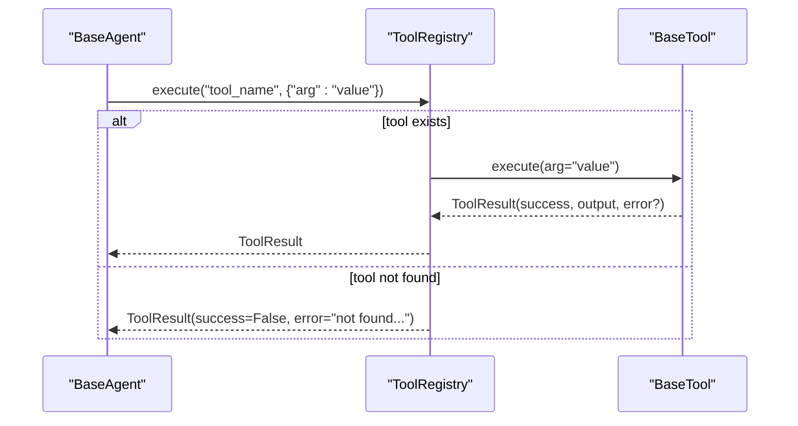
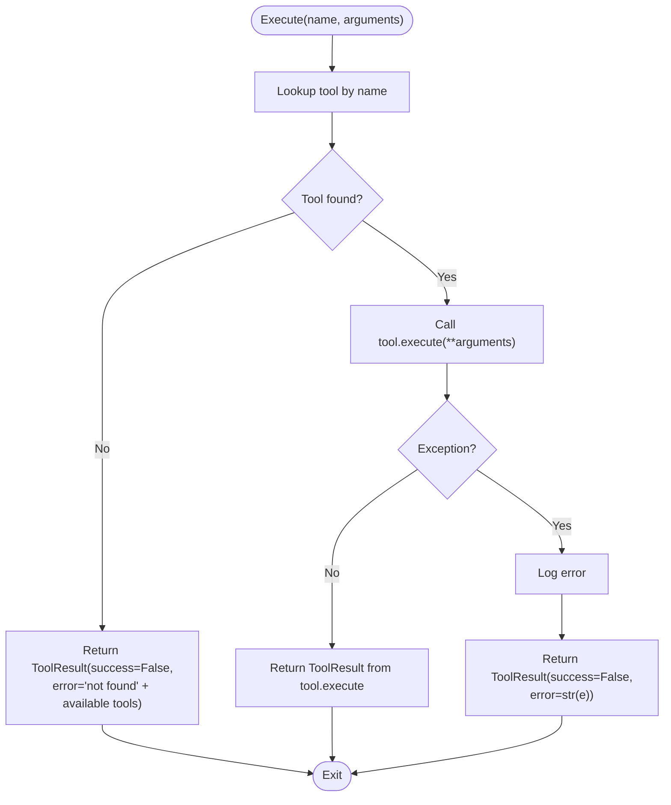
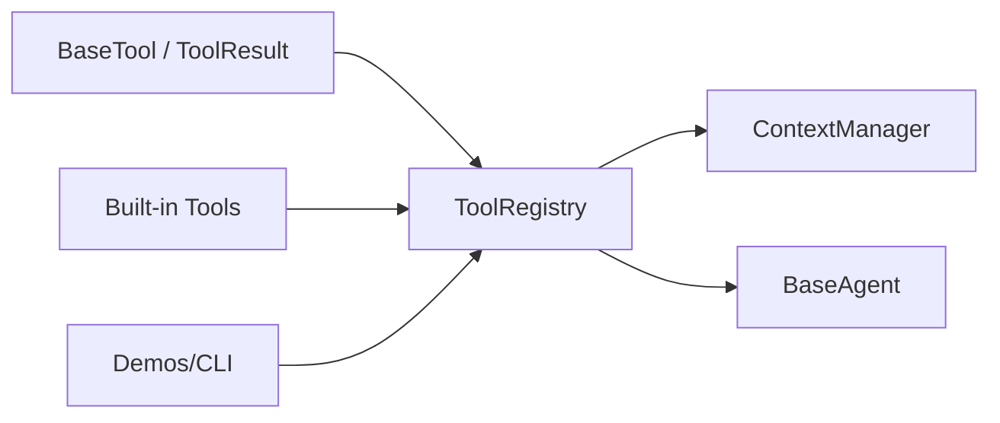

# Tool Registry

<cite>
**Referenced Files in This Document**
- [registry.py](file://harness/tools/registry.py)
- [base.py](file://harness/tools/base.py)
- [builtin.py](file://harness/tools/builtin.py)
- [__init__.py](file://harness/tools/__init__.py)
- [manager.py](file://harness/context/manager.py)
- [base.py](file://harness/agent/base.py)
- [orchestrator.py](file://harness/agent/orchestrator.py)
- [demo_agent.py](file://demos/demo_agent.py)
- [demo_multi_agent.py](file://demos/demo_multi_agent.py)
- [cli.py](file://harness/cli.py)
</cite>

## Table of Contents
1. [Introduction](#introduction)
2. [Project Structure](#project-structure)
3. [Core Components](#core-components)
4. [Architecture Overview](#architecture-overview)
5. [Detailed Component Analysis](#detailed-component-analysis)
6. [Dependency Analysis](#dependency-analysis)
7. [Performance Considerations](#performance-considerations)
8. [Troubleshooting Guide](#troubleshooting-guide)
9. [Conclusion](#conclusion)
10. [Appendices](#appendices)

## Introduction
This document explains the Tool Registry system that powers tool discovery, registration, and execution within the HarnessAIDemo project. It focuses on:
- The registry pattern for dynamic tool loading and lifecycle management
- Methods to register tools, retrieve instances, and execute them with error handling
- Programmatic registration patterns and integration with agents
- Thread safety considerations, error handling for missing or failing tools, and performance optimization techniques for large tool collections

The goal is to help developers extend the system with custom tools and integrate them into agent workflows safely and efficiently.

## Project Structure
The Tool Registry lives under harness/tools and integrates with the agent loop and context manager to expose tools to the LLM and execute them during multi-step reasoning.

**Diagram sources**
- [registry.py:17-73](file://harness/tools/registry.py#L17-L73)
- [base.py:16-66](file://harness/tools/base.py#L16-L66)
- [builtin.py:13-82](file://harness/tools/builtin.py#L13-L82)
- [manager.py:41-104](file://harness/context/manager.py#L41-L104)
- [base.py:63-164](file://harness/agent/base.py#L63-L164)
- [demo_agent.py:21-24](file://demos/demo_agent.py#L21-L24)
- [demo_multi_agent.py:25-35](file://demos/demo_multi_agent.py#L25-L35)
- [cli.py:50-62](file://harness/cli.py#L50-L62)

**Section sources**
- [registry.py:1-73](file://harness/tools/registry.py#L1-L73)
- [base.py:1-66](file://harness/tools/base.py#L1-L66)
- [builtin.py:1-82](file://harness/tools/builtin.py#L1-L82)
- [manager.py:1-118](file://harness/context/manager.py#L1-L118)
- [base.py:1-164](file://harness/agent/base.py#L1-L164)
- [demo_agent.py:1-40](file://demos/demo_agent.py#L1-L40)
- [demo_multi_agent.py:1-47](file://demos/demo_multi_agent.py#L1-L47)
- [cli.py:1-362](file://harness/cli.py#L1-L362)

## Core Components
- BaseTool and ToolResult define the contract for all tools and their outcomes.
- ToolRegistry provides centralized registration, lookup, listing, description generation, and execution with error handling.
- Built-in tools demonstrate concrete implementations and a helper to register defaults.
- ContextManager injects tool descriptions into the system prompt so the LLM knows what tools are available.
- BaseAgent executes the agent loop, calling ToolRegistry.execute for each tool call requested by the LLM.

Key responsibilities:
- Registration: add/remove tools dynamically at runtime
- Discovery: list tools and generate descriptions for prompts
- Execution: resolve tool by name, validate parameters via tool.execute, handle errors uniformly
- Integration: provide tool descriptions to the LLM through ContextManager; execute calls from BaseAgent

**Section sources**
- [base.py:16-66](file://harness/tools/base.py#L16-L66)
- [registry.py:17-73](file://harness/tools/registry.py#L17-L73)
- [builtin.py:13-82](file://harness/tools/builtin.py#L13-L82)
- [manager.py:41-104](file://harness/context/manager.py#L41-L104)
- [base.py:97-164](file://harness/agent/base.py#L97-L164)

## Architecture Overview
The registry acts as a central catalog used by both the agent loop and the context builder. During an agent run:
- ContextManager builds messages including tool descriptions from the registry
- BaseAgent calls the LLM, parses tool calls, and delegates execution to ToolRegistry
- ToolRegistry resolves the tool by name, invokes its execute method, and returns a standardized result

**Diagram sources**
- [manager.py:61-104](file://harness/context/manager.py#L61-L104)
- [base.py:97-164](file://harness/agent/base.py#L97-L164)
- [registry.py:43-67](file://harness/tools/registry.py#L43-L67)
- [base.py:30-66](file://harness/tools/base.py#L30-L66)

## Detailed Component Analysis

### ToolRegistry
Responsibilities:
- Maintain a dictionary of tools keyed by name
- Register tools, optionally overwriting existing ones with a warning
- Retrieve tools by name
- List all tools
- Generate combined tool descriptions for system prompts
- Execute tools by name with robust error handling

Execution flow:
- If tool not found, return a failure ToolResult with a helpful message listing available tools
- If tool exists, call its execute method with keyword arguments and return the result
- Catch exceptions and return a failure ToolResult with the error message

Thread safety:
- The current implementation uses a plain dict without synchronization primitives. Concurrent writes or reads from multiple threads can cause race conditions. For thread-safe usage, wrap operations with locks or use a thread-safe mapping.

Extensibility:
- Implement new tools by subclassing BaseTool and registering them via ToolRegistry.register
- Use register_default_tools to bootstrap common tools quickly

**Section sources**
- [registry.py:17-73](file://harness/tools/registry.py#L17-L73)

### BaseTool and ToolResult
Contract:
- Each tool defines name, description, and parameters schema
- Implement execute(**kwargs) returning ToolResult
- Provide to_description and to_schema helpers for prompt injection and introspection

ToolResult:
- success flag indicates outcome
- output carries the string shown to the model
- error holds error details when success is False

Validation:
- Parameter validation is delegated to individual tools’ execute methods. The registry does not enforce schemas but ensures consistent error reporting.

**Section sources**
- [base.py:16-66](file://harness/tools/base.py#L16-L66)

### Built-in Tools
Examples:
- CalculatorTool: safe evaluation of mathematical expressions
- DateTimeTool: returns date/time information based on query
- FileOpsTool: read-only file operations (list directory, read file with size limits)

Registration helper:
- register_default_tools(registry) registers calculator, datetime, and file_ops tools

Safety notes:
- CalculatorTool restricts allowed characters and disables builtins during eval
- FileOpsTool enforces read-only behavior and caps content length

**Section sources**
- [builtin.py:13-82](file://harness/tools/builtin.py#L13-L82)

### Integration with Agents and Context
- BaseAgent constructs the agent loop, builds messages via ContextManager, and executes tool calls using ToolRegistry.execute
- ContextManager appends tool descriptions to the system prompt when tools are present, enabling the LLM to know available capabilities
- Multi-agent orchestrator coordinates specialist agents, each potentially owning its own ToolRegistry instance

Programmatic examples:
- Single agent demo creates a registry, registers default tools, and passes it to a TaskAgent
- Multi-agent demo creates specialized registries per agent and registers specific tools
- CLI demos show interactive and batch usage patterns

**Section sources**
- [base.py:63-164](file://harness/agent/base.py#L63-L164)
- [manager.py:41-104](file://harness/context/manager.py#L41-L104)
- [demo_agent.py:21-24](file://demos/demo_agent.py#L21-L24)
- [demo_multi_agent.py:25-35](file://demos/demo_multi_agent.py#L25-L35)
- [cli.py:50-62](file://harness/cli.py#L50-L62)

### Class Diagram

**Diagram sources**
- [base.py:16-66](file://harness/tools/base.py#L16-L66)
- [registry.py:17-73](file://harness/tools/registry.py#L17-L73)
- [builtin.py:13-82](file://harness/tools/builtin.py#L13-L82)

### Sequence Diagram: Tool Execution Flow

**Diagram sources**
- [registry.py:43-67](file://harness/tools/registry.py#L43-L67)
- [base.py:30-66](file://harness/tools/base.py#L30-L66)

### Flowchart: Registry Execute Logic

**Diagram sources**
- [registry.py:43-67](file://harness/tools/registry.py#L43-L67)

## Dependency Analysis
- ToolRegistry depends on BaseTool and ToolResult
- Built-in tools depend on BaseTool and standard library modules
- ContextManager depends on ToolRegistry to generate tool descriptions
- BaseAgent depends on ToolRegistry to execute tool calls
- Demos and CLI wire up registries and agents for demonstration

**Diagram sources**
- [base.py:16-66](file://harness/tools/base.py#L16-L66)
- [registry.py:17-73](file://harness/tools/registry.py#L17-L73)
- [builtin.py:13-82](file://harness/tools/builtin.py#L13-L82)
- [manager.py:41-104](file://harness/context/manager.py#L41-L104)
- [base.py:63-164](file://harness/agent/base.py#L63-L164)
- [cli.py:50-62](file://harness/cli.py#L50-L62)

**Section sources**
- [registry.py:17-73](file://harness/tools/registry.py#L17-L73)
- [base.py:16-66](file://harness/tools/base.py#L16-L66)
- [builtin.py:13-82](file://harness/tools/builtin.py#L13-L82)
- [manager.py:41-104](file://harness/context/manager.py#L41-L104)
- [base.py:63-164](file://harness/agent/base.py#L63-L164)
- [cli.py:50-62](file://harness/cli.py#L50-L62)

## Performance Considerations
- Tool lookup is O(1) average due to dictionary storage
- Listing tools is O(n) where n is number of registered tools
- Generating tool descriptions iterates all tools once per context build; cache descriptions if context building is frequent
- Avoid heavy initialization in tool constructors; defer expensive setup to first use or lazy load
- For large tool collections:
  - Partition tools into specialized registries per agent domain to reduce prompt size and lookup overhead
  - Use selective registration based on runtime features or configuration
  - Consider lazy registration triggered by capability hints from the LLM
- Minimize logging verbosity in hot paths; use debug-level logs for registration and errors

[No sources needed since this section provides general guidance]

## Troubleshooting Guide
Common issues and resolutions:
- Missing tool: ToolRegistry.execute returns a failure ToolResult with a message listing available tools. Verify tool names and ensure registration occurred before agent runs.
- Tool execution errors: Exceptions are caught and returned as ToolResult with error details. Inspect tool.execute logic and input parameters.
- Overwritten tools: Registering a tool with an existing name logs a warning and replaces the previous entry. Ensure unique names or intentional overrides.
- Prompt too large: Too many tools increase system prompt size. Use specialized registries per agent and only include necessary tools.

Debugging tips:
- Print registry contents via list_tools to verify active tools
- Enable verbose mode in agents to see tool calls and results
- Check logs for warnings about overwritten tools and errors during execution

**Section sources**
- [registry.py:28-60](file://harness/tools/registry.py#L28-L60)
- [builtin.py:19-30](file://harness/tools/builtin.py#L19-L30)
- [builtin.py:58-74](file://harness/tools/builtin.py#L58-L74)
- [base.py:132-152](file://harness/agent/base.py#L132-L152)

## Conclusion
The Tool Registry provides a clean, extensible mechanism for managing tools in the HarnessAIDemo system. It centralizes registration and execution, integrates seamlessly with the agent loop and context builder, and supports dynamic tool loading through built-ins and custom implementations. By following the patterns outlined here, you can safely add new tools, manage lifecycles, and optimize performance for large tool sets while maintaining robust error handling and clear integration points with agents.

[No sources needed since this section summarizes without analyzing specific files]

## Appendices

### Programmatic Registration Examples
- Create a registry and register default tools for a single agent
- Create specialized registries for multi-agent scenarios
- Use CLI to start interactive demos with tool-enabled agents

References:
- [demo_agent.py:21-24](file://demos/demo_agent.py#L21-L24)
- [demo_multi_agent.py:25-35](file://demos/demo_multi_agent.py#L25-L35)
- [cli.py:50-62](file://harness/cli.py#L50-L62)

**Section sources**
- [demo_agent.py:21-24](file://demos/demo_agent.py#L21-L24)
- [demo_multi_agent.py:25-35](file://demos/demo_multi_agent.py#L25-L35)
- [cli.py:50-62](file://harness/cli.py#L50-L62)

### Thread Safety Notes
- Current registry is not thread-safe; concurrent modifications may lead to inconsistent state
- Recommended approaches:
  - Wrap registry operations with a threading lock for write-heavy workloads
  - Use immutable snapshots of tool lists for read-only contexts
  - Prefer per-agent registries to reduce contention

[No sources needed since this section provides general guidance]

### Error Handling Patterns
- Missing tools: handled centrally in ToolRegistry.execute
- Tool-specific errors: handled inside tool.execute and surfaced via ToolResult
- Logging: warnings for overwrites; errors logged for failures

**Section sources**
- [registry.py:28-60](file://harness/tools/registry.py#L28-L60)
- [builtin.py:19-30](file://harness/tools/builtin.py#L19-L30)
- [builtin.py:58-74](file://harness/tools/builtin.py#L58-L74)