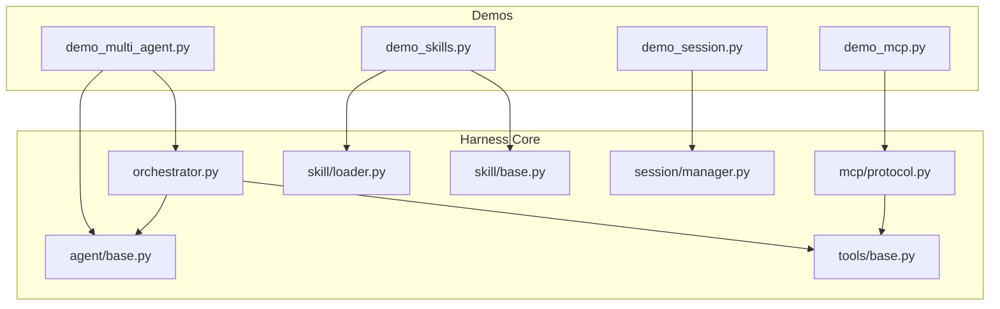
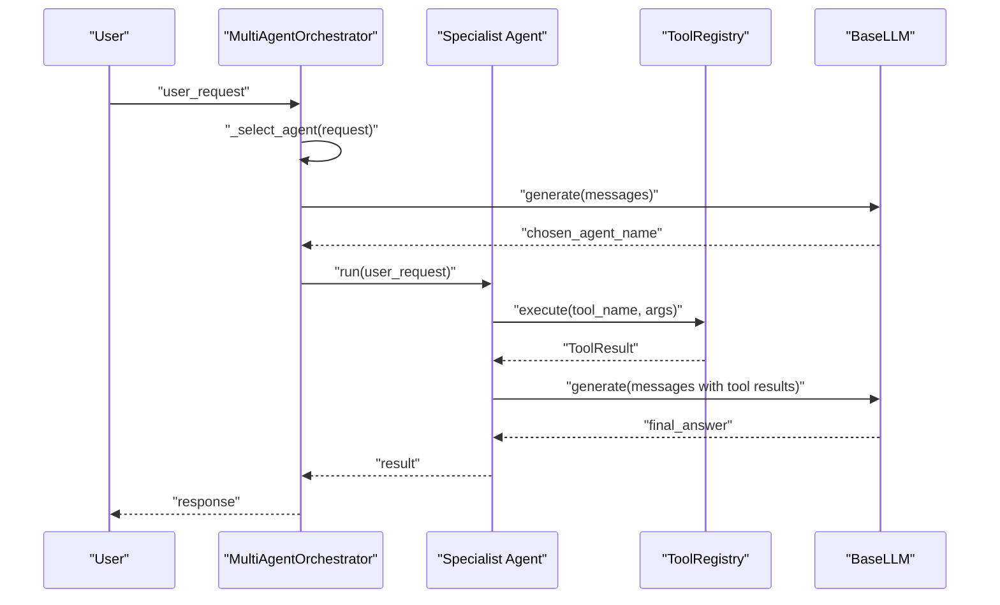
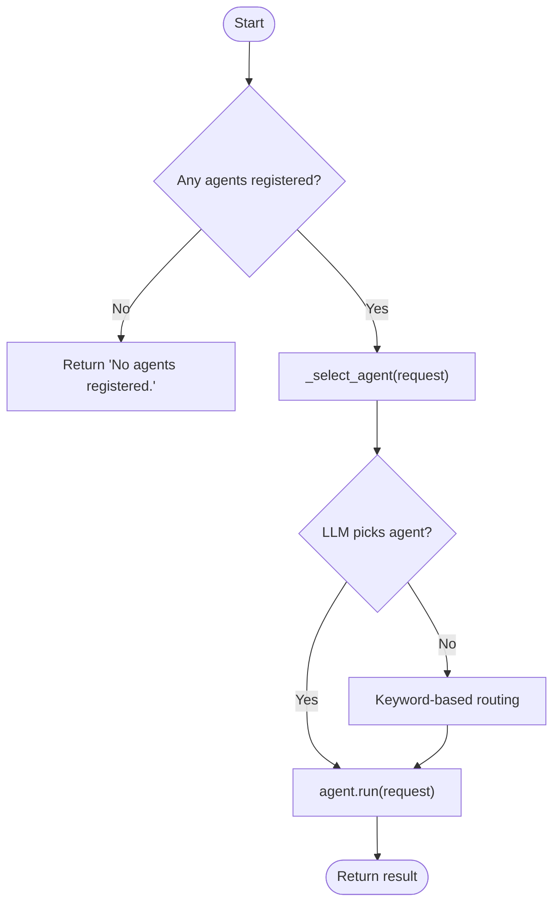
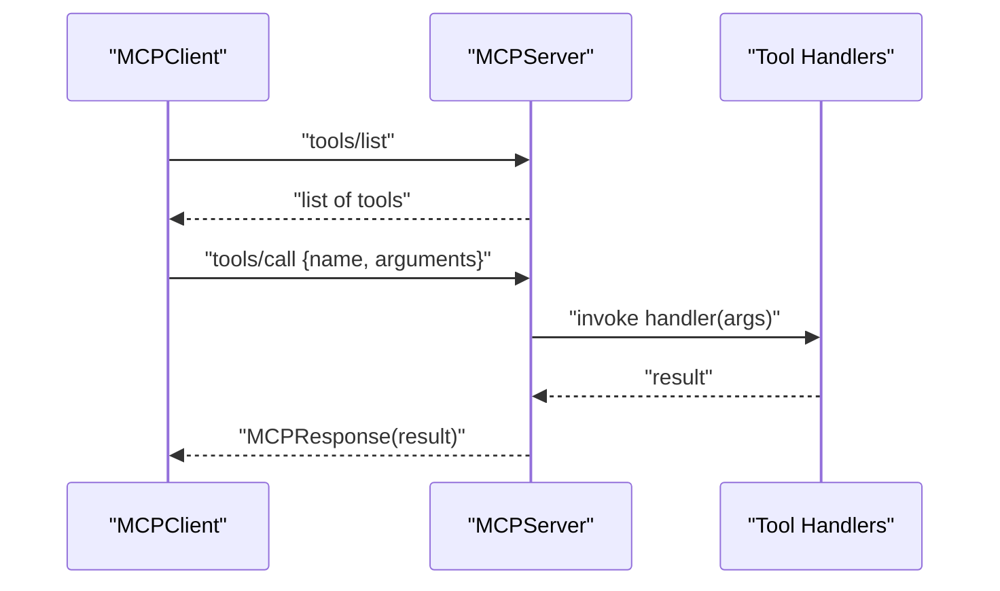
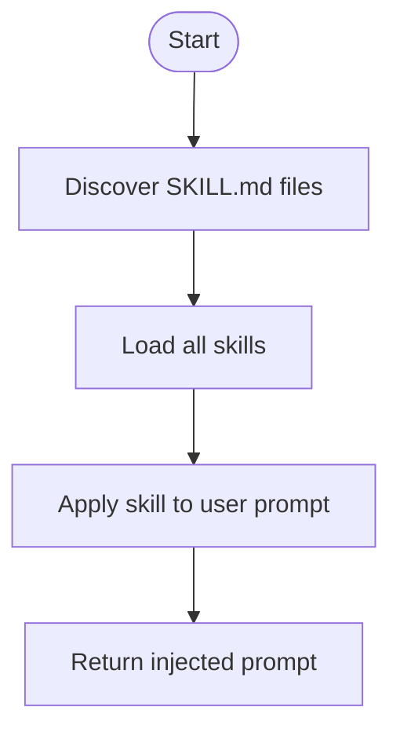
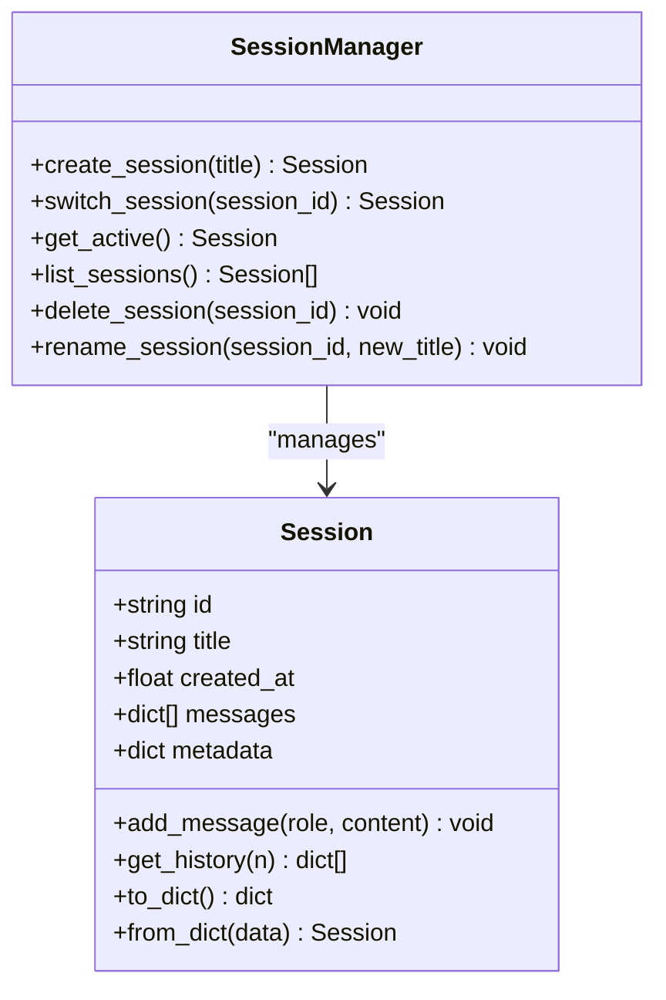
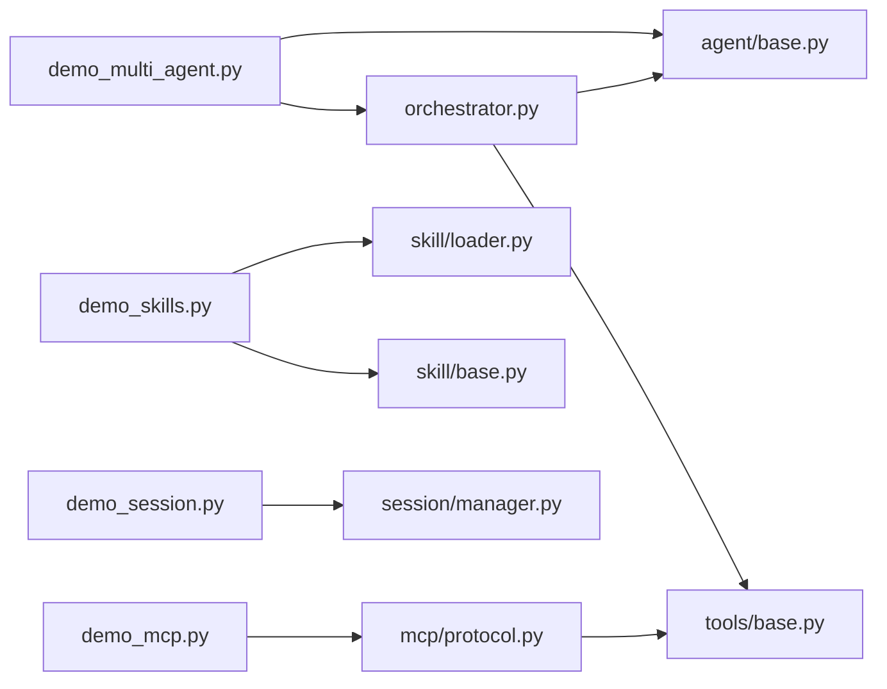

# Advanced Demos

<cite>
**Referenced Files in This Document**
- [README.md](file://README.md)
- [demo_multi_agent.py](file://demos/demo_multi_agent.py)
- [demo_mcp.py](file://demos/demo_mcp.py)
- [demo_skills.py](file://demos/demo_skills.py)
- [demo_session.py](file://demos/demo_session.py)
- [orchestrator.py](file://harness/agent/orchestrator.py)
- [base.py](file://harness/agent/base.py)
- [protocol.py](file://harness/mcp/protocol.py)
- [loader.py](file://harness/skill/loader.py)
- [base.py](file://harness/skill/base.py)
- [manager.py](file://harness/session/manager.py)
- [base.py](file://harness/tools/base.py)
</cite>

## Table of Contents
1. [Introduction](#introduction)
2. [Project Structure](#project-structure)
3. [Core Components](#core-components)
4. [Architecture Overview](#architecture-overview)
5. [Detailed Component Analysis](#detailed-component-analysis)
6. [Dependency Analysis](#dependency-analysis)
7. [Performance Considerations](#performance-considerations)
8. [Troubleshooting Guide](#troubleshooting-guide)
9. [Conclusion](#conclusion)
10. [Appendices](#appendices)

## Introduction
This document provides advanced, code-backed documentation for four sophisticated demos that showcase the framework’s orchestration, protocol integration, skills system, and session management. It explains how multi-agent orchestration delegates tasks to specialists via a supervisor pattern, how MCP standardizes external tool integration, how markdown-based skills inject capabilities into prompts, and how sessions isolate conversations with persistence. Each section includes architecture diagrams, configuration examples, and extension patterns grounded in the repository’s source files.

## Project Structure
The advanced demos are implemented under demos/ and rely on core modules in harness/. The key components used across these demos include:
- Multi-agent orchestration via orchestrator.py and agent base loop in base.py
- MCP protocol via protocol.py (server/client, JSON-RPC style requests/responses)
- Skills system via loader.py and base.py (SKILL.md parsing and prompt injection)
- Session management via manager.py (create, switch, list, persist)

**Diagram sources**
- [demo_multi_agent.py:1-47](file://demos/demo_multi_agent.py#L1-L47)
- [demo_mcp.py:1-40](file://demos/demo_mcp.py#L1-L40)
- [demo_skills.py:1-35](file://demos/demo_skills.py#L1-L35)
- [demo_session.py:1-43](file://demos/demo_session.py#L1-L43)
- [orchestrator.py:1-152](file://harness/agent/orchestrator.py#L1-L152)
- [base.py:1-165](file://harness/agent/base.py#L1-L165)
- [protocol.py:1-251](file://harness/mcp/protocol.py#L1-L251)
- [loader.py:1-122](file://harness/skill/loader.py#L1-L122)
- [base.py:1-70](file://harness/skill/base.py#L1-L70)
- [manager.py:1-146](file://harness/session/manager.py#L1-L146)
- [base.py:1-67](file://harness/tools/base.py#L1-L67)

**Section sources**
- [README.md:73-131](file://README.md#L73-L131)

## Core Components
- Multi-Agent Orchestration: Supervisor routes user requests to specialized agents using LLM-based selection with keyword fallbacks; executes chosen agent and returns results.
- MCP Protocol Demo: Demonstrates server registration of tools/resources/prompts, client discovery and invocation, and JSON-RPC-style request/response handling.
- Skills System Demo: Discovers SKILL.md files, parses metadata and instructions, and applies skill instructions to user prompts for capability injection.
- Session Management Demo: Creates isolated sessions, persists messages and metadata to disk, supports switching active sessions and listing all sessions.

**Section sources**
- [orchestrator.py:31-152](file://harness/agent/orchestrator.py#L31-L152)
- [protocol.py:68-210](file://harness/mcp/protocol.py#L68-L210)
- [loader.py:26-122](file://harness/skill/loader.py#L26-L122)
- [base.py:34-70](file://harness/skill/base.py#L34-L70)
- [manager.py:32-146](file://harness/session/manager.py#L32-L146)

## Architecture Overview
The advanced demos compose several subsystems to deliver sophisticated behaviors:

**Diagram sources**
- [orchestrator.py:61-145](file://harness/agent/orchestrator.py#L61-L145)
- [base.py:97-160](file://harness/agent/base.py#L97-L160)

## Detailed Component Analysis

### Multi-Agent Orchestration (Supervisor Pattern)
The orchestrator implements a supervisor pattern: it receives a user request, selects the best specialist agent (via LLM routing with keyword fallback), delegates execution, and returns the result. Agents can be registered with descriptions to aid routing.

Key behaviors:
- Registration: register_agent(name, agent, description)
- Routing: _select_agent uses LLM to pick an agent; falls back to keyword matching based on agent descriptions and request content
- Execution: run delegates to the selected agent and returns its output
- Aggregation: run_with_all runs through all agents and collects results

**Diagram sources**
- [orchestrator.py:61-145](file://harness/agent/orchestrator.py#L61-L145)

Configuration and usage:
- Create orchestrator with an LLM and optional verbosity
- Register specialized agents with ToolRegistries containing relevant tools
- Run tasks and observe delegation

Extension patterns:
- Add new agents by subclassing BaseAgent or using TaskAgent/ChatAgent
- Provide clear descriptions to improve routing accuracy
- Use run_with_all for multi-perspective answers

**Section sources**
- [demo_multi_agent.py:17-44](file://demos/demo_multi_agent.py#L17-L44)
- [orchestrator.py:31-152](file://harness/agent/orchestrator.py#L31-L152)
- [base.py:63-165](file://harness/agent/base.py#L63-L165)

### MCP Protocol Demo (External Tool Integration)
The MCP demo demonstrates standardized communication between clients and servers using JSON-RPC style requests. The server exposes tools, resources, and prompts; the client discovers and calls tools across connected servers.

Key behaviors:
- Server: MCPServer registers tools/resources/prompts and handles methods like tools/list, tools/call, resources/read, prompts/get
- Client: MCPClient connects to servers, lists tools, calls tools, and converts MCP tools into harness Tool objects for registry integration
- Request/Response: MCPRequest and MCPResponse encapsulate JSON-RPC payloads

**Diagram sources**
- [protocol.py:100-138](file://harness/mcp/protocol.py#L100-L138)
- [protocol.py:162-183](file://harness/mcp/protocol.py#L162-L183)

Configuration and usage:
- Create a demo server with sample tools and resources
- Connect a client and discover tools
- Call tools and inspect responses
- Build raw MCPRequest and handle responses directly

Extension patterns:
- Implement custom handlers for tools/resources/prompts
- Expose MCP tools to ToolRegistry via get_tools_for_registry()
- Integrate MCP tools into agents’ tool registries for seamless use

**Section sources**
- [demo_mcp.py:11-36](file://demos/demo_mcp.py#L11-L36)
- [protocol.py:68-210](file://harness/mcp/protocol.py#L68-L210)
- [base.py:30-67](file://harness/tools/base.py#L30-L67)

### Skills System Demo (Markdown-Based Capabilities and Prompt Injection)
The skills system enables modular capabilities defined as SKILL.md files with YAML frontmatter and detailed instructions. The loader discovers and parses skills, and skills can be applied to user prompts to inject specialized behavior.

Key behaviors:
- Discovery: SkillLoader.discover scans directories for SKILL.md files
- Loading: load_all parses frontmatter into metadata and extracts instructions
- Application: Skill.apply_to_prompt combines skill instructions with user input to form a complete prompt

**Diagram sources**
- [loader.py:33-71](file://harness/skill/loader.py#L33-L71)
- [base.py:55-65](file://harness/skill/base.py#L55-L65)

Configuration and usage:
- Initialize SkillLoader with a skills directory
- Discover and load skills
- For each skill, apply to user request to see injected prompt

Extension patterns:
- Add new skills by creating directories with SKILL.md including name, description, tags, version, and instructions
- Use tags to categorize and filter skills
- Integrate skills into agent context to specialize behavior per task

**Section sources**
- [demo_skills.py:11-31](file://demos/demo_skills.py#L11-L31)
- [loader.py:26-122](file://harness/skill/loader.py#L26-L122)
- [base.py:25-70](file://harness/skill/base.py#L25-L70)

### Session Management Demo (Conversation Isolation and State Persistence)
SessionManager manages multiple independent conversation sessions, each with its own history, metadata, and persistent storage. It supports creating, switching, listing, deleting, and renaming sessions.

Key behaviors:
- Creation: create_session generates a unique id, initializes messages and metadata, persists to disk
- Switching: switch_session sets the active session and returns it
- Listing: list_sessions returns all sessions sorted by creation time
- Persistence: _save writes session data to JSON files; _load_all restores sessions at startup

**Diagram sources**
- [manager.py:32-146](file://harness/session/manager.py#L32-L146)

Configuration and usage:
- Initialize SessionManager with a storage directory
- Create multiple sessions and add messages
- Switch active session and retrieve history
- List all sessions and manage lifecycle

Extension patterns:
- Extend Session with additional fields (e.g., tags, permissions)
- Customize persistence format or backend (e.g., database)
- Integrate with memory systems for cross-session knowledge

**Section sources**
- [demo_session.py:11-39](file://demos/demo_session.py#L11-L39)
- [manager.py:71-146](file://harness/session/manager.py#L71-L146)

## Dependency Analysis
The advanced demos depend on core harness modules to provide orchestration, protocol integration, skills loading, and session management.

**Diagram sources**
- [demo_multi_agent.py:10-15](file://demos/demo_multi_agent.py#L10-L15)
- [demo_mcp.py:9-9](file://demos/demo_mcp.py#L9-L9)
- [demo_skills.py:9-9](file://demos/demo_skills.py#L9-L9)
- [demo_session.py:9-9](file://demos/demo_session.py#L9-L9)
- [orchestrator.py:24-26](file://harness/agent/orchestrator.py#L24-L26)
- [base.py:29-33](file://harness/agent/base.py#L29-L33)
- [protocol.py:185-210](file://harness/mcp/protocol.py#L185-L210)
- [base.py:30-67](file://harness/tools/base.py#L30-L67)

**Section sources**
- [README.md:73-131](file://README.md#L73-L131)

## Performance Considerations
- Multi-Agent Orchestration:
  - LLM-based routing incurs an extra call; consider caching agent selections for similar requests.
  - Keyword fallback reduces latency when LLM is unavailable or slow.
  - run_with_all executes all agents; use selectively to avoid unnecessary overhead.
- MCP Protocol:
  - In-process server avoids network overhead but limits concurrency; for production, run separate processes and scale horizontally.
  - Tool schema validation should be enforced to minimize error handling costs.
- Skills System:
  - Parsing SKILL.md is lightweight; cache parsed skills to avoid repeated I/O.
  - Prompt injection increases token usage; monitor context window constraints.
- Session Management:
  - Persisting large histories can grow storage; implement pruning or archival strategies.
  - Switching sessions is O(1); listing sessions is O(N) over stored files.

[No sources needed since this section provides general guidance]

## Troubleshooting Guide
Common issues and resolutions:
- No agents registered:
  - Ensure register_agent is called before run; verify agent names and descriptions.
  - Check verbose logs for registration confirmation.
- LLM routing fails:
  - Verify agent descriptions contain keywords matching user requests.
  - Inspect fallback logic and adjust keyword sets if necessary.
- MCP tool not found:
  - Confirm tool registration on the server and correct method usage.
  - Validate request parameters match input_schema.
- Skill not found:
  - Ensure SKILL.md exists under the expected directory structure.
  - Check file encoding and frontmatter syntax.
- Session persistence errors:
  - Verify storage directory permissions and existence.
  - Inspect JSON integrity for corrupted session files.

**Section sources**
- [orchestrator.py:69-70](file://harness/agent/orchestrator.py#L69-L70)
- [protocol.py:112-138](file://harness/mcp/protocol.py#L112-L138)
- [loader.py:45-71](file://harness/skill/loader.py#L45-L71)
- [manager.py:108-142](file://harness/session/manager.py#L108-L142)

## Conclusion
The advanced demos illustrate how the framework composes specialized agents, standardized protocols, modular skills, and isolated sessions to build robust AI applications. By leveraging the supervisor pattern, MCP integration, markdown-driven capabilities, and persistent session management, developers can create scalable, maintainable systems that adapt to complex tasks while keeping concerns separated and extensible.

[No sources needed since this section summarizes without analyzing specific files]

## Appendices

### Configuration Examples
- Environment variables for LLM backend and model selection:
  - HARNESS_LLM_BACKEND: choose mock or transformers
  - HARNESS_MODEL_NAME: specify HuggingFace model
  - HARNESS_MAX_TOKENS, HARNESS_TEMPERATURE, HARNESS_DEVICE: tune generation behavior
- Demo-specific configurations:
  - Multi-agent: register agents with descriptive names and tool registries
  - MCP: define tools with schemas and handlers; connect clients to servers
  - Skills: organize SKILL.md files with frontmatter and instructions
  - Sessions: set storage_dir for persistence location

**Section sources**
- [README.md:287-298](file://README.md#L287-L298)

### Extension Patterns
- Custom tools:
  - Subclass BaseTool, implement execute, and register via ToolRegistry
- Custom skills:
  - Create SKILL.md with metadata and instructions; integrate via SkillLoader
- MCP servers:
  - Implement MCPServer with tools/resources/prompts; expose via MCPClient
- Custom sessions:
  - Extend Session with additional fields; customize persistence in SessionManager

**Section sources**
- [base.py:30-67](file://harness/tools/base.py#L30-L67)
- [loader.py:26-122](file://harness/skill/loader.py#L26-L122)
- [protocol.py:68-210](file://harness/mcp/protocol.py#L68-L210)
- [manager.py:32-146](file://harness/session/manager.py#L32-L146)