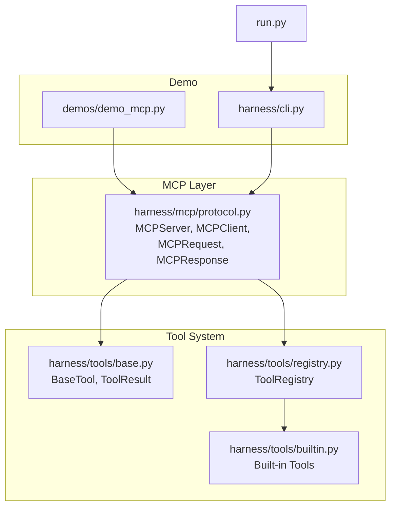
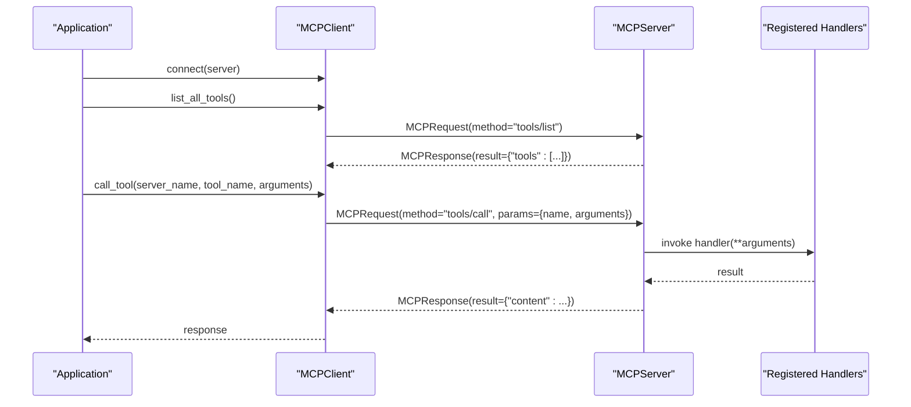
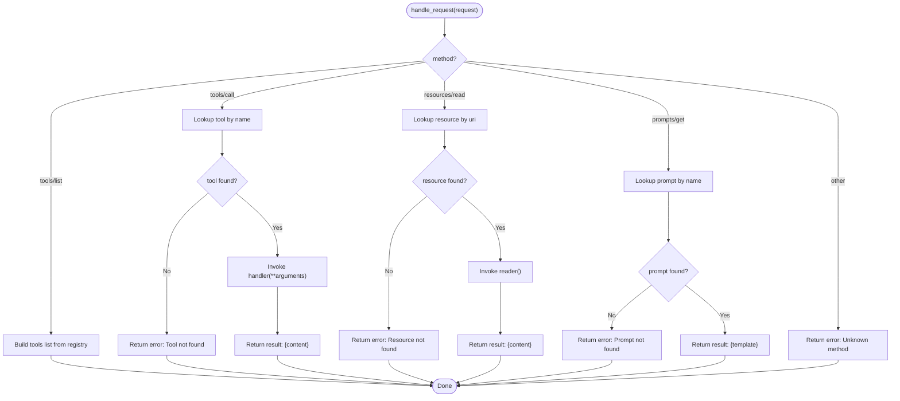
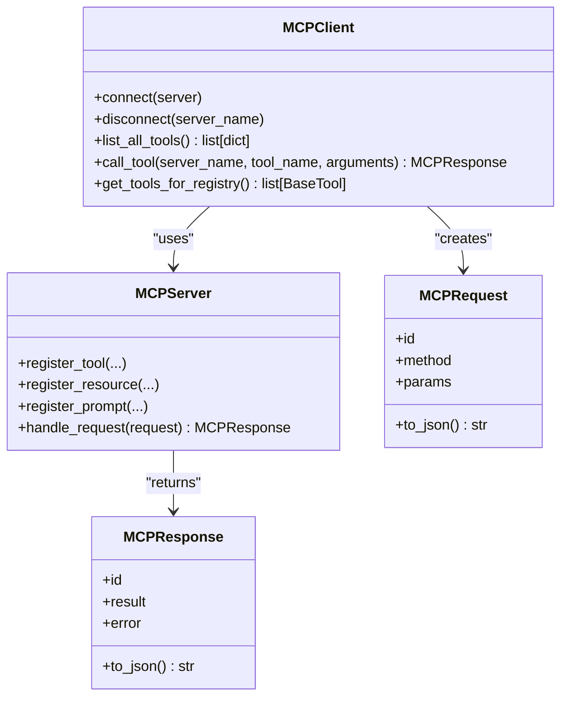
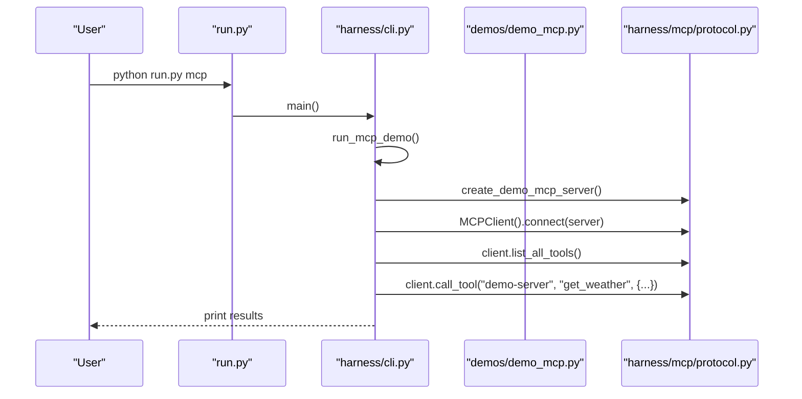
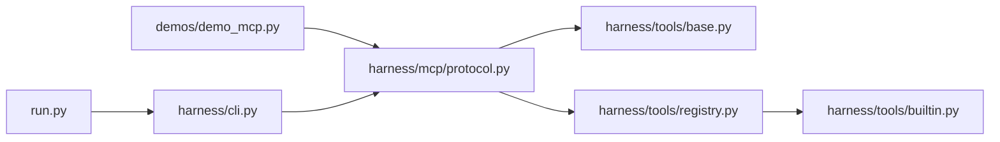

# MCP Protocol Demo

<cite>
**Referenced Files in This Document**
- [protocol.py](file://harness/mcp/protocol.py)
- [demo_mcp.py](file://demos/demo_mcp.py)
- [base.py](file://harness/tools/base.py)
- [registry.py](file://harness/tools/registry.py)
- [builtin.py](file://harness/tools/builtin.py)
- [cli.py](file://harness/cli.py)
- [run.py](file://run.py)
- [README.md](file://README.md)
</cite>

## Table of Contents
1. [Introduction](#introduction)
2. [Project Structure](#project-structure)
3. [Core Components](#core-components)
4. [Architecture Overview](#architecture-overview)
5. [Detailed Component Analysis](#detailed-component-analysis)
6. [Dependency Analysis](#dependency-analysis)
7. [Performance Considerations](#performance-considerations)
8. [Troubleshooting Guide](#troubleshooting-guide)
9. [Conclusion](#conclusion)
10. [Appendices](#appendices)

## Introduction
This document explains the Model Context Protocol (MCP) demo implementation that standardizes tool interoperability between AI systems. It covers the JSON-RPC 2.0 communication layer, message formats, protocol endpoints, server-side tool discovery and registration, client integration patterns for connecting external tools via MCP, and practical examples for building custom MCP servers and integrating third-party tools. It also addresses error handling strategies, security considerations, and performance optimization techniques suitable for production deployments.

## Project Structure
The MCP demo is implemented as an in-process protocol to demonstrate concepts without network sockets. The core implementation lives under harness/mcp, with a demo script under demos and integration points into the harness tool system.

**Diagram sources**
- [protocol.py:68-210](file://harness/mcp/protocol.py#L68-L210)
- [demo_mcp.py:11-39](file://demos/demo_mcp.py#L11-L39)
- [cli.py:179-211](file://harness/cli.py#L179-L211)
- [base.py:16-67](file://harness/tools/base.py#L16-L67)
- [registry.py:17-74](file://harness/tools/registry.py#L17-L74)
- [builtin.py:13-83](file://harness/tools/builtin.py#L13-L83)

**Section sources**
- [README.md:214-235](file://README.md#L214-L235)
- [protocol.py:1-22](file://harness/mcp/protocol.py#L1-L22)

## Core Components
- MCPServer: Exposes tools, resources, and prompts; routes JSON-RPC requests to handlers.
- MCPClient: Connects to one or more servers, discovers tools, calls tools, and bridges MCP tools into the harness ToolRegistry.
- MCPRequest/MCPResponse: JSON-RPC 2.0 style messages with id, method, params/result/error.
- MCPToolDef: Schema and handler metadata for each tool.
- Integration with BaseTool/ToolRegistry: MCP tools can be wrapped as harness tools for unified execution.

Key responsibilities:
- Server: tool/resource/prompt registration, request routing, error wrapping.
- Client: connection management, tool discovery, invocation, conversion to harness tools.
- Messages: standardized JSON-RPC payloads for interoperability.

**Section sources**
- [protocol.py:31-66](file://harness/mcp/protocol.py#L31-L66)
- [protocol.py:68-139](file://harness/mcp/protocol.py#L68-L139)
- [protocol.py:141-210](file://harness/mcp/protocol.py#L141-L210)
- [base.py:16-67](file://harness/tools/base.py#L16-L67)
- [registry.py:17-74](file://harness/tools/registry.py#L17-L74)

## Architecture Overview
The MCP architecture decouples tool providers from consumers using a standardized protocol. In this demo, the server and client run in-process; in production, they communicate over stdio or HTTP using JSON-RPC 2.0.

**Diagram sources**
- [protocol.py:100-139](file://harness/mcp/protocol.py#L100-L139)
- [protocol.py:162-183](file://harness/mcp/protocol.py#L162-L183)

## Detailed Component Analysis

### JSON-RPC 2.0 Message Formats
- Request: {jsonrpc: "2.0", id, method, params}
- Response: {jsonrpc: "2.0", id, result|error}
- Methods:
  - tools/list: returns available tools with name, description, inputSchema
  - tools/call: invokes a named tool with arguments
  - resources/read: reads a resource by URI
  - prompts/get: retrieves a prompt template by name

These are serialized via MCPRequest.to_json() and MCPResponse.to_json().

**Section sources**
- [protocol.py:40-66](file://harness/mcp/protocol.py#L40-L66)
- [protocol.py:100-139](file://harness/mcp/protocol.py#L100-L139)

### Server Implementation: Tool Discovery, Registration, Request Handling
- Tool registration: register_tool(name, description, input_schema, handler)
- Resource registration: register_resource(uri, reader)
- Prompt registration: register_prompt(name, template)
- Request routing: handle_request(request) dispatches by method and returns MCPResponse
- Error handling: unknown methods, missing tools/resources/prompts, and exceptions are wrapped into MCPResponse.error

**Diagram sources**
- [protocol.py:100-139](file://harness/mcp/protocol.py#L100-L139)

**Section sources**
- [protocol.py:80-139](file://harness/mcp/protocol.py#L80-L139)

### Client Integration Patterns
- Connection: connect(server) stores server reference by name
- Discovery: list_all_tools() aggregates tools across connected servers
- Invocation: call_tool(server_name, tool_name, arguments) sends tools/call
- Bridge to harness: get_tools_for_registry() converts discovered MCP tools into BaseTool instances so they can be executed through ToolRegistry

**Diagram sources**
- [protocol.py:141-210](file://harness/mcp/protocol.py#L141-L210)
- [protocol.py:40-66](file://harness/mcp/protocol.py#L40-L66)

**Section sources**
- [protocol.py:152-210](file://harness/mcp/protocol.py#L152-L210)

### Practical Examples

#### Running the Demo
- Execute the standalone demo script to see tool discovery, invocation, and raw JSON-RPC messages.
- Use the CLI entry point to run the same flow via the harness CLI.

**Diagram sources**
- [run.py:1-28](file://run.py#L1-L28)
- [cli.py:179-211](file://harness/cli.py#L179-L211)
- [demo_mcp.py:11-39](file://demos/demo_mcp.py#L11-L39)
- [protocol.py:213-251](file://harness/mcp/protocol.py#L213-L251)

**Section sources**
- [demo_mcp.py:11-39](file://demos/demo_mcp.py#L11-L39)
- [cli.py:179-211](file://harness/cli.py#L179-L211)

#### Implementing a Custom MCP Server
- Create an MCPServer instance and register tools with schemas and handlers.
- Optionally register resources and prompts.
- Expose via your application’s transport (in-process here; production would use stdio/HTTP).

Reference paths:
- Server creation and tool registration: [create_demo_mcp_server:213-251](file://harness/mcp/protocol.py#L213-L251)
- Tool registration API: [register_tool:86-92](file://harness/mcp/protocol.py#L86-L92)
- Resource and prompt registration: [register_resource:94-95](file://harness/mcp/protocol.py#L94-L95), [register_prompt:97-98](file://harness/mcp/protocol.py#L97-L98)

**Section sources**
- [protocol.py:86-98](file://harness/mcp/protocol.py#L86-L98)
- [protocol.py:213-251](file://harness/mcp/protocol.py#L213-L251)

#### Integrating Third-Party Tools via MCP
- Wrap third-party functions as MCP handlers and register them on an MCPServer.
- On the client side, connect to the server and discover/call tools.
- Convert MCP tools into harness tools using get_tools_for_registry() to integrate with existing tool orchestration.

Reference paths:
- Client bridge to harness tools: [get_tools_for_registry:185-210](file://harness/mcp/protocol.py#L185-L210)
- Harness tool base and registry: [BaseTool:30-67](file://harness/tools/base.py#L30-L67), [ToolRegistry:17-74](file://harness/tools/registry.py#L17-L74)

**Section sources**
- [protocol.py:185-210](file://harness/mcp/protocol.py#L185-L210)
- [base.py:30-67](file://harness/tools/base.py#L30-L67)
- [registry.py:17-74](file://harness/tools/registry.py#L17-L74)

#### Handling Asynchronous Operations
- Current implementation is synchronous. For async operations:
  - Make handlers return awaitable results or schedule work and poll status.
  - Extend MCPRequest/MCPResponse to support notifications and streaming if needed.
  - Introduce timeouts and cancellation at the client layer.
  - In production transports (stdio/HTTP), leverage async I/O frameworks.

[No sources needed since this section provides general guidance]

## Dependency Analysis
The MCP module depends on Python standard library modules and integrates with the harness tool system.

**Diagram sources**
- [protocol.py:185-210](file://harness/mcp/protocol.py#L185-L210)
- [registry.py:17-74](file://harness/tools/registry.py#L17-L74)
- [builtin.py:13-83](file://harness/tools/builtin.py#L13-L83)
- [demo_mcp.py:9-39](file://demos/demo_mcp.py#L9-L39)
- [cli.py:179-211](file://harness/cli.py#L179-L211)
- [run.py:18-27](file://run.py#L18-L27)

**Section sources**
- [protocol.py:185-210](file://harness/mcp/protocol.py#L185-L210)
- [registry.py:17-74](file://harness/tools/registry.py#L17-L74)
- [builtin.py:13-83](file://harness/tools/builtin.py#L13-L83)

## Performance Considerations
- In-process vs. process-per-server: The demo uses in-process calls for simplicity; production should isolate servers to improve stability and scalability.
- Transport choice: stdio or HTTP with JSON-RPC 2.0 enables concurrency and load distribution.
- Serialization overhead: Keep payloads small; avoid large content in tool responses when possible.
- Caching: Cache tool schemas and resource contents where appropriate.
- Concurrency: Use async handlers and non-blocking I/O for long-running tasks; implement timeouts and retries.
- Backpressure: Limit concurrent tool invocations per server to prevent overload.
- Observability: Add structured logging and metrics around request/response latency and error rates.

[No sources needed since this section provides general guidance]

## Troubleshooting Guide
Common issues and resolutions:
- Unknown method: Ensure the client sends supported methods (tools/list, tools/call, resources/read, prompts/get).
- Tool not found: Verify tool names match registered ones; check case sensitivity.
- Resource/Prompt not found: Confirm URIs and names are correctly registered.
- Handler exceptions: Errors are wrapped into MCPResponse.error; inspect logs and validate input schemas.
- Client connection errors: Ensure the server name matches the connected server; disconnect/reconnect as needed.

Relevant code paths:
- Request routing and error handling: [handle_request:100-139](file://harness/mcp/protocol.py#L100-L139)
- Client tool lookup and invocation: [call_tool:174-183](file://harness/mcp/protocol.py#L174-L183)
- Registry execution error handling: [execute:43-61](file://harness/tools/registry.py#L43-L61)

**Section sources**
- [protocol.py:100-139](file://harness/mcp/protocol.py#L100-L139)
- [protocol.py:174-183](file://harness/mcp/protocol.py#L174-L183)
- [registry.py:43-61](file://harness/tools/registry.py#L43-L61)

## Conclusion
The MCP demo demonstrates a minimal but complete implementation of a standardized protocol for AI tool interoperability. It showcases JSON-RPC 2.0 messaging, server-side tool/resource/prompt exposure, client-side discovery and invocation, and seamless integration with the harness tool system. For production, extend the demo with robust transports, asynchronous handling, security controls, observability, and performance optimizations.

[No sources needed since this section summarizes without analyzing specific files]

## Appendices

### Security Considerations
- Input validation: Validate and sanitize all tool arguments before execution.
- Authorization: Enforce access control per server/tool/resource based on user roles or tokens.
- Sandboxing: Isolate tool execution environments to limit damage from malicious inputs.
- Rate limiting: Protect servers from abuse with throttling and quotas.
- Secrets management: Avoid exposing sensitive data in tool outputs; use secure channels and redaction.

[No sources needed since this section provides general guidance]

### Production Deployment Checklist
- Replace in-process calls with stdio/HTTP JSON-RPC 2.0 transports.
- Implement async handlers and connection pooling.
- Add health checks and graceful shutdown.
- Enable structured logging, tracing, and metrics.
- Configure timeouts, retries, and circuit breakers.
- Perform load testing and capacity planning.

[No sources needed since this section provides general guidance]