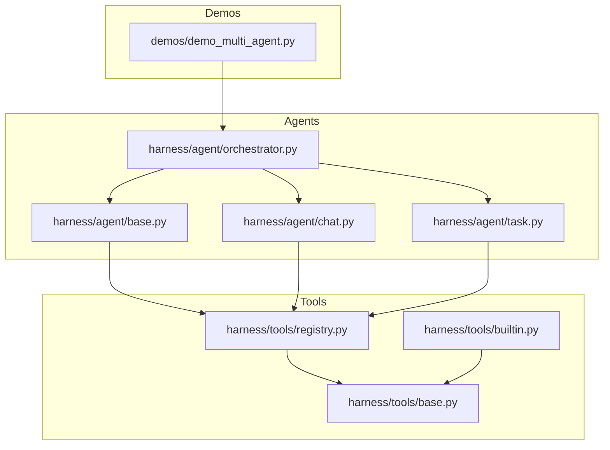
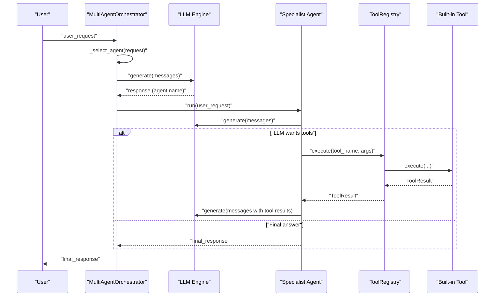
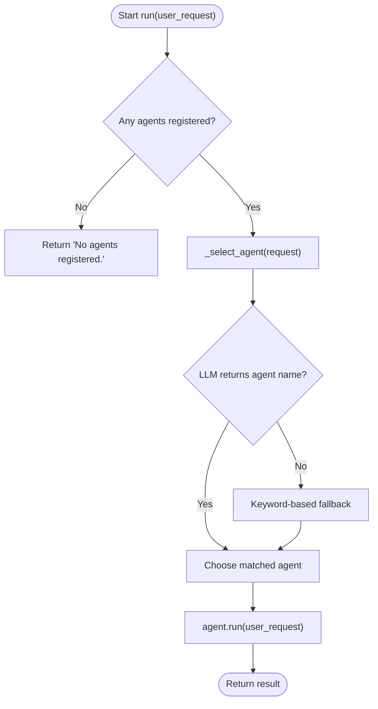
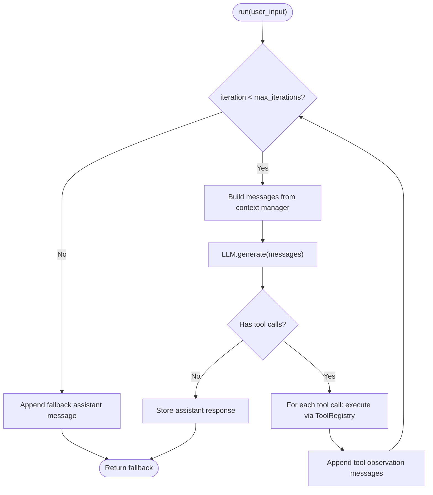
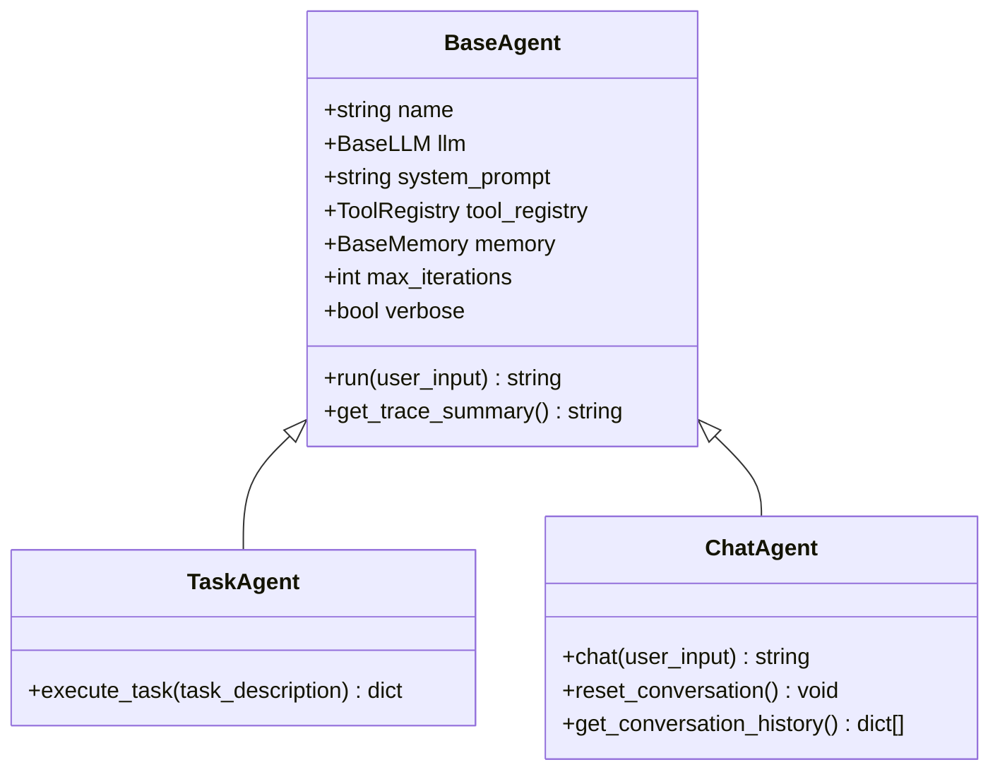
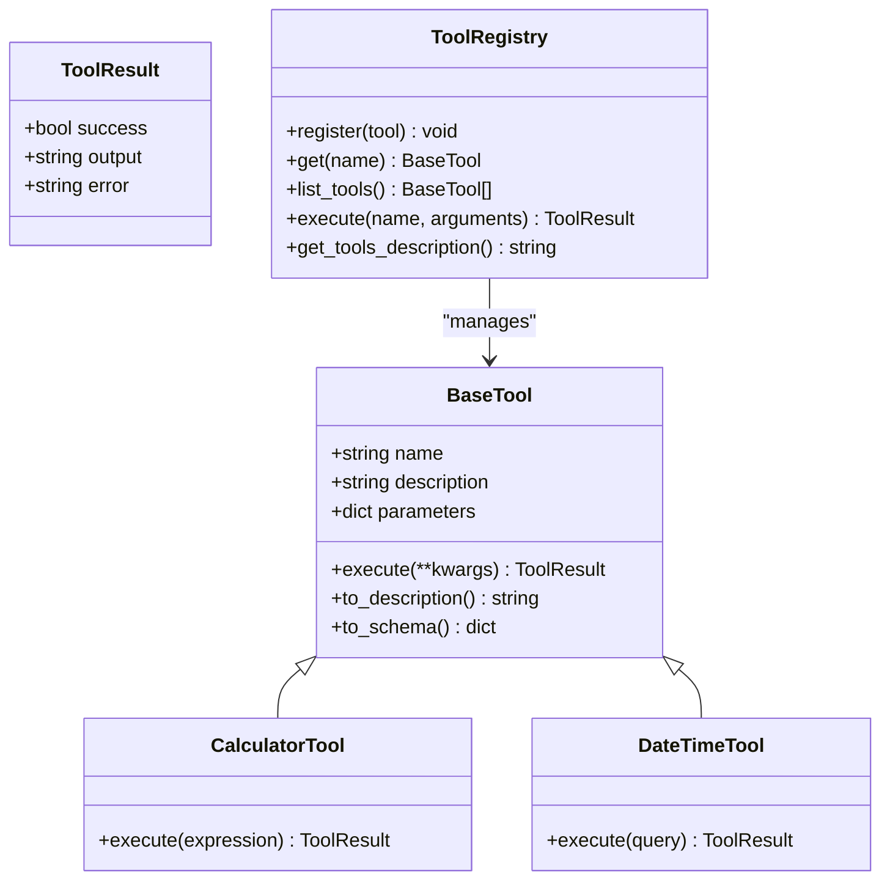
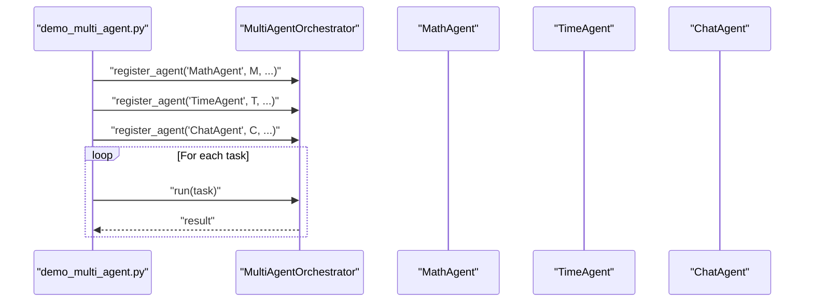
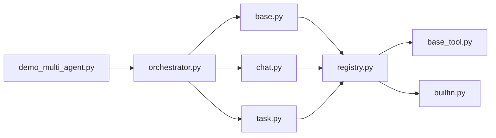

# Multi-Agent Orchestration Demo

<cite>
**Referenced Files in This Document**
- [demo_multi_agent.py](file://demos/demo_multi_agent.py)
- [orchestrator.py](file://harness/agent/orchestrator.py)
- [base.py](file://harness/agent/base.py)
- [chat.py](file://harness/agent/chat.py)
- [task.py](file://harness/agent/task.py)
- [builtin.py](file://harness/tools/builtin.py)
- [registry.py](file://harness/tools/registry.py)
- [base_tool.py](file://harness/tools/base.py)
- [README.md](file://README.md)
- [run.py](file://run.py)
</cite>

## Table of Contents
1. [Introduction](#introduction)
2. [Project Structure](#project-structure)
3. [Core Components](#core-components)
4. [Architecture Overview](#architecture-overview)
5. [Detailed Component Analysis](#detailed-component-analysis)
6. [Dependency Analysis](#dependency-analysis)
7. [Performance Considerations](#performance-considerations)
8. [Troubleshooting Guide](#troubleshooting-guide)
9. [Conclusion](#conclusion)
10. [Appendices](#appendices)

## Introduction
This document explains the multi-agent orchestration demo that implements a supervisor pattern to coordinate specialized agents for different tasks. The orchestrator receives user requests, selects the most suitable agent (or runs all agents), delegates execution, and aggregates results. It demonstrates how to set up:
- MathAgent with CalculatorTool for math calculations
- TimeAgent with DateTimeTool for date/time queries
- ChatAgent for general conversation

It also covers agent registration, task delegation mechanisms, response aggregation strategies, configuration examples for creating custom specialist agents, best practices for designing effective specializations, performance considerations, and troubleshooting guidance.

## Project Structure
The demo is organized into a harness framework and demonstration scripts:
- demos/: runnable examples including the multi-agent orchestration demo
- harness/: core framework modules for agents, tools, memory, context, LLM engine, and more

**Diagram sources**
- [demo_multi_agent.py:1-47](file://demos/demo_multi_agent.py#L1-L47)
- [orchestrator.py:1-152](file://harness/agent/orchestrator.py#L1-L152)
- [base.py:1-165](file://harness/agent/base.py#L1-L165)
- [chat.py:1-60](file://harness/agent/chat.py#L1-L60)
- [task.py:1-73](file://harness/agent/task.py#L1-L73)
- [base_tool.py:1-67](file://harness/tools/base.py#L1-L67)
- [registry.py:1-74](file://harness/tools/registry.py#L1-L74)
- [builtin.py:1-83](file://harness/tools/builtin.py#L1-L83)

**Section sources**
- [README.md:73-131](file://README.md#L73-L131)
- [run.py:1-28](file://run.py#L1-L28)

## Core Components
- MultiAgentOrchestrator: Supervisor that routes requests to specialists and aggregates results.
- BaseAgent: Implements the agent loop (context building, LLM calls, tool execution, iteration control).
- TaskAgent: Specialized agent for task completion with higher iteration budget and structured output support.
- ChatAgent: Conversational agent optimized for multi-turn dialogue.
- ToolRegistry: Central catalog for registering and executing tools.
- Built-in Tools: CalculatorTool and DateTimeTool used by MathAgent and TimeAgent respectively.

Key responsibilities:
- Agent registration and description binding for routing decisions
- LLM-based or keyword-based agent selection
- Execution via agent.run() and result return/aggregation
- Tool invocation through ToolRegistry with error handling

**Section sources**
- [orchestrator.py:31-152](file://harness/agent/orchestrator.py#L31-L152)
- [base.py:63-165](file://harness/agent/base.py#L63-L165)
- [task.py:22-73](file://harness/agent/task.py#L22-L73)
- [chat.py:19-60](file://harness/agent/chat.py#L19-L60)
- [registry.py:17-74](file://harness/tools/registry.py#L17-L74)
- [builtin.py:13-47](file://harness/tools/builtin.py#L13-L47)

## Architecture Overview
The system follows a supervisor pattern:
- User request enters the orchestrator
- Orchestrator selects an agent using LLM-based routing with keyword fallback
- Selected agent executes its loop, potentially calling tools
- Orchestrator returns the selected agent’s result; optionally run_with_all collects all responses

**Diagram sources**
- [orchestrator.py:61-145](file://harness/agent/orchestrator.py#L61-L145)
- [base.py:97-160](file://harness/agent/base.py#L97-L160)
- [registry.py:43-60](file://harness/tools/registry.py#L43-L60)
- [builtin.py:13-47](file://harness/tools/builtin.py#L13-L47)

## Detailed Component Analysis

### MultiAgentOrchestrator (Supervisor Pattern)
- Maintains a registry of agents with descriptions for routing
- Uses a supervisor prompt to ask the LLM which agent should handle the request
- Falls back to keyword matching if LLM routing does not match any agent
- Provides run() for single-agent delegation and run_with_all() to collect all responses

Routing logic highlights:
- Builds a list of agent names and descriptions
- Sends a system message to the LLM requesting only the agent name
- Matches returned name against registered agents
- Keyword fallback checks for math/time/general chat cues

Aggregation strategies:
- Single-run: returns the chosen agent’s response
- All-run: iterates over all agents and returns a mapping of agent name to response

**Diagram sources**
- [orchestrator.py:61-145](file://harness/agent/orchestrator.py#L61-L145)

**Section sources**
- [orchestrator.py:31-152](file://harness/agent/orchestrator.py#L31-L152)

### BaseAgent (Agent Loop)
Implements the core execution cycle:
- Build context messages (system prompt + memory + tools + history)
- Call LLM.generate()
- If no tool calls, store assistant response and return final answer
- If tool calls exist, execute each via ToolRegistry, append tool observations, and continue loop
- Enforces max_iterations to prevent infinite loops

Trace and debugging:
- AgentTrace records steps: llm_call, tool_call, tool_result, final_answer
- Verbose logging prints tool calls and results

**Diagram sources**
- [base.py:97-160](file://harness/agent/base.py#L97-L160)

**Section sources**
- [base.py:1-165](file://harness/agent/base.py#L1-L165)

### TaskAgent and ChatAgent (Specialists)
- TaskAgent:
  - Higher max_iterations for complex tasks
  - Structured output helper (execute_task) returning success/result/task
  - System prompt emphasizes step-by-step tool usage and clear final answers
- ChatAgent:
  - Lower max_iterations for conversational turns
  - Conversation management utilities (reset_conversation, get_conversation_history)
  - Optimized for interactive multi-turn dialogue

**Diagram sources**
- [base.py:63-165](file://harness/agent/base.py#L63-L165)
- [task.py:22-73](file://harness/agent/task.py#L22-L73)
- [chat.py:19-60](file://harness/agent/chat.py#L19-L60)

**Section sources**
- [task.py:1-73](file://harness/agent/task.py#L1-L73)
- [chat.py:1-60](file://harness/agent/chat.py#L1-L60)

### Tool System (CalculatorTool, DateTimeTool)
- BaseTool defines interface: name, description, parameters, execute(), to_description(), to_schema()
- ToolRegistry manages registration, listing, and execution with error handling
- CalculatorTool safely evaluates mathematical expressions with restricted character sets
- DateTimeTool returns current date/time based on query parameter

**Diagram sources**
- [base_tool.py:16-67](file://harness/tools/base.py#L16-L67)
- [registry.py:17-74](file://harness/tools/registry.py#L17-L74)
- [builtin.py:13-47](file://harness/tools/builtin.py#L13-L47)

**Section sources**
- [base_tool.py:1-67](file://harness/tools/base.py#L1-L67)
- [registry.py:1-74](file://harness/tools/registry.py#L1-L74)
- [builtin.py:1-83](file://harness/tools/builtin.py#L1-L83)

### Demo Setup and Usage
The demo script wires together:
- LLM creation via create_llm()
- Orchestrator initialization with verbose mode
- Registration of MathAgent (TaskAgent with CalculatorTool), TimeAgent (TaskAgent with DateTimeTool), and ChatAgent
- Iterating over sample tasks and printing orchestrator.run() outputs

**Diagram sources**
- [demo_multi_agent.py:17-44](file://demos/demo_multi_agent.py#L17-L44)
- [orchestrator.py:54-91](file://harness/agent/orchestrator.py#L54-L91)

**Section sources**
- [demo_multi_agent.py:1-47](file://demos/demo_multi_agent.py#L1-L47)

## Dependency Analysis
High-level dependencies:
- Orchestrator depends on BaseAgent implementations and LLM engine
- Agents depend on ToolRegistry and Memory systems
- Tools depend on BaseTool interface and are managed by ToolRegistry
- Demo script composes these components to demonstrate orchestration

**Diagram sources**
- [demo_multi_agent.py:1-47](file://demos/demo_multi_agent.py#L1-L47)
- [orchestrator.py:1-152](file://harness/agent/orchestrator.py#L1-L152)
- [base.py:1-165](file://harness/agent/base.py#L1-L165)
- [chat.py:1-60](file://harness/agent/chat.py#L1-L60)
- [task.py:1-73](file://harness/agent/task.py#L1-L73)
- [registry.py:1-74](file://harness/tools/registry.py#L1-L74)
- [base_tool.py:1-67](file://harness/tools/base.py#L1-L67)
- [builtin.py:1-83](file://harness/tools/builtin.py#L1-L83)

**Section sources**
- [README.md:73-131](file://README.md#L73-L131)

## Performance Considerations
- Agent loop iterations:
  - BaseAgent enforces max_iterations to avoid infinite loops; TaskAgent uses higher limits for complex tasks, while ChatAgent uses lower limits for quick replies
- Tool execution overhead:
  - Each tool call incurs LLM round-trips; minimize unnecessary tool calls by refining prompts and tool schemas
- Routing efficiency:
  - LLM-based routing adds one extra generate call per request; keyword fallback reduces cost when LLM fails to match
- Context size:
  - ContextManager builds messages with system prompt, tool descriptions, memory, and history; keep histories concise to reduce token usage
- Parallelism:
  - run_with_all() sequentially processes all agents; consider parallelization at application level if needed, ensuring thread safety and resource constraints

[No sources needed since this section provides general guidance]

## Troubleshooting Guide
Common issues and resolutions:
- No agents registered:
  - Ensure register_agent is called before run(); the orchestrator returns a specific message if none are found
- LLM routing mismatch:
  - Verify agent descriptions are distinct and include keywords relevant to tasks; fallback routing uses keyword heuristics for math/time/general chat
- Tool execution errors:
  - ToolRegistry.execute wraps exceptions and returns ToolResult(success=False); inspect error messages and validate tool parameters
- Infinite loops:
  - Adjust max_iterations per agent type; ensure tool outputs provide sufficient context for the LLM to terminate
- Verbose output noise:
  - Set verbose flags appropriately per component (e.g., ChatAgent defaults to False verbosity)

**Section sources**
- [orchestrator.py:61-71](file://harness/agent/orchestrator.py#L61-L71)
- [orchestrator.py:105-145](file://harness/agent/orchestrator.py#L105-L145)
- [base.py:157-160](file://harness/agent/base.py#L157-L160)
- [registry.py:43-60](file://harness/tools/registry.py#L43-L60)
- [builtin.py:19-30](file://harness/tools/builtin.py#L19-L30)

## Conclusion
The multi-agent orchestration demo showcases a practical supervisor pattern where a central orchestrator coordinates specialized agents equipped with focused tools. By combining LLM-based routing with robust fallbacks, the system efficiently delegates tasks to MathAgent, TimeAgent, or ChatAgent. The base agent loop ensures safe, iterative execution with tool integration, while the tool registry provides a clean abstraction for extensibility. Following the provided best practices and performance guidelines will help you design effective agent specializations and scale orchestration responsibly.

[No sources needed since this section summarizes without analyzing specific files]

## Appendices

### Configuration Examples for Custom Specialist Agents
- Create a new tool subclassing BaseTool with name, description, parameters, and execute method
- Register the tool in a ToolRegistry instance
- Instantiate a TaskAgent with the registry and a tailored system prompt
- Register the TaskAgent with the orchestrator using a descriptive label for routing

References:
- Tool definition and schema generation: [base_tool.py:30-67](file://harness/tools/base.py#L30-L67)
- Tool registration and execution: [registry.py:28-60](file://harness/tools/registry.py#L28-L60)
- TaskAgent setup and execution: [task.py:32-73](file://harness/agent/task.py#L32-L73)
- Orchestrator registration and routing: [orchestrator.py:54-91](file://harness/agent/orchestrator.py#L54-L91)

### Best Practices for Effective Agent Specializations
- Distinct descriptions: Provide clear, unique descriptions for each agent to improve routing accuracy
- Focused tool sets: Equip each agent with only the tools it needs to reduce confusion and token usage
- Tuned iteration budgets: Use higher max_iterations for complex tasks and lower for simple conversations
- Robust tool error handling: Always return informative ToolResult messages to guide the LLM toward recovery
- Minimal context: Keep histories concise and rely on long-term memory for relevant past information

[No sources needed since this section provides general guidance]