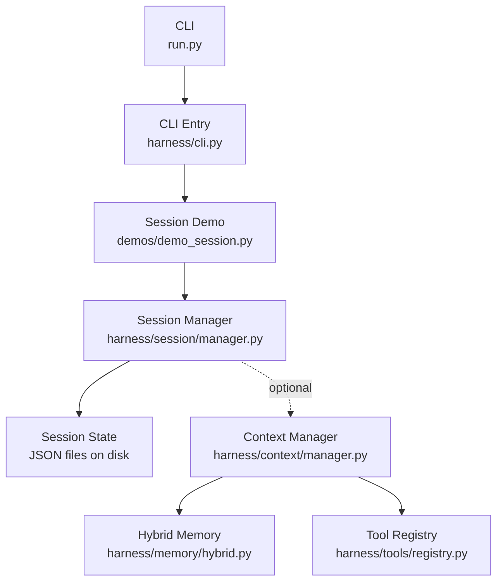
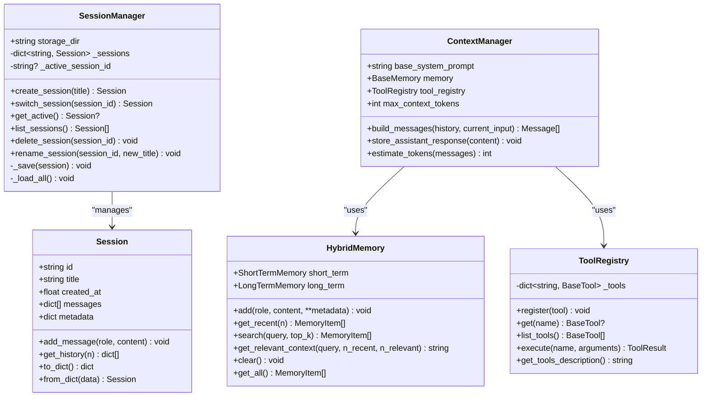
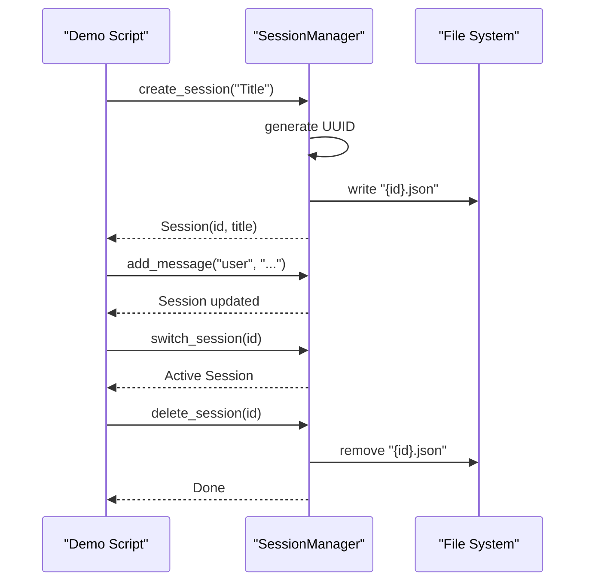
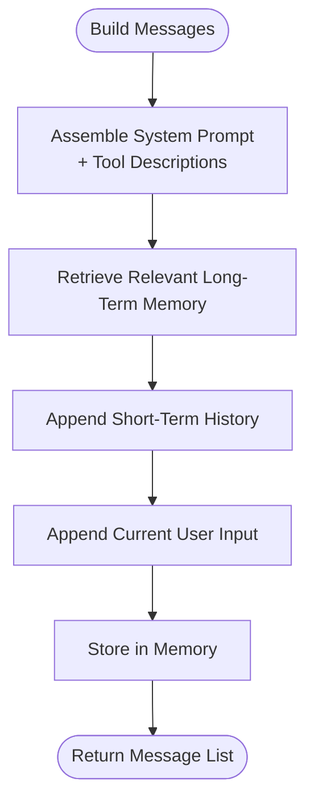
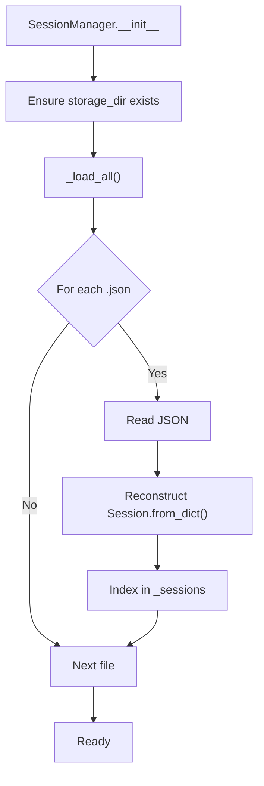
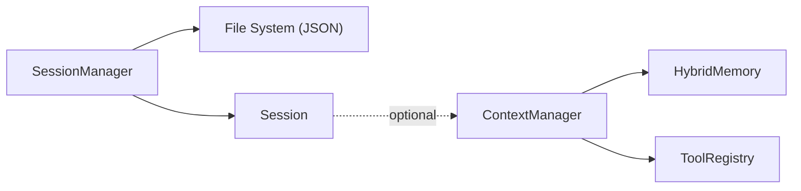

# Session Management Demo

<cite>
**Referenced Files in This Document**
- [demo_session.py](file://demos/demo_session.py)
- [manager.py](file://harness/session/manager.py)
- [manager.py](file://harness/context/manager.py)
- [hybrid.py](file://harness/memory/hybrid.py)
- [registry.py](file://harness/tools/registry.py)
- [cli.py](file://harness/cli.py)
- [README.md](file://README.md)
</cite>

## Table of Contents
1. [Introduction](#introduction)
2. [Project Structure](#project-structure)
3. [Core Components](#core-components)
4. [Architecture Overview](#architecture-overview)
5. [Detailed Component Analysis](#detailed-component-analysis)
6. [Dependency Analysis](#dependency-analysis)
7. [Performance Considerations](#performance-considerations)
8. [Troubleshooting Guide](#troubleshooting-guide)
9. [Conclusion](#conclusion)
10. [Appendices](#appendices)

## Introduction
This document explains the session management demo that demonstrates conversation isolation and state persistence. It covers how sessions provide independent state containers for multiple concurrent conversations, the lifecycle of a session (creation, activation, deactivation, cleanup), how each session maintains isolated context, memory, and tool registries, and how states are persisted to disk. It also includes practical guidance for long-running conversations, multi-user scenarios, recovery after failures, performance considerations, and debugging techniques.

## Project Structure
The session management demo is implemented under demos and harness/session with supporting components for context assembly, memory, and tools. The CLI exposes a dedicated session demo command.

**Diagram sources**
- [cli.py:279-328](file://harness/cli.py#L279-L328)
- [demo_session.py:1-43](file://demos/demo_session.py#L1-L43)
- [manager.py:1-146](file://harness/session/manager.py#L1-L146)
- [manager.py:1-118](file://harness/context/manager.py#L1-L118)
- [hybrid.py:1-84](file://harness/memory/hybrid.py#L1-L84)
- [registry.py:1-74](file://harness/tools/registry.py#L1-L74)

**Section sources**
- [README.md:73-131](file://README.md#L73-L131)
- [cli.py:279-328](file://harness/cli.py#L279-L328)
- [demo_session.py:1-43](file://demos/demo_session.py#L1-L43)

## Core Components
- Session: Represents an isolated conversation with its own history, metadata, and timestamps. Supports adding messages, retrieving recent history, and serialization/deserialization.
- SessionManager: Manages multiple sessions, tracks the active session, persists sessions to JSON files, and provides CRUD operations (create, list, switch, rename, delete).
- ContextManager: Assembles prompts by combining system instructions, tool descriptions, relevant long-term memory, short-term history, and current input. Integrates with HybridMemory and ToolRegistry.
- HybridMemory: Combines short-term buffer and long-term persistent storage; builds context strings from recent and relevant memories.
- ToolRegistry: Central catalog of available tools, used to generate tool descriptions for prompts and execute tools safely.

Key responsibilities:
- Isolation: Each Session holds its own messages and metadata.
- Persistence: Sessions are saved as JSON files per session ID.
- Context assembly: ContextManager composes prompts using memory and tools.

**Section sources**
- [manager.py:32-68](file://harness/session/manager.py#L32-L68)
- [manager.py:71-146](file://harness/session/manager.py#L71-L146)
- [manager.py:41-104](file://harness/context/manager.py#L41-L104)
- [hybrid.py:22-84](file://harness/memory/hybrid.py#L22-L84)
- [registry.py:17-74](file://harness/tools/registry.py#L17-L74)

## Architecture Overview
The session architecture centers around SessionManager, which owns in-memory Session objects and persists them to disk. ContextManager can be attached to agents or workflows to build prompts using the active session’s history and memory. Tools are registered centrally and described into prompts.

**Diagram sources**
- [manager.py:32-68](file://harness/session/manager.py#L32-L68)
- [manager.py:71-146](file://harness/session/manager.py#L71-L146)
- [manager.py:41-104](file://harness/context/manager.py#L41-L104)
- [hybrid.py:22-84](file://harness/memory/hybrid.py#L22-L84)
- [registry.py:17-74](file://harness/tools/registry.py#L17-L74)

## Detailed Component Analysis

### Session Lifecycle
- Creation: SessionManager.create_session generates a unique ID, constructs a Session, stores it in memory, sets it as active, and persists to JSON.
- Activation: Switching via switch_session updates the active session pointer. get_active returns the currently active session if any.
- Deactivation: Deleting a session removes it from memory and deletes its JSON file; if it was active, the active pointer is cleared.
- Cleanup: delete_session ensures no dangling references remain and cleans up storage.

**Diagram sources**
- [manager.py:81-116](file://harness/session/manager.py#L81-L116)
- [manager.py:124-143](file://harness/session/manager.py#L124-L143)

**Section sources**
- [manager.py:81-116](file://harness/session/manager.py#L81-L116)
- [manager.py:124-143](file://harness/session/manager.py#L124-L143)

### Conversation Isolation and State Containers
- Each Session encapsulates its own messages list and metadata.
- SessionManager keeps a dictionary of sessions keyed by ID, ensuring isolation between conversations.
- Active session selection allows one thread/process to operate on a single conversation at a time.

Practical implications:
- Different topics maintain separate histories.
- No cross-talk between unrelated conversations unless explicitly merged.

**Section sources**
- [manager.py:32-68](file://harness/session/manager.py#L32-L68)
- [manager.py:71-106](file://harness/session/manager.py#L71-L106)

### Context Assembly and Tool Registries
- ContextManager.build_messages composes the final prompt:
  - System prompt with optional tool instructions and tool descriptions from ToolRegistry.
  - Relevant long-term memory via HybridMemory.get_relevant_context.
  - Short-term history passed in.
  - Current user input appended.
- store_assistant_response persists assistant responses into memory for future retrieval.

**Diagram sources**
- [manager.py:61-104](file://harness/context/manager.py#L61-L104)
- [hybrid.py:46-73](file://harness/memory/hybrid.py#L46-L73)
- [registry.py:62-67](file://harness/tools/registry.py#L62-L67)

**Section sources**
- [manager.py:61-104](file://harness/context/manager.py#L61-L104)
- [hybrid.py:46-73](file://harness/memory/hybrid.py#L46-L73)
- [registry.py:62-67](file://harness/tools/registry.py#L62-L67)

### Persistence Mechanisms
- Storage format: JSON files named by session ID with fields id, title, created_at, messages, metadata.
- Save path: storage_dir set during SessionManager initialization; defaults to ".sessions".
- Load behavior: On init, SessionManager scans storage_dir for JSON files and reconstructs sessions. Errors during load are logged but do not crash the manager.

**Diagram sources**
- [manager.py:74-79](file://harness/session/manager.py#L74-L79)
- [manager.py:129-143](file://harness/session/manager.py#L129-L143)
- [manager.py:124-128](file://harness/session/manager.py#L124-L128)

**Section sources**
- [manager.py:74-79](file://harness/session/manager.py#L74-L79)
- [manager.py:124-143](file://harness/session/manager.py#L124-L143)

### Practical Examples

#### Managing Long-Running Conversations
- Use Session.add_message to append user and assistant turns within a specific session.
- Retrieve recent history via Session.get_history(n) to keep context bounded.
- Persist automatically on create/rename; ensure you call create_session once per conversation and reuse the same Session object across interactions.

References:
- Adding messages and retrieving history: [manager.py:41-49](file://harness/session/manager.py#L41-L49)
- Listing and switching sessions: [manager.py:91-106](file://harness/session/manager.py#L91-L106)

**Section sources**
- [manager.py:41-49](file://harness/session/manager.py#L41-L49)
- [manager.py:91-106](file://harness/session/manager.py#L91-L106)

#### Implementing Multi-User Scenarios
- Maintain a SessionManager per user or per process/thread.
- Assign each user a dedicated session ID and persist it (e.g., in a database or token) to resume later.
- When building prompts, pass the selected session’s history to ContextManager.build_messages so each user’s context remains isolated.

References:
- Session isolation and active session management: [manager.py:71-106](file://harness/session/manager.py#L71-L106)
- Context assembly with history: [manager.py:61-104](file://harness/context/manager.py#L61-L104)

**Section sources**
- [manager.py:71-106](file://harness/session/manager.py#L71-L106)
- [manager.py:61-104](file://harness/context/manager.py#L61-L104)

#### Handling Session Recovery After Failures
- On startup, SessionManager._load_all restores all persisted sessions from disk.
- If a JSON file is corrupted, loading errors are logged and the session is skipped; other sessions remain intact.
- To recover, inspect storage_dir for orphaned JSON files and validate their structure.

References:
- Load-all logic and error handling: [manager.py:129-143](file://harness/session/manager.py#L129-L143)

**Section sources**
- [manager.py:129-143](file://harness/session/manager.py#L129-L143)

## Dependency Analysis
Sessions depend on:
- Filesystem for persistence (JSON).
- Optional integration with ContextManager for prompt assembly.
- HybridMemory for long-term retrieval and short-term buffering.
- ToolRegistry for tool descriptions and execution.

**Diagram sources**
- [manager.py:71-146](file://harness/session/manager.py#L71-L146)
- [manager.py:41-104](file://harness/context/manager.py#L41-L104)
- [hybrid.py:22-84](file://harness/memory/hybrid.py#L22-L84)
- [registry.py:17-74](file://harness/tools/registry.py#L17-L74)

**Section sources**
- [manager.py:71-146](file://harness/session/manager.py#L71-L146)
- [manager.py:41-104](file://harness/context/manager.py#L41-L104)
- [hybrid.py:22-84](file://harness/memory/hybrid.py#L22-L84)
- [registry.py:17-74](file://harness/tools/registry.py#L17-L74)

## Performance Considerations
- Context window management: Use ContextManager.estimate_tokens to approximate token usage and avoid exceeding model limits.
- Memory growth: Limit short-term history via HybridMemory capacity and retrieve only recent messages when building prompts.
- I/O overhead: Persist sessions on create/rename; batch writes if needed for high-throughput scenarios.
- Concurrency: Ensure one active session per thread/process to prevent race conditions on the active pointer.
- Scaling: For many concurrent users, consider one SessionManager per process and distribute sessions across processes or use a shared backend (e.g., database-backed persistence) beyond JSON.

[No sources needed since this section provides general guidance]

## Troubleshooting Guide
Common issues and remedies:
- Session not found when switching: Validate session IDs and ensure they exist in SessionManager._sessions before switching.
- Corrupted session file: Check storage_dir for malformed JSON; logs will indicate failures during load.
- Missing tool descriptions: Verify ToolRegistry has registered tools; ContextManager uses registry.get_tools_description() to inject tool info.
- Excessive context size: Reduce n_recent or n_relevant in HybridMemory.get_relevant_context; trim history via Session.get_history(n).

Operational tips:
- Enable logging to capture session load/save events and tool execution errors.
- Inspect storage_dir contents to verify persistence state.
- Use list_sessions to audit active and inactive sessions.

**Section sources**
- [manager.py:91-96](file://harness/session/manager.py#L91-L96)
- [manager.py:129-143](file://harness/session/manager.py#L129-L143)
- [registry.py:43-67](file://harness/tools/registry.py#L43-L67)
- [hybrid.py:46-73](file://harness/memory/hybrid.py#L46-L73)

## Conclusion
The session management demo provides a clear, extensible foundation for isolating conversations and persisting state. SessionManager offers straightforward APIs to create, switch, list, rename, and delete sessions, while ContextManager integrates memory and tools to assemble effective prompts. With careful attention to context sizing, concurrency, and persistence reliability, this architecture scales to multi-user environments and supports robust recovery strategies.

[No sources needed since this section summarizes without analyzing specific files]

## Appendices

### Running the Session Demo
- Via CLI: python run.py session
- Directly: python demos/demo_session.py

These invoke the session demo flow that creates multiple sessions, adds messages, lists sessions, switches the active session, and performs cleanup.

**Section sources**
- [cli.py:279-328](file://harness/cli.py#L279-L328)
- [demo_session.py:1-43](file://demos/demo_session.py#L1-L43)