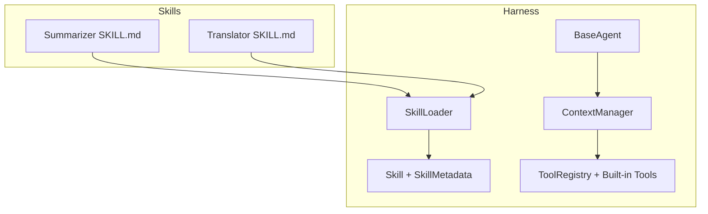
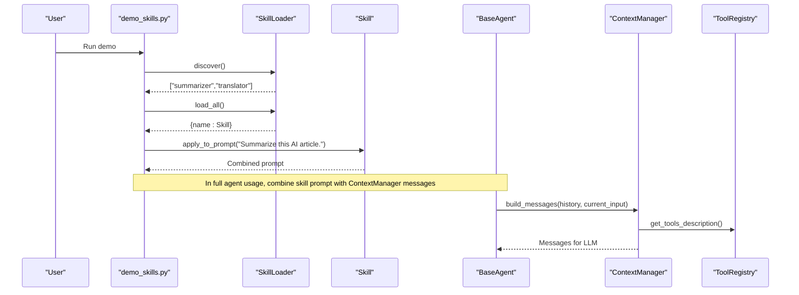
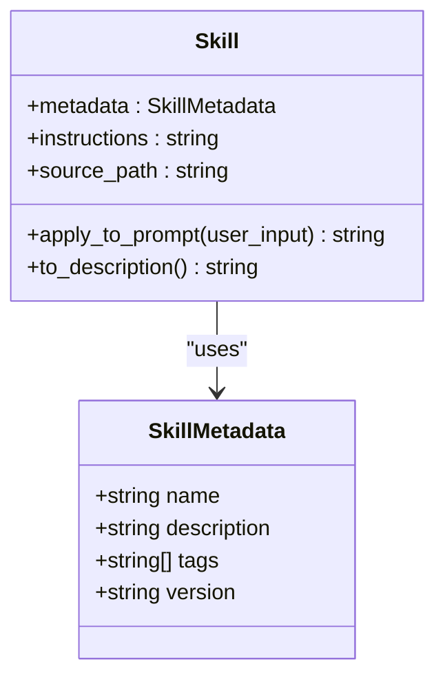
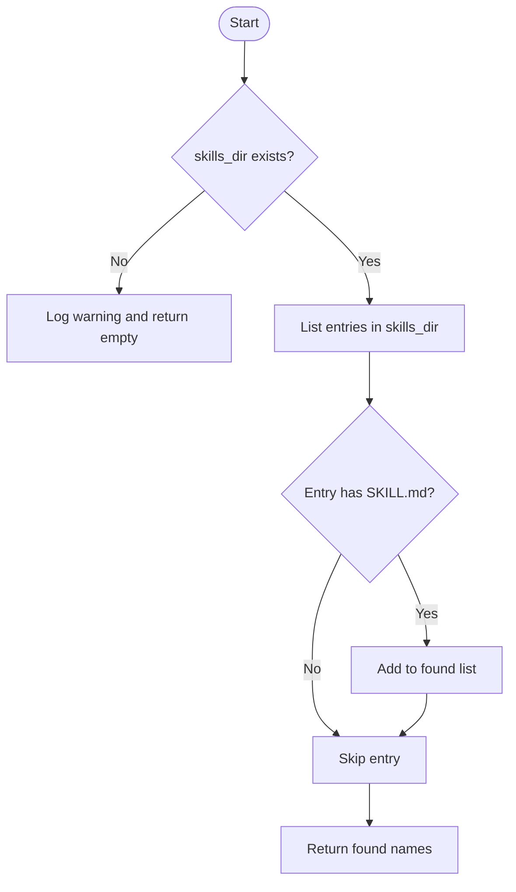
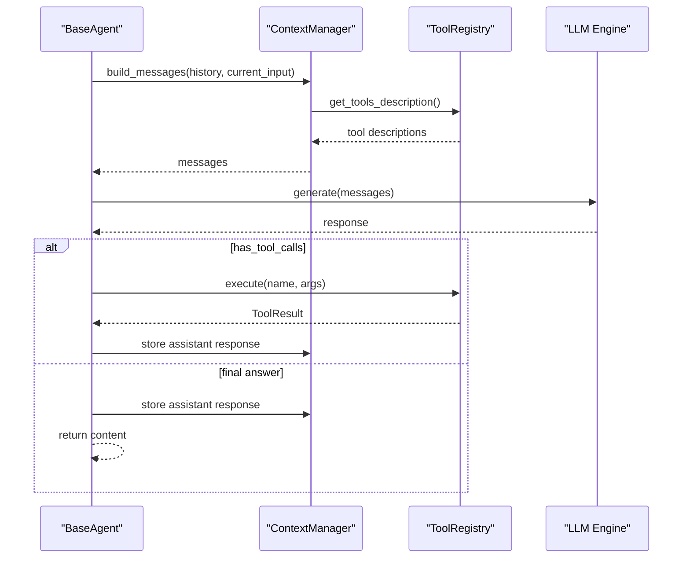
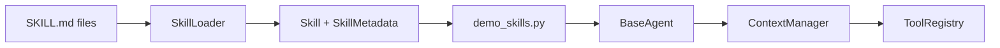

# Skills System Demo

<cite>
**Referenced Files in This Document**
- [SKILL.md (Summarizer)](file://demos/skills/summarizer/SKILL.md)
- [SKILL.md (Translator)](file://demos/skills/translator/SKILL.md)
- [Skill Base](file://harness/skill/base.py)
- [Skill Loader](file://harness/skill/loader.py)
- [Demo Skills](file://demos/demo_skills.py)
- [Agent Base](file://harness/agent/base.py)
- [Context Manager](file://harness/context/manager.py)
- [Tool Base](file://harness/tools/base.py)
- [Tool Registry](file://harness/tools/registry.py)
- [Built-in Tools](file://harness/tools/builtin.py)
- [README](file://README.md)
</cite>

## Table of Contents
1. [Introduction](#introduction)
2. [Project Structure](#project-structure)
3. [Core Components](#core-components)
4. [Architecture Overview](#architecture-overview)
5. [Detailed Component Analysis](#detailed-component-analysis)
6. [Dependency Analysis](#dependency-analysis)
7. [Performance Considerations](#performance-considerations)
8. [Troubleshooting Guide](#troubleshooting-guide)
9. [Conclusion](#conclusion)
10. [Appendices](#appendices)

## Introduction
This document explains the skills system demo that showcases markdown-based capability definitions for agents. It details how SKILL.md files define reusable agent capabilities, how skills are discovered and loaded automatically, and how skill instructions are injected into the agent’s context to guide behavior. It also covers the built-in summarizer and translator skills as examples, provides guidelines for creating custom skills, best practices for authoring, testing strategies, and patterns for versioning, dependency management, and distribution.

## Project Structure
The skills system is implemented under harness/skill with two core modules:
- Skill base model and prompt application logic
- Skill discovery and parsing from filesystem directories

Skills are authored as SKILL.md files inside dedicated folders under demos/skills. A demo script demonstrates discovery, loading, listing, and applying skills to user requests.

**Diagram sources**
- [Skill Loader:26-79](file://harness/skill/loader.py#L26-L79)
- [Skill Base:25-69](file://harness/skill/base.py#L25-L69)
- [Agent Base:63-165](file://harness/agent/base.py#L63-L165)
- [Context Manager:41-118](file://harness/context/manager.py#L41-L118)
- [Tool Registry:17-74](file://harness/tools/registry.py#L17-L74)
- [Built-in Tools:13-83](file://harness/tools/builtin.py#L13-L83)

**Section sources**
- [Skill Loader:26-79](file://harness/skill/loader.py#L26-L79)
- [Skill Base:25-69](file://harness/skill/base.py#L25-L69)
- [Demo Skills:11-34](file://demos/demo_skills.py#L11-L34)
- [README:236-252](file://README.md#L236-L252)

## Core Components
- SkillMetadata: Holds name, description, tags, and version extracted from SKILL.md frontmatter.
- Skill: Encapsulates metadata, instructions, source path, and a method to apply instructions to a user request by generating a combined prompt.
- SkillLoader: Scans a directory for SKILL.md files, parses frontmatter and instructions, caches loaded skills, and exposes methods to discover, load, list, and retrieve skills.
- Demo script: Demonstrates discovering skills, loading all of them, printing descriptions, and applying each skill to a sample request.

Key behaviors:
- Discovery scans for directories containing a SKILL.md file.
- Parsing extracts YAML-like frontmatter fields and separates instructions from frontmatter.
- Prompt application prepends skill instructions and appends the user request in a structured format.

**Section sources**
- [Skill Base:25-69](file://harness/skill/base.py#L25-L69)
- [Skill Loader:26-122](file://harness/skill/loader.py#L26-L122)
- [Demo Skills:11-34](file://demos/demo_skills.py#L11-L34)

## Architecture Overview
The skills system integrates with the agent loop via prompt injection. While skills are not directly invoked as tools, their instructions shape the agent’s behavior when applied to prompts. The typical flow:
- Skills are discovered and loaded from a configured directory.
- Each skill can be applied to a user input to produce a specialized prompt.
- In an agent workflow, this prompt becomes part of the system or user message, guiding the LLM to behave according to the skill’s instructions.

**Diagram sources**
- [Demo Skills:11-34](file://demos/demo_skills.py#L11-L34)
- [Skill Loader:33-79](file://harness/skill/loader.py#L33-L79)
- [Skill Base:55-65](file://harness/skill/base.py#L55-L65)
- [Agent Base:97-165](file://harness/agent/base.py#L97-L165)
- [Context Manager:61-104](file://harness/context/manager.py#L61-L104)
- [Tool Registry:62-67](file://harness/tools/registry.py#L62-L67)

## Detailed Component Analysis

### Skill Model and Prompt Application
- SkillMetadata captures key attributes parsed from SKILL.md frontmatter.
- Skill stores instructions and provides apply_to_prompt to generate a combined prompt that includes skill instructions followed by the user request.
- to_description formats a human-readable summary including tags.

**Diagram sources**
- [Skill Base:25-69](file://harness/skill/base.py#L25-L69)

**Section sources**
- [Skill Base:25-69](file://harness/skill/base.py#L25-L69)

### Skill Discovery and Loading
- SkillLoader discovers skills by scanning a directory for subfolders containing SKILL.md.
- It loads individual skills or all discovered skills, caching them internally.
- Parsing uses regex to extract frontmatter fields (name, description, tags, version) and separates instructions from frontmatter. If no name is found, it falls back to the first heading.

**Diagram sources**
- [Skill Loader:33-43](file://harness/skill/loader.py#L33-L43)

**Section sources**
- [Skill Loader:33-122](file://harness/skill/loader.py#L33-L122)

### Integration with Agent Loop and Context
- The agent loop builds messages using ContextManager, which composes system prompt, tool descriptions, memory context, history, and current input.
- Skills integrate by providing instruction text that can be included in the system or user message before calling the LLM.
- Tool registry supplies tool descriptions to inform the LLM about available tools.

**Diagram sources**
- [Agent Base:97-165](file://harness/agent/base.py#L97-L165)
- [Context Manager:61-104](file://harness/context/manager.py#L61-L104)
- [Tool Registry:43-67](file://harness/tools/registry.py#L43-L67)

**Section sources**
- [Agent Base:97-165](file://harness/agent/base.py#L97-L165)
- [Context Manager:61-104](file://harness/context/manager.py#L61-L104)
- [Tool Registry:43-67](file://harness/tools/registry.py#L43-L67)

### Built-in Summarizer Skill
- Purpose: Summarizes long text into concise key points.
- Structure: Frontmatter defines name, description, tags, and version; body contains role definition, step-by-step instructions, output format, and rules.
- Usage: Apply to a user request to generate a prompt that instructs the LLM to summarize according to the defined rules.

**Section sources**
- [SKILL.md (Summarizer):1-29](file://demos/skills/summarizer/SKILL.md#L1-L29)
- [Skill Base:55-65](file://harness/skill/base.py#L55-L65)

### Built-in Translator Skill
- Purpose: Translates text between languages while preserving meaning, tone, and context.
- Structure: Frontmatter defines name, description, tags, and version; body defines role, translation steps, output format, and supported languages.
- Usage: Apply to a user request to generate a prompt that guides the LLM to translate with specified constraints.

**Section sources**
- [SKILL.md (Translator):1-30](file://demos/skills/translator/SKILL.md#L1-L30)
- [Skill Base:55-65](file://harness/skill/base.py#L55-L65)

### Demo Script Behavior
- Discovers skills in demos/skills.
- Loads all skills and prints descriptions.
- Applies each skill to a sample request and prints the resulting prompt snippet.

**Section sources**
- [Demo Skills:11-34](file://demos/demo_skills.py#L11-L34)

## Dependency Analysis
Skills depend on:
- Filesystem access to locate SKILL.md files.
- Regex-based parsing to extract frontmatter and instructions.
- The Skill data model to encapsulate metadata and instructions.

Integration points:
- Agent loop consumes prompts that may include skill instructions.
- Context manager composes messages and injects tool descriptions.
- Tool registry provides tool capabilities to the agent.

**Diagram sources**
- [Skill Loader:33-79](file://harness/skill/loader.py#L33-L79)
- [Skill Base:25-69](file://harness/skill/base.py#L25-L69)
- [Demo Skills:11-34](file://demos/demo_skills.py#L11-L34)
- [Agent Base:97-165](file://harness/agent/base.py#L97-L165)
- [Context Manager:61-104](file://harness/context/manager.py#L61-L104)
- [Tool Registry:43-67](file://harness/tools/registry.py#L43-L67)

**Section sources**
- [Skill Loader:33-79](file://harness/skill/loader.py#L33-L79)
- [Skill Base:25-69](file://harness/skill/base.py#L25-L69)
- [Demo Skills:11-34](file://demos/demo_skills.py#L11-L34)
- [Agent Base:97-165](file://harness/agent/base.py#L97-L165)
- [Context Manager:61-104](file://harness/context/manager.py#L61-L104)
- [Tool Registry:43-67](file://harness/tools/registry.py#L43-L67)

## Performance Considerations
- Directory scanning: Discovery iterates over the skills directory once per load_all call; cache results if frequently accessed.
- Parsing overhead: Regex parsing runs per skill load; consider caching parsed results per path.
- Prompt size: Applying skills adds instruction text to prompts; monitor token usage to avoid exceeding context limits.
- Memory: Cached skills are stored in memory; ensure only needed skills are loaded in large deployments.

[No sources needed since this section provides general guidance]

## Troubleshooting Guide
Common issues and resolutions:
- Skills directory not found: Ensure the configured skills_dir exists and is readable; loader logs a warning and returns an empty list.
- Missing SKILL.md: Discovery only includes directories containing a SKILL.md file; verify file presence and naming.
- Parse errors: Frontmatter must follow expected keys (name, description, tags, version); missing name falls back to first heading.
- Load failures: Exceptions during load are logged; check logs for specific error messages and fix malformed SKILL.md.

Operational tips:
- Use demo_skills.py to validate discovery and loading before integrating with the agent.
- Inspect generated prompts via apply_to_prompt to confirm correct instruction injection.

**Section sources**
- [Skill Loader:33-71](file://harness/skill/loader.py#L33-L71)
- [Skill Loader:81-122](file://harness/skill/loader.py#L81-L122)
- [Demo Skills:11-34](file://demos/demo_skills.py#L11-L34)

## Conclusion
The skills system enables modular, reusable agent capabilities defined purely through markdown. Skills are discovered automatically, parsed into structured metadata and instructions, and can be applied to prompts to guide agent behavior. The built-in summarizer and translator demonstrate effective skill authoring patterns. By following the guidelines and best practices outlined here, you can create, test, version, and distribute skills across projects to enhance agent functionality consistently.

[No sources needed since this section summarizes without analyzing specific files]

## Appendices

### Creating Custom Skills
- Create a new folder under your skills directory (e.g., my_skills/my_skill).
- Add a SKILL.md file with:
  - Frontmatter: name, description, tags, version
  - Instructions: clear role definition, step-by-step procedures, output format, and rules
- Validate discovery and loading using the demo script.

**Section sources**
- [Skill Loader:33-79](file://harness/skill/loader.py#L33-L79)
- [Skill Loader:81-122](file://harness/skill/loader.py#L81-L122)
- [Demo Skills:11-34](file://demos/demo_skills.py#L11-L34)

### Best Practices for Skill Authoring
- Keep instructions concise and unambiguous.
- Define explicit output formats to improve downstream processing.
- Use tags to categorize skills for easier discovery and filtering.
- Version frontmatter to track changes and enable compatibility checks.
- Include examples within instructions where helpful.

[No sources needed since this section provides general guidance]

### Testing Strategies for Skill Validation
- Discovery tests: Assert that known skills are detected in the configured directory.
- Parsing tests: Verify frontmatter extraction for name, description, tags, and version.
- Prompt tests: Apply skills to sample inputs and assert structure of generated prompts.
- Integration tests: Combine skill prompts with ContextManager messages and verify agent behavior with mock LLM responses.

**Section sources**
- [Skill Loader:33-79](file://harness/skill/loader.py#L33-L79)
- [Skill Base:55-65](file://harness/skill/base.py#L55-L65)
- [Context Manager:61-104](file://harness/context/manager.py#L61-L104)

### Versioning, Dependencies, and Distribution
- Versioning: Use the version field in frontmatter to indicate skill versions; adopt semantic versioning conventions for clarity.
- Dependencies: Skills are self-contained; if external assets are required, place them alongside SKILL.md and reference them in instructions.
- Distribution: Package skills directories as reusable modules; share via repositories or packages; consumers configure the skills_dir to point to shared locations.
- Compatibility: Maintain backward compatibility in instruction semantics when updating versions; document breaking changes.

[No sources needed since this section provides general guidance]