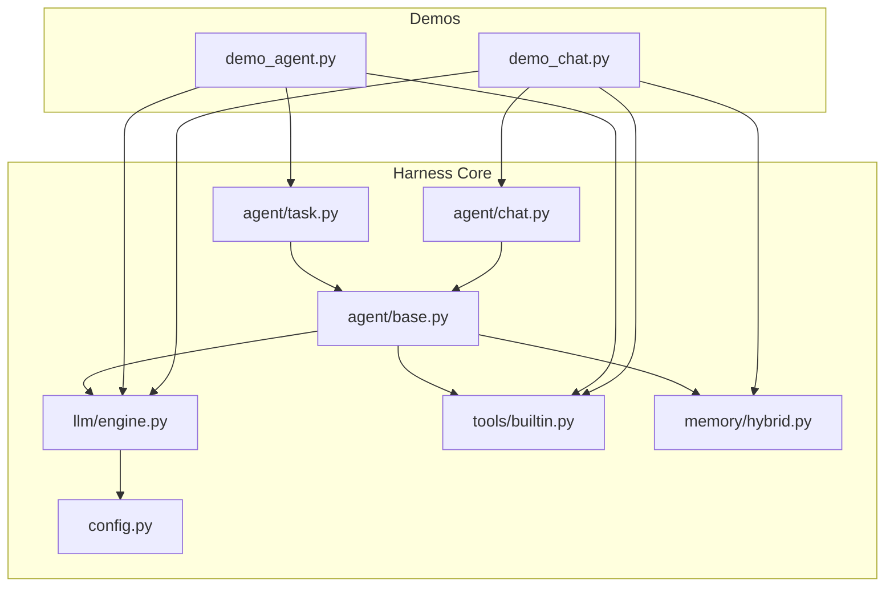
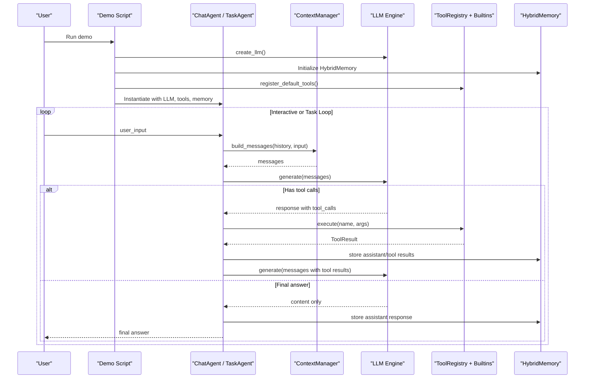
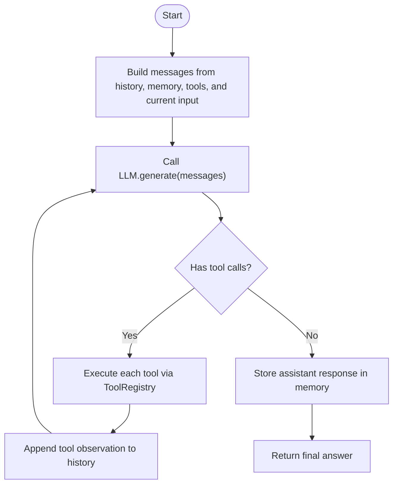
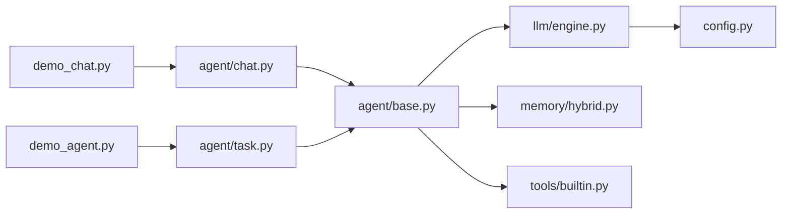

# Basic Demos

<cite>
**Referenced Files in This Document**
- [README.md](file://README.md)
- [setup.sh](file://setup.sh)
- [requirements.txt](file://requirements.txt)
- [run.py](file://run.py)
- [harness/config.py](file://harness/config.py)
- [harness/llm/engine.py](file://harness/llm/engine.py)
- [harness/agent/base.py](file://harness/agent/base.py)
- [harness/agent/chat.py](file://harness/agent/chat.py)
- [harness/agent/task.py](file://harness/agent/task.py)
- [harness/tools/builtin.py](file://harness/tools/builtin.py)
- [harness/memory/hybrid.py](file://harness/memory/hybrid.py)
- [demos/demo_chat.py](file://demos/demo_chat.py)
- [demos/demo_agent.py](file://demos/demo_agent.py)
</cite>

## Table of Contents
1. [Introduction](#introduction)
2. [Project Structure](#project-structure)
3. [Core Components](#core-components)
4. [Architecture Overview](#architecture-overview)
5. [Detailed Component Analysis](#detailed-component-analysis)
6. [Dependency Analysis](#dependency-analysis)
7. [Performance Considerations](#performance-considerations)
8. [Troubleshooting Guide](#troubleshooting-guide)
9. [Conclusion](#conclusion)
10. [Appendices](#appendices)

## Introduction
This section documents the basic demos that demonstrate fundamental framework usage patterns:
- Interactive chat demo with tool-calling capabilities
- Agent demo for autonomous task completion using built-in tools

You will learn how to set up the environment, configure LLM backends, run the demos, customize prompts and tools, and troubleshoot common issues.

## Project Structure
The demos are thin entry points that wire together core components from the harness:
- LLM engine (mock or transformers)
- Agents (ChatAgent for conversation, TaskAgent for tasks)
- Tool registry and built-in tools
- Hybrid memory for short-term and long-term context

**Diagram sources**
- [demos/demo_chat.py:1-47](file://demos/demo_chat.py#L1-L47)
- [demos/demo_agent.py:1-40](file://demos/demo_agent.py#L1-L40)
- [harness/agent/base.py:63-165](file://harness/agent/base.py#L63-L165)
- [harness/agent/chat.py:25-60](file://harness/agent/chat.py#L25-L60)
- [harness/agent/task.py:32-73](file://harness/agent/task.py#L32-L73)
- [harness/llm/engine.py:404-421](file://harness/llm/engine.py#L404-L421)
- [harness/tools/builtin.py:77-83](file://harness/tools/builtin.py#L77-L83)
- [harness/memory/hybrid.py:22-84](file://harness/memory/hybrid.py#L22-L84)
- [harness/config.py:8-70](file://harness/config.py#L8-L70)

**Section sources**
- [README.md:22-69](file://README.md#L22-L69)
- [run.py:1-28](file://run.py#L1-L28)

## Core Components
- LLM Engine: Abstract interface with Transformers and Mock backends; factory selects backend based on configuration.
- Agents: Base agent implements the core loop; ChatAgent optimizes multi-turn dialogue; TaskAgent focuses on structured task execution.
- Tools: Built-in tools for math, datetime, and file operations; registered via a registry.
- Memory: Hybrid memory combines recent conversation history with relevant past memories.

Key responsibilities:
- LLM engine generates responses and parses tool calls.
- Agents orchestrate context building, LLM calls, tool execution, and final answers.
- Tools provide safe, focused capabilities.
- Memory provides both immediate and retrieved context.

**Section sources**
- [harness/llm/engine.py:127-147](file://harness/llm/engine.py#L127-L147)
- [harness/agent/base.py:63-165](file://harness/agent/base.py#L63-L165)
- [harness/agent/chat.py:25-60](file://harness/agent/chat.py#L25-L60)
- [harness/agent/task.py:32-73](file://harness/agent/task.py#L32-L73)
- [harness/tools/builtin.py:13-83](file://harness/tools/builtin.py#L13-L83)
- [harness/memory/hybrid.py:22-84](file://harness/memory/hybrid.py#L22-L84)

## Architecture Overview
The demos wire together agents, tools, memory, and an LLM backend to enable conversational AI and autonomous task completion.

**Diagram sources**
- [harness/agent/base.py:97-160](file://harness/agent/base.py#L97-L160)
- [harness/llm/engine.py:206-241](file://harness/llm/engine.py#L206-L241)
- [harness/llm/engine.py:254-399](file://harness/llm/engine.py#L254-L399)
- [harness/tools/builtin.py:77-83](file://harness/tools/builtin.py#L77-L83)
- [harness/memory/hybrid.py:33-73](file://harness/memory/hybrid.py#L33-L73)

## Detailed Component Analysis

### Interactive Chat Demo
Purpose: Demonstrate conversational AI with tool-calling capabilities in an interactive loop.

Setup and execution:
- Ensure Python 3.11 is available and dependencies are installed.
- Use the mock backend to avoid model downloads, or switch to transformers for real models.
- Run the demo script directly or via the CLI runner.

Expected behavior:
- The demo prints model info and available tools.
- You type messages; the agent responds, optionally calling tools like calculator or datetime.
- Type quit/exit/q to stop.

Customization examples:
- Change the LLM backend by setting the appropriate environment variable before running.
- Adjust memory persistence path when initializing HybridMemory.
- Modify the system prompt in ChatAgent to tailor personality or instructions.

Common interactions:
- Ask for calculations to trigger the calculator tool.
- Ask for date/time to trigger the datetime tool.
- Request file listing or reading to trigger file_ops.

**Section sources**
- [demos/demo_chat.py:1-47](file://demos/demo_chat.py#L1-L47)
- [harness/agent/chat.py:25-60](file://harness/agent/chat.py#L25-L60)
- [harness/memory/hybrid.py:22-84](file://harness/memory/hybrid.py#L22-L84)
- [harness/llm/engine.py:404-421](file://harness/llm/engine.py#L404-L421)
- [README.md:22-69](file://README.md#L22-L69)

### Agent Demo (Autonomous Task Completion)
Purpose: Demonstrate a single agent completing specific tasks using tools in a loop.

Setup and execution:
- Same environment setup as the chat demo.
- Run the agent demo script directly or via the CLI runner.

Expected behavior:
- The demo defines a list of tasks and executes each one.
- For each task, the agent may call multiple tools and returns a structured result.
- History is cleared between tasks to keep outputs clean.

Customization examples:
- Add new tasks to the list to test different workflows.
- Register additional custom tools to extend capabilities.
- Switch to a real model backend to observe actual tool-calling behavior.

**Section sources**
- [demos/demo_agent.py:1-40](file://demos/demo_agent.py#L1-L40)
- [harness/agent/task.py:32-73](file://harness/agent/task.py#L32-L73)
- [harness/tools/builtin.py:77-83](file://harness/tools/builtin.py#L77-L83)
- [README.md:22-69](file://README.md#L22-L69)

### Agent Loop Flow (Core Logic)
The agent loop builds context, calls the LLM, executes tool calls if needed, and repeats until a final answer is produced.

**Diagram sources**
- [harness/agent/base.py:97-160](file://harness/agent/base.py#L97-L160)

### Tool System and Built-ins
Built-in tools include:
- Calculator: safely evaluates mathematical expressions.
- DateTime: returns current date, time, or both.
- FileOps: lists directory contents or reads files (read-only).

These tools are registered into a registry and can be invoked by agents during the loop.

**Section sources**
- [harness/tools/builtin.py:13-83](file://harness/tools/builtin.py#L13-L83)

### Memory System
Hybrid memory combines:
- Short-term buffer for recent messages.
- Long-term storage with retrieval for relevant past memories.

It constructs context by merging recent and relevant items for the LLM.

**Section sources**
- [harness/memory/hybrid.py:22-84](file://harness/memory/hybrid.py#L22-L84)

## Dependency Analysis
High-level dependencies among core modules used by the demos:

**Diagram sources**
- [demos/demo_chat.py:1-47](file://demos/demo_chat.py#L1-L47)
- [demos/demo_agent.py:1-40](file://demos/demo_agent.py#L1-L40)
- [harness/agent/chat.py:25-60](file://harness/agent/chat.py#L25-L60)
- [harness/agent/task.py:32-73](file://harness/agent/task.py#L32-L73)
- [harness/agent/base.py:63-165](file://harness/agent/base.py#L63-L165)
- [harness/llm/engine.py:404-421](file://harness/llm/engine.py#L404-L421)
- [harness/memory/hybrid.py:22-84](file://harness/memory/hybrid.py#L22-L84)
- [harness/tools/builtin.py:77-83](file://harness/tools/builtin.py#L77-L83)
- [harness/config.py:8-70](file://harness/config.py#L8-L70)

**Section sources**
- [README.md:73-131](file://README.md#L73-L131)

## Performance Considerations
- Use the mock backend for fast iteration without GPU requirements.
- When using the transformers backend, prefer CPU for quick tests or GPU/MPS for faster inference.
- Limit max iterations to prevent excessive loops in complex tasks.
- Keep memory capacity reasonable to control context size and token usage.
- Prefer concise prompts and tools to reduce overhead.

[No sources needed since this section provides general guidance]

## Troubleshooting Guide
Environment setup:
- Ensure Python 3.11 is installed; the setup script checks for it.
- Activate the virtual environment created by the setup script before running demos.
- Install dependencies using the provided script or pip.

Model loading problems:
- If using the transformers backend, ensure torch, transformers, and accelerate are installed.
- First run may download the model; allow sufficient disk space and network access.
- Set device to cpu, cuda, or mps explicitly if auto-detection fails.

Common runtime issues:
- If no tool calls occur, verify that tools are registered and the LLM backend supports tool-call parsing.
- If the agent appears stuck, reduce max_iterations or simplify the task.
- For file operations, ensure paths exist and permissions allow read access.

Configuration tips:
- Switch backends via environment variables.
- Adjust temperature and max tokens to balance creativity and determinism.
- Persist memory to a known path for debugging conversations.

**Section sources**
- [setup.sh:20-77](file://setup.sh#L20-L77)
- [requirements.txt:1-14](file://requirements.txt#L1-L14)
- [harness/llm/engine.py:171-204](file://harness/llm/engine.py#L171-L204)
- [harness/config.py:25-34](file://harness/config.py#L25-L34)
- [README.md:28-58](file://README.md#L28-L58)

## Conclusion
The basic demos provide a clear path to understanding and extending the framework:
- Start with the interactive chat demo to explore conversation and tool-calling.
- Move to the agent demo to see autonomous task completion.
- Customize prompts, add tools, and integrate different LLM backends as needed.
- Use hybrid memory to maintain context across turns and sessions.

[No sources needed since this section summarizes without analyzing specific files]

## Appendices

### Step-by-Step Execution Instructions

Interactive Chat Demo:
1. Prepare environment using the setup script and activate the virtual environment.
2. Optionally set the LLM backend to mock for quick start.
3. Run the chat demo script directly or via the CLI runner.
4. Interact by typing questions; exit with quit/exit/q.

Agent Demo:
1. Prepare environment as above.
2. Run the agent demo script directly or via the CLI runner.
3. Observe the agent executing predefined tasks and returning structured results.

**Section sources**
- [README.md:22-69](file://README.md#L22-L69)
- [demos/demo_chat.py:1-47](file://demos/demo_chat.py#L1-L47)
- [demos/demo_agent.py:1-40](file://demos/demo_agent.py#L1-L40)

### Customization Examples

Modify prompts:
- Adjust the system prompt in ChatAgent or TaskAgent to change behavior and tone.

Add custom tools:
- Implement a tool following the base interface and register it with the tool registry.

Integrate different LLM backends:
- Use the factory to select mock or transformers backend via configuration.

**Section sources**
- [harness/agent/chat.py:25-44](file://harness/agent/chat.py#L25-L44)
- [harness/agent/task.py:32-52](file://harness/agent/task.py#L32-L52)
- [harness/tools/builtin.py:77-83](file://harness/tools/builtin.py#L77-L83)
- [harness/llm/engine.py:404-421](file://harness/llm/engine.py#L404-L421)