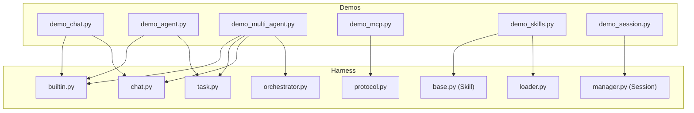
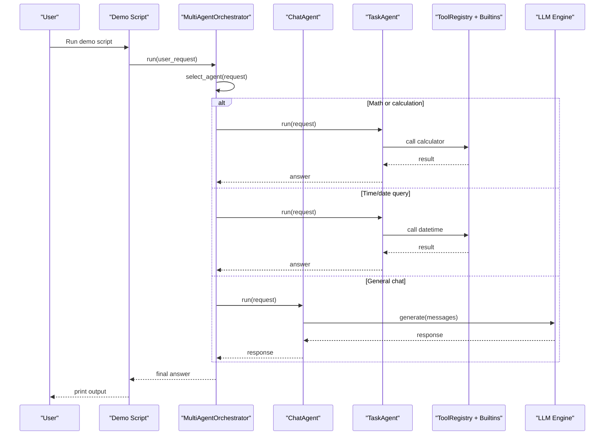
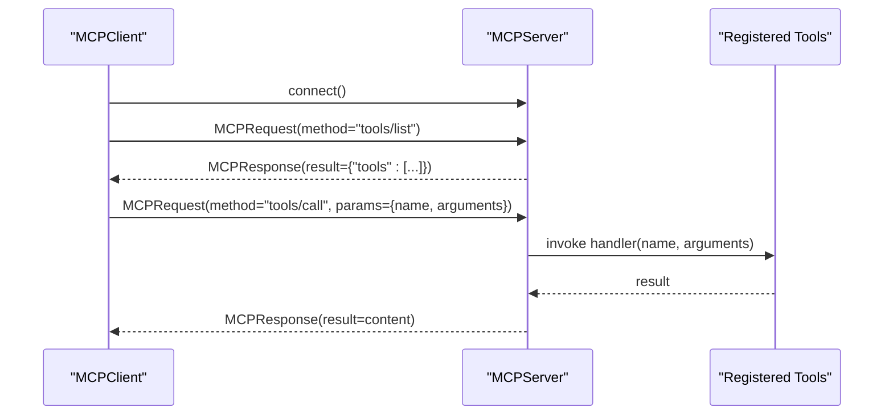
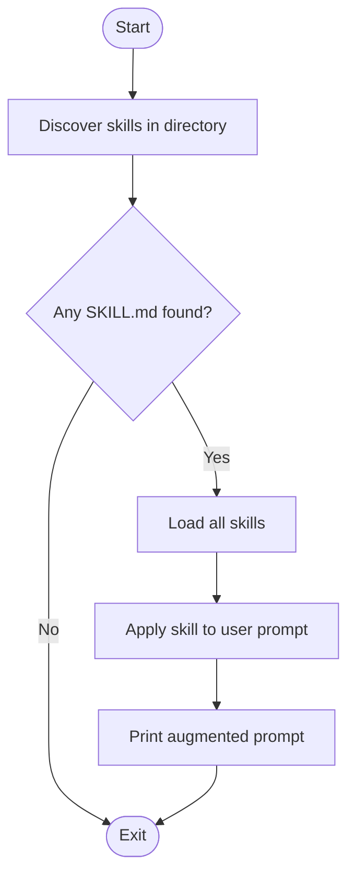
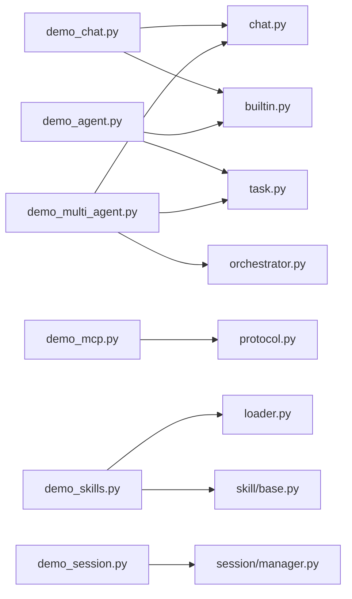

# Examples and Demos

<cite>
**Referenced Files in This Document**
- [demo_chat.py](file://demos/demo_chat.py)
- [demo_agent.py](file://demos/demo_agent.py)
- [demo_multi_agent.py](file://demos/demo_multi_agent.py)
- [demo_mcp.py](file://demos/demo_mcp.py)
- [demo_skills.py](file://demos/demo_skills.py)
- [demo_session.py](file://demos/demo_session.py)
- [SKILL.md (Summarizer)](file://demos/skills/summarizer/SKILL.md)
- [SKILL.md (Translator)](file://demos/skills/translator/SKILL.md)
- [orchestrator.py](file://harness/agent/orchestrator.py)
- [chat.py](file://harness/agent/chat.py)
- [task.py](file://harness/agent/task.py)
- [protocol.py](file://harness/mcp/protocol.py)
- [loader.py](file://harness/skill/loader.py)
- [base.py (Skill)](file://harness/skill/base.py)
- [manager.py (Session)](file://harness/session/manager.py)
- [builtin.py](file://harness/tools/builtin.py)
</cite>

## Table of Contents
1. Introduction
2. Project Structure
3. Core Components
4. Architecture Overview
5. Detailed Component Analysis
6. Dependency Analysis
7. Performance Considerations
8. Troubleshooting Guide
9. Conclusion
10. Appendices

## Introduction
This section provides practical demonstrations of the framework’s capabilities through runnable scripts. Each demo highlights a specific feature: interactive chat, agent tool calling, multi-agent orchestration, MCP protocol usage, skills system, and session management. For each demo, you will find step-by-step walkthroughs, expected outputs, customization guidance, and debugging tips.

## Project Structure
The demos are organized under demos/, with supporting skill definitions under demos/skills/. The harness package provides the core abstractions for agents, tools, sessions, skills, and MCP protocol support.

**Diagram sources**
- [demo_chat.py:1-47](file://demos/demo_chat.py#L1-L47)
- [demo_agent.py:1-40](file://demos/demo_agent.py#L1-L40)
- [demo_multi_agent.py:1-47](file://demos/demo_multi_agent.py#L1-L47)
- [demo_mcp.py:1-40](file://demos/demo_mcp.py#L1-L40)
- [demo_skills.py:1-35](file://demos/demo_skills.py#L1-L35)
- [demo_session.py:1-43](file://demos/demo_session.py#L1-L43)
- [orchestrator.py:1-152](file://harness/agent/orchestrator.py#L1-L152)
- [chat.py:1-60](file://harness/agent/chat.py#L1-L60)
- [task.py:1-73](file://harness/agent/task.py#L1-L73)
- [protocol.py:1-251](file://harness/mcp/protocol.py#L1-L251)
- [loader.py:1-122](file://harness/skill/loader.py#L1-L122)
- [base.py (Skill):1-70](file://harness/skill/base.py#L1-L70)
- [manager.py (Session):1-146](file://harness/session/manager.py#L1-L146)
- [builtin.py:1-83](file://harness/tools/builtin.py#L1-L83)

**Section sources**
- [demo_chat.py:1-47](file://demos/demo_chat.py#L1-L47)
- [demo_agent.py:1-40](file://demos/demo_agent.py#L1-L40)
- [demo_multi_agent.py:1-47](file://demos/demo_multi_agent.py#L1-L47)
- [demo_mcp.py:1-40](file://demos/demo_mcp.py#L1-L40)
- [demo_skills.py:1-35](file://demos/demo_skills.py#L1-L35)
- [demo_session.py:1-43](file://demos/demo_session.py#L1-L43)

## Core Components
- Interactive Chat Agent: A conversational agent that supports multi-turn dialogue and tool-calling integration.
- Task Agent: An agent specialized in completing tasks using tools with structured output and progress tracking.
- Multi-Agent Orchestrator: Coordinates multiple specialist agents to handle complex requests by routing to the best-fit agent.
- MCP Protocol: A simplified Model Context Protocol implementation enabling client-server tool discovery and invocation.
- Skills System: Markdown-defined capabilities loaded from disk to augment agent prompts and behavior.
- Session Management: Persistent, isolated conversation sessions with switching and listing capabilities.

**Section sources**
- [chat.py:1-60](file://harness/agent/chat.py#L1-L60)
- [task.py:1-73](file://harness/agent/task.py#L1-L73)
- [orchestrator.py:1-152](file://harness/agent/orchestrator.py#L1-L152)
- [protocol.py:1-251](file://harness/mcp/protocol.py#L1-L251)
- [loader.py:1-122](file://harness/skill/loader.py#L1-L122)
- [base.py (Skill):1-70](file://harness/skill/base.py#L1-L70)
- [manager.py (Session):1-146](file://harness/session/manager.py#L1-L146)

## Architecture Overview
The demos compose framework components to showcase key features. Agents use tools; orchestrators route tasks; MCP enables standardized tool access; skills inject domain-specific instructions; sessions isolate context.

**Diagram sources**
- [demo_multi_agent.py:1-47](file://demos/demo_multi_agent.py#L1-L47)
- [orchestrator.py:61-145](file://harness/agent/orchestrator.py#L61-L145)
- [chat.py:25-60](file://harness/agent/chat.py#L25-L60)
- [task.py:32-73](file://harness/agent/task.py#L32-L73)
- [builtin.py:13-83](file://harness/tools/builtin.py#L13-L83)

## Detailed Component Analysis

### Interactive Chat Demo
Purpose: Demonstrate an interactive chat loop with tool-calling support and memory persistence.

Step-by-step walkthrough:
- Initialize LLM backend (mock by default).
- Create HybridMemory for conversation history.
- Register default tools (calculator, datetime, file ops).
- Instantiate ChatAgent with LLM, registry, and memory.
- Loop until user quits; send input to agent and print response.

Expected outputs:
- Prints model info and available tools.
- Prompts “You:” for input.
- Displays “Bot:” responses after each turn.

Customization possibilities:
- Swap memory storage path or strategy.
- Add custom tools to the registry.
- Adjust system prompt or persona via ChatAgent configuration.

Common modifications:
- Change LLM backend environment variable.
- Integrate long-term memory or external knowledge base.

Debugging techniques:
- Enable verbose logging in agents if needed.
- Inspect tool registry contents before starting the loop.

**Section sources**
- [demo_chat.py:1-47](file://demos/demo_chat.py#L1-L47)
- [chat.py:1-60](file://harness/agent/chat.py#L1-L60)
- [builtin.py:77-83](file://harness/tools/builtin.py#L77-L83)

### Agent Tool Calling Demo
Purpose: Show a task-oriented agent executing multi-step tasks using tools and returning structured results.

Step-by-step walkthrough:
- Initialize LLM backend (mock).
- Create ToolRegistry and register default tools.
- Instantiate TaskAgent with LLM and registry.
- Define tasks (e.g., math expressions, date/time queries).
- Execute each task and print structured results.

Expected outputs:
- For each task: prints task description, execution steps, and final answer.
- Returns a dict with success flag, result text, and original task.

Customization possibilities:
- Provide custom tools for domain-specific operations.
- Tune max_iterations and verbosity for complex tasks.

Common modifications:
- Replace mock LLM with a real provider.
- Persist task traces for auditing.

Debugging techniques:
- Print intermediate tool calls and results.
- Validate tool parameters and error messages.

**Section sources**
- [demo_agent.py:1-40](file://demos/demo_agent.py#L1-L40)
- [task.py:1-73](file://harness/agent/task.py#L1-L73)
- [builtin.py:13-83](file://harness/tools/builtin.py#L13-L83)

### Multi-Agent Orchestration Demo
Purpose: Demonstrate routing user requests to specialist agents (math, time, general chat) via an orchestrator.

Step-by-step walkthrough:
- Initialize LLM backend (mock).
- Create MultiAgentOrchestrator with verbose mode.
- Register specialist agents:
  - MathAgent with CalculatorTool.
  - TimeAgent with DateTimeTool.
  - ChatAgent for general conversation.
- Iterate over sample requests and print orchestrated answers.

Expected outputs:
- Logs which agent is selected for each request.
- Shows final aggregated answer from the chosen agent.

Customization possibilities:
- Add new specialists with tailored tool sets.
- Customize routing logic via descriptions and keywords.

Common modifications:
- Extend keyword-based fallback routing for edge cases.
- Parallelize execution across agents where appropriate.

Debugging techniques:
- Use verbose logs to trace selection and execution.
- Inspect agent descriptions and matching logic.

**Section sources**
- [demo_multi_agent.py:1-47](file://demos/demo_multi_agent.py#L1-L47)
- [orchestrator.py:31-152](file://harness/agent/orchestrator.py#L31-L152)
- [builtin.py:13-83](file://harness/tools/builtin.py#L13-L83)

### MCP Protocol Demo
Purpose: Demonstrate client-server interaction using a simplified MCP protocol for tool discovery and invocation.

Step-by-step walkthrough:
- Create a demo MCP server with sample tools (weather simulation, text stats).
- Connect an MCPClient to the server.
- List all discovered tools and their descriptions.
- Call tools via the client and print results.
- Demonstrate JSON-RPC style request/response objects.

Expected outputs:
- Lists tools with names and descriptions.
- Prints results for tool calls (weather, text stats).
- Shows JSON-RPC formatted request and response strings.

Customization possibilities:
- Add new tools/resources/prompts to the server.
- Wrap MCP tools into harness Tool objects for seamless integration.

Common modifications:
- Replace in-process server with networked server (stdio/HTTP).
- Implement authentication and rate limiting at the server layer.

Debugging techniques:
- Log request and response payloads.
- Validate tool schemas and parameter types.

**Diagram sources**
- [demo_mcp.py:1-40](file://demos/demo_mcp.py#L1-L40)
- [protocol.py:68-210](file://harness/mcp/protocol.py#L68-L210)

**Section sources**
- [demo_mcp.py:1-40](file://demos/demo_mcp.py#L1-L40)
- [protocol.py:1-251](file://harness/mcp/protocol.py#L1-L251)

### Skills System Demo
Purpose: Demonstrate discovering and loading markdown-defined skills, then applying them to user prompts.

Step-by-step walkthrough:
- Initialize SkillLoader pointing to demos/skills.
- Discover available skills by scanning directories for SKILL.md files.
- Load all skills and print their descriptions.
- Apply each skill to a sample user request and show how instructions augment the prompt.

Expected outputs:
- Lists discovered skills.
- Prints skill descriptions with tags.
- Shows augmented prompts combining skill instructions with user input.

Customization possibilities:
- Add new skills by creating directories with SKILL.md files.
- Extend metadata fields or parsing logic in the loader.

Common modifications:
- Integrate skills into agent system prompts dynamically.
- Cache loaded skills for performance.

Debugging techniques:
- Verify YAML frontmatter parsing and tag extraction.
- Check file paths and permissions for skill directories.

**Diagram sources**
- [demo_skills.py:1-35](file://demos/demo_skills.py#L1-L35)
- [loader.py:26-122](file://harness/skill/loader.py#L26-L122)
- [base.py (Skill):34-70](file://harness/skill/base.py#L34-L70)

**Section sources**
- [demo_skills.py:1-35](file://demos/demo_skills.py#L1-L35)
- [loader.py:1-122](file://harness/skill/loader.py#L1-L122)
- [base.py (Skill):1-70](file://harness/skill/base.py#L1-L70)

### Session Management Demo
Purpose: Demonstrate creating, switching, and managing multiple independent conversation sessions with persistence.

Step-by-step walkthrough:
- Initialize SessionManager with a storage directory.
- Create two sessions with distinct titles.
- Add messages to each session.
- List all sessions and identify the active one.
- Switch to a session and print its message history.

Expected outputs:
- Shows created sessions with IDs and titles.
- Lists all sessions with message counts and active marker.
- Displays active session title and recent messages.

Customization possibilities:
- Extend metadata fields per session.
- Implement cross-session sharing or merging strategies.

Common modifications:
- Add export/import functionality for sessions.
- Integrate with external storage backends.

Debugging techniques:
- Validate JSON serialization and deserialization.
- Ensure storage directory exists and has write permissions.

**Section sources**
- [demo_session.py:1-43](file://demos/demo_session.py#L1-L43)
- [manager.py (Session):1-146](file://harness/session/manager.py#L1-L146)

## Dependency Analysis
Key dependencies between demos and framework components:
- Chat and Task agents depend on LLM engine and ToolRegistry.
- Orchestrator depends on agents and uses LLM for routing decisions.
- MCP demo depends on protocol module for client/server interactions.
- Skills demo depends on loader and base skill classes.
- Session demo depends on session manager for persistence and lifecycle.

**Diagram sources**
- [demo_chat.py:1-47](file://demos/demo_chat.py#L1-L47)
- [demo_agent.py:1-40](file://demos/demo_agent.py#L1-L40)
- [demo_multi_agent.py:1-47](file://demos/demo_multi_agent.py#L1-L47)
- [demo_mcp.py:1-40](file://demos/demo_mcp.py#L1-L40)
- [demo_skills.py:1-35](file://demos/demo_skills.py#L1-L35)
- [demo_session.py:1-43](file://demos/demo_session.py#L1-L43)
- [chat.py:1-60](file://harness/agent/chat.py#L1-L60)
- [task.py:1-73](file://harness/agent/task.py#L1-L73)
- [orchestrator.py:1-152](file://harness/agent/orchestrator.py#L1-L152)
- [protocol.py:1-251](file://harness/mcp/protocol.py#L1-L251)
- [loader.py:1-122](file://harness/skill/loader.py#L1-L122)
- [base.py (Skill):1-70](file://harness/skill/base.py#L1-L70)
- [manager.py (Session):1-146](file://harness/session/manager.py#L1-L146)
- [builtin.py:1-83](file://harness/tools/builtin.py#L1-L83)

**Section sources**
- [demo_chat.py:1-47](file://demos/demo_chat.py#L1-L47)
- [demo_agent.py:1-40](file://demos/demo_agent.py#L1-L40)
- [demo_multi_agent.py:1-47](file://demos/demo_multi_agent.py#L1-L47)
- [demo_mcp.py:1-40](file://demos/demo_mcp.py#L1-L40)
- [demo_skills.py:1-35](file://demos/demo_skills.py#L1-L35)
- [demo_session.py:1-43](file://demos/demo_session.py#L1-L43)

## Performance Considerations
- Prefer minimal tool calls: batch operations where possible to reduce overhead.
- Limit conversation history length in chat agents to control memory usage.
- Cache frequently used skills and tool results to avoid repeated computations.
- Use parallel execution in orchestrator when agents operate independently.
- Monitor LLM backend latency and adjust timeouts accordingly.

[No sources needed since this section provides general guidance]

## Troubleshooting Guide
Common issues and resolutions:
- LLM backend not configured: Ensure environment variable is set appropriately for your backend.
- Tool not found: Verify tool registration and correct method names in MCP requests.
- Skill loading errors: Check SKILL.md format and frontmatter syntax.
- Session persistence failures: Confirm storage directory exists and is writable.
- Routing misclassification: Review agent descriptions and keyword fallback logic in orchestrator.

Debugging techniques:
- Enable verbose logging in agents and orchestrator to trace decision paths.
- Print request/response payloads in MCP flows to validate JSON-RPC structure.
- Validate tool parameters and error messages for precise failure localization.
- Inspect session JSON files for corruption or schema mismatches.

**Section sources**
- [orchestrator.py:105-145](file://harness/agent/orchestrator.py#L105-L145)
- [protocol.py:100-138](file://harness/mcp/protocol.py#L100-L138)
- [loader.py:33-71](file://harness/skill/loader.py#L33-L71)
- [manager.py (Session):124-142](file://harness/session/manager.py#L124-L142)

## Conclusion
These demos provide hands-on exposure to the framework’s core capabilities. By following the walkthroughs, you can extend each example to fit your use case—adding custom tools, skills, agents, and sessions—while leveraging robust routing, protocol standardization, and persistent context management.

[No sources needed since this section summarizes without analyzing specific files]

## Appendices

### Sample Skill Definitions
- Summarization Skill: Defines instructions to produce concise summaries with main topic, key points, and conclusion.
- Translation Skill: Defines instructions to translate text while preserving meaning, tone, and cultural context, including notes for culturally specific terms.

How to use:
- Place SKILL.md files under demos/skills/<skill_name>/ and run the skills demo to discover and apply them.
- Integrate skills into agent prompts by invoking apply_to_prompt with user input.

**Section sources**
- [SKILL.md (Summarizer):1-29](file://demos/skills/summarizer/SKILL.md#L1-L29)
- [SKILL.md (Translator):1-30](file://demos/skills/translator/SKILL.md#L1-L30)
- [loader.py:81-122](file://harness/skill/loader.py#L81-L122)
- [base.py (Skill):55-65](file://harness/skill/base.py#L55-L65)