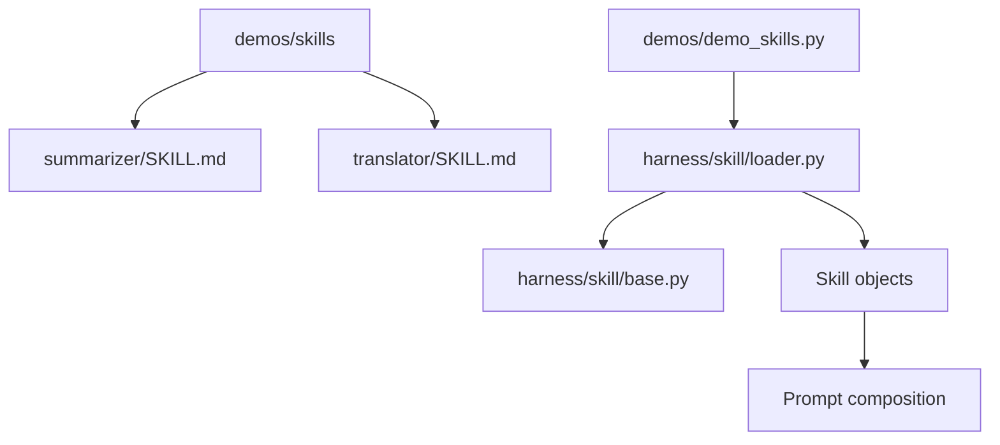
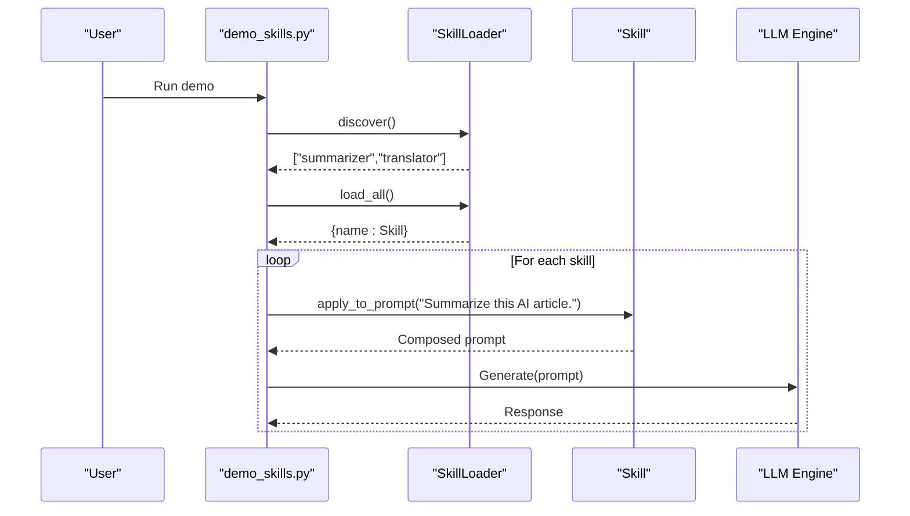
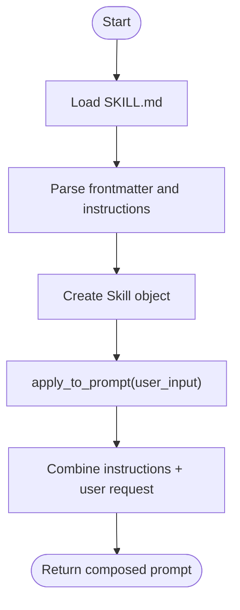
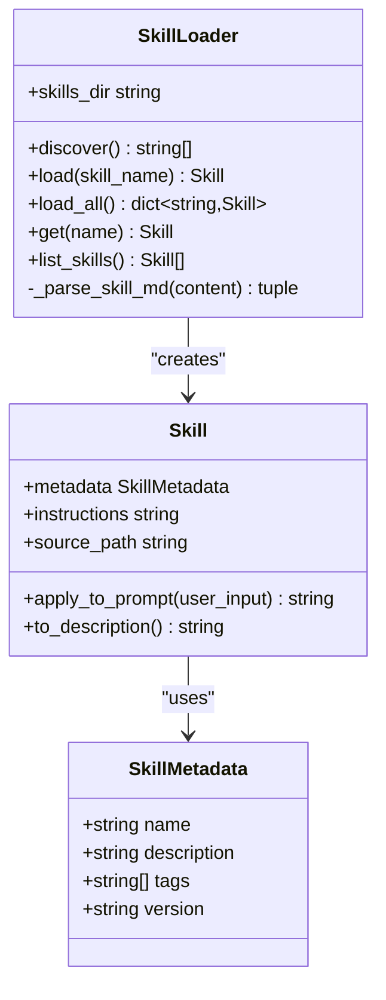

# Sample Skills

<cite>
**Referenced Files in This Document**
- [SKILL.md](file://demos/skills/summarizer/SKILL.md)
- [SKILL.md](file://demos/skills/translator/SKILL.md)
- [base.py](file://harness/skill/base.py)
- [loader.py](file://harness/skill/loader.py)
- [demo_skills.py](file://demos/demo_skills.py)
- [README.md](file://README.md)
</cite>

## Table of Contents
1. [Introduction](#introduction)
2. [Project Structure](#project-structure)
3. [Core Components](#core-components)
4. [Architecture Overview](#architecture-overview)
5. [Detailed Component Analysis](#detailed-component-analysis)
6. [Dependency Analysis](#dependency-analysis)
7. [Performance Considerations](#performance-considerations)
8. [Troubleshooting Guide](#troubleshooting-guide)
9. [Conclusion](#conclusion)
10. [Appendices](#appendices)

## Introduction
This document explains the sample skills provided in the repository, focusing on how skills are defined and implemented using markdown-based SKILL.md files. It covers two concrete examples:
- Summarizer skill: text compression and key point extraction
- Translator skill: language conversion with context preservation

It also details the SKILL.md structure, parameter definitions, prompt templates, output formatting, guidelines for creating custom skills, best practices for prompt engineering, and testing strategies to validate skill effectiveness.

## Project Structure
The skills system is located under harness/skill and demonstrated via demos/skills. The loader discovers and parses SKILL.md files, while the Skill class composes prompts that combine skill instructions with user input.

**Diagram sources**
- [loader.py:26-79](file://harness/skill/loader.py#L26-L79)
- [base.py:25-70](file://harness/skill/base.py#L25-L70)
- [demo_skills.py:11-34](file://demos/demo_skills.py#L11-L34)

**Section sources**
- [README.md:236-252](file://README.md#L236-L252)
- [loader.py:1-122](file://harness/skill/loader.py#L1-L122)
- [base.py:1-70](file://harness/skill/base.py#L1-L70)
- [demo_skills.py:1-35](file://demos/demo_skills.py#L1-L35)

## Core Components
- SkillMetadata: Holds name, description, tags, and version extracted from SKILL.md frontmatter.
- Skill: Encapsulates metadata, instructions, source path, and provides methods to apply instructions to a user prompt and generate a human-readable description.
- SkillLoader: Discovers SKILL.md files, parses frontmatter and instructions, caches loaded skills, and exposes convenience methods to list or retrieve skills.

Key responsibilities:
- Discovery: Scan a directory for skill folders containing SKILL.md.
- Parsing: Extract YAML-like frontmatter fields (name, description, tags, version) and separate them from the instruction body.
- Composition: Combine skill instructions with user input into a single prompt string.

**Section sources**
- [base.py:25-70](file://harness/skill/base.py#L25-L70)
- [loader.py:26-122](file://harness/skill/loader.py#L26-L122)

## Architecture Overview
Skills are loaded at runtime and used to shape the agent’s behavior by injecting specialized instructions into the prompt pipeline. The demo script demonstrates discovery, loading, listing, and applying skills to a sample request.

**Diagram sources**
- [demo_skills.py:11-34](file://demos/demo_skills.py#L11-L34)
- [loader.py:33-79](file://harness/skill/loader.py#L33-L79)
- [base.py:55-65](file://harness/skill/base.py#L55-L65)

## Detailed Component Analysis

### SKILL.md Format and Structure
Each skill is defined by a SKILL.md file with:
- Frontmatter block: name, description, tags, version
- Instruction body: detailed steps, rules, and output format expectations

Parsing behavior:
- Frontmatter is extracted using a regex pattern and split into metadata fields.
- The remaining content after frontmatter becomes the instructions.
- If name is missing, it falls back to the first heading.

Output formatting:
- Skills define structured outputs (e.g., sections like Main Topic, Key Points, Conclusion; or Translation and Notes).
- These formats guide the model to produce consistent results.

**Section sources**
- [loader.py:81-122](file://harness/skill/loader.py#L81-L122)
- [SKILL.md:1-29](file://demos/skills/summarizer/SKILL.md#L1-L29)
- [SKILL.md:1-30](file://demos/skills/translator/SKILL.md#L1-L30)

### Summarizer Skill
Purpose:
- Compress long text into concise summaries while preserving factual accuracy.
- Extract main topic, key points, and a brief conclusion.

Implementation highlights:
- Instructions specify reading the full text, identifying main topics and arguments, extracting important facts, and producing a structured summary.
- Rules enforce length constraints (e.g., 20–30% of original), clarity, and fidelity to source material.

Output format:
- Main Topic: One-sentence overview
- Key Points: Bullet list of essential information
- Conclusion: Brief closing statement

Use cases:
- Article summarization
- Meeting notes condensation
- Research paper abstract generation

Best practices:
- Provide clear boundaries for what counts as “key” information.
- Include explicit constraints on length and tone to ensure consistency.
- Use examples in SKILL.md when possible to anchor expected output style.

**Section sources**
- [SKILL.md:1-29](file://demos/skills/summarizer/SKILL.md#L1-L29)

### Translator Skill
Purpose:
- Translate text between languages while preserving meaning, tone, and cultural context.
- Provide translation notes for culturally specific terms or ambiguous phrases.

Implementation highlights:
- Instructions emphasize identifying source/target languages, maintaining intent and tone, handling idioms, and selecting contextually appropriate translations.
- Output includes both the translated text and optional notes.

Supported languages:
- Chinese, English, Japanese, Korean, French, German, Spanish, and more.

Use cases:
- Multilingual content localization
- Cross-language communication assistance
- Cultural nuance preservation in technical or creative texts

Best practices:
- Specify target audience and register (formal/informal) when relevant.
- Encourage notes for idiomatic or culture-specific expressions.
- Keep translation faithful to original intent while adapting phrasing naturally.

**Section sources**
- [SKILL.md:1-30](file://demos/skills/translator/SKILL.md#L1-L30)

### Prompt Composition and Application
How skills integrate with prompts:
- Skill.apply_to_prompt combines the skill’s instructions with the user’s request into a single prompt string.
- The composed prompt acts as a specialized system prompt guiding the model’s behavior for that task.

Flow:
- Loader loads SKILL.md and creates a Skill instance.
- Demo calls apply_to_prompt with a user request.
- Resulting prompt is sent to the LLM engine for generation.

**Diagram sources**
- [loader.py:45-79](file://harness/skill/loader.py#L45-L79)
- [base.py:55-65](file://harness/skill/base.py#L55-L65)
- [demo_skills.py:27-31](file://demos/demo_skills.py#L27-L31)

**Section sources**
- [base.py:55-65](file://harness/skill/base.py#L55-L65)
- [demo_skills.py:27-31](file://demos/demo_skills.py#L27-L31)

## Dependency Analysis
- Skill depends on SkillMetadata for typed configuration.
- SkillLoader depends on Skill and SkillMetadata to parse and instantiate skills.
- Demo depends on SkillLoader to orchestrate discovery, loading, and application.

**Diagram sources**
- [base.py:25-70](file://harness/skill/base.py#L25-L70)
- [loader.py:26-122](file://harness/skill/loader.py#L26-L122)

**Section sources**
- [base.py:25-70](file://harness/skill/base.py#L25-L70)
- [loader.py:26-122](file://harness/skill/loader.py#L26-L122)

## Performance Considerations
- Prompt size: Long SKILL.md instructions increase token usage; keep instructions concise and focused.
- Parsing overhead: Regex parsing is lightweight but should be avoided repeatedly; cache parsed skills where possible.
- Memory footprint: Loading all skills may consume memory proportional to the number and size of SKILL.md files.
- LLM cost: Each apply_to_prompt call triggers an LLM invocation; batch requests or reuse contexts when feasible.

[No sources needed since this section provides general guidance]

## Troubleshooting Guide
Common issues and resolutions:
- Missing SKILL.md: Ensure each skill folder contains a valid SKILL.md file; otherwise, discovery will skip it.
- Invalid frontmatter: Verify name, description, tags, and version fields are present and correctly formatted; fallback to first heading if name is missing.
- File not found errors: Confirm the skills directory path matches the loader configuration.
- Unexpected output: Review skill instructions for clarity and constraints; add examples to stabilize behavior.

Operational tips:
- Use verbose logging in the loader to track discovered and loaded skills.
- Inspect the composed prompt via the demo to verify instruction injection.

**Section sources**
- [loader.py:33-79](file://harness/skill/loader.py#L33-L79)
- [loader.py:81-122](file://harness/skill/loader.py#L81-L122)
- [demo_skills.py:11-34](file://demos/demo_skills.py#L11-L34)

## Conclusion
The skills system enables modular, reusable agent capabilities defined entirely in markdown. The summarizer and translator skills demonstrate how to structure instructions, constrain outputs, and preserve context. By following the SKILL.md format and leveraging the loader and Skill classes, you can create custom skills that consistently guide the model toward desired behaviors.

[No sources needed since this section summarizes without analyzing specific files]

## Appendices

### Guidelines for Creating Custom Skills
- Define clear objectives and scope in the frontmatter (name, description, tags, version).
- Write step-by-step instructions that specify inputs, processing steps, and expected outputs.
- Enforce constraints (length, tone, fidelity) to reduce variability.
- Provide examples within the instructions to anchor output style.
- Test across diverse inputs to validate robustness.

**Section sources**
- [loader.py:81-122](file://harness/skill/loader.py#L81-L122)
- [SKILL.md:1-29](file://demos/skills/summarizer/SKILL.md#L1-L29)
- [SKILL.md:1-30](file://demos/skills/translator/SKILL.md#L1-L30)

### Best Practices for Prompt Engineering
- Be explicit about roles and goals (e.g., “You are an expert text summarizer”).
- Break tasks into ordered steps to improve reliability.
- Specify output structure to facilitate downstream parsing or presentation.
- Include negative constraints (what not to do) to prevent hallucination.
- Iterate based on failure modes observed during testing.

**Section sources**
- [SKILL.md:10-29](file://demos/skills/summarizer/SKILL.md#L10-L29)
- [SKILL.md:10-30](file://demos/skills/translator/SKILL.md#L10-L30)

### Testing Strategies for Skill Effectiveness
- Unit-style tests:
  - Validate SKILL.md parsing (frontmatter fields, instructions separation).
  - Assert composed prompt structure (presence of instructions and user input).
- Functional tests:
  - Feed representative inputs to the LLM and evaluate outputs against criteria (length, completeness, accuracy).
- Edge case tests:
  - Very short or very long inputs
  - Ambiguous or multilingual content
  - Inputs violating constraints (e.g., overly complex jargon)
- Regression tests:
  - Maintain a test corpus and compare outputs over time to detect drift.

**Section sources**
- [loader.py:81-122](file://harness/skill/loader.py#L81-L122)
- [base.py:55-65](file://harness/skill/base.py#L55-L65)
- [demo_skills.py:27-31](file://demos/demo_skills.py#L27-L31)