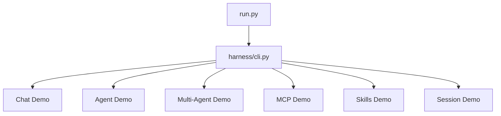
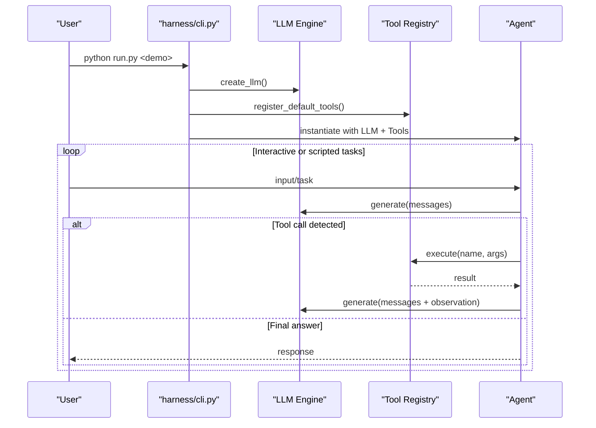
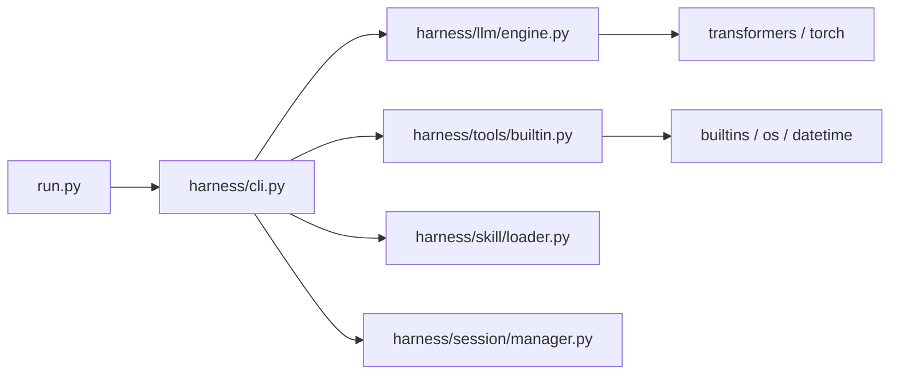

# Getting Started

<cite>
**Referenced Files in This Document**
- [README.md](file://README.md)
- [setup.sh](file://setup.sh)
- [run.py](file://run.py)
- [pyproject.toml](file://pyproject.toml)
- [requirements.txt](file://requirements.txt)
- [harness/cli.py](file://harness/cli.py)
- [harness/config.py](file://harness/config.py)
- [harness/llm/engine.py](file://harness/llm/engine.py)
- [demos/demo_chat.py](file://demos/demo_chat.py)
- [demos/demo_agent.py](file://demos/demo_agent.py)
- [demos/demo_multi_agent.py](file://demos/demo_multi_agent.py)
- [demos/demo_mcp.py](file://demos/demo_mcp.py)
- [demos/demo_skills.py](file://demos/demo_skills.py)
- [demos/demo_session.py](file://demos/demo_session.py)
</cite>

## Table of Contents
1. [Introduction](#introduction)
2. [Project Structure](#project-structure)
3. [Core Components](#core-components)
4. [Architecture Overview](#architecture-overview)
5. [Detailed Component Analysis](#detailed-component-analysis)
6. [Dependency Analysis](#dependency-analysis)
7. [Performance Considerations](#performance-considerations)
8. [Troubleshooting Guide](#troubleshooting-guide)
9. [Conclusion](#conclusion)

## Introduction
This guide helps you quickly set up HarnessAIDemo and run your first demos. You can start with a GPU-free mock mode to explore all features, then switch to real model inference using Qwen2.5-0.5B-Instruct. The project supports multiple demo modes: chat, agent, multi-agent, mcp, skills, and session.

## Project Structure
HarnessAIDemo is organized into a core harness framework and several demo scripts that showcase different capabilities. The main entry point routes to the appropriate demo based on command-line arguments.

**Diagram sources**
- [run.py:1-28](file://run.py#L1-L28)
- [harness/cli.py:331-357](file://harness/cli.py#L331-L357)

**Section sources**
- [README.md:73-131](file://README.md#L73-L131)
- [run.py:1-28](file://run.py#L1-L28)

## Core Components
- LLM Engine: Abstract interface with two backends—Transformers (real models) and Mock (pattern-based, no GPU).
- Tools: Built-in tools for math, time, and file operations; extensible registry.
- Agent Loop: Orchestrates context building, LLM calls, tool execution, and memory updates.
- MCP Protocol: JSON-RPC 2.0 server/client for standardized tool/resource access.
- Skills: Markdown-defined reusable instructions loaded at runtime.
- Sessions: Multi-session isolation with persistence.

Key configuration is read from environment variables and applied via a central config module.

**Section sources**
- [harness/llm/engine.py:125-421](file://harness/llm/engine.py#L125-L421)
- [harness/tools/builtin.py:1-83](file://harness/tools/builtin.py#L1-L83)
- [harness/config.py:8-70](file://harness/config.py#L8-L70)

## Architecture Overview
The system composes an LLM engine, tools, memory, and agents to deliver interactive experiences. The CLI selects a demo, which wires components together and runs the workflow.

**Diagram sources**
- [harness/cli.py:39-176](file://harness/cli.py#L39-L176)
- [harness/llm/engine.py:404-421](file://harness/llm/engine.py#L404-L421)
- [harness/tools/builtin.py:77-83](file://harness/tools/builtin.py#L77-L83)

## Detailed Component Analysis

### Installation and Environment Setup
- Use the provided setup script to create a virtual environment and install dependencies.
- Activate the virtual environment before running any commands.

Steps:
1. Run the setup script to prepare Python 3.11, virtual environment, and dependencies.
2. Activate the virtual environment.
3. Verify installation by running a quick demo in mock mode.

Environment variables:
- HARNESS_LLM_BACKEND=mock to skip model download and run without GPU.
- HARNESS_MODEL_NAME to override the default model when using Transformers backend.

**Section sources**
- [setup.sh:1-77](file://setup.sh#L1-L77)
- [README.md:22-58](file://README.md#L22-L58)
- [harness/config.py:25-34](file://harness/config.py#L25-L34)

### Running Mock Demos (No GPU Required)
Start with mock mode to explore all features instantly.

Quick start:
- Set the mock backend and run the CLI demos:
  - python run.py chat
  - python run.py agent
  - python run.py multi-agent
  - python run.py mcp
  - python run.py skills
  - python run.py session

Alternatively, run standalone demo scripts directly; they default to mock mode.

**Section sources**
- [README.md:34-69](file://README.md#L34-L69)
- [harness/cli.py:39-328](file://harness/cli.py#L39-L328)
- [demos/demo_chat.py:1-47](file://demos/demo_chat.py#L1-L47)
- [demos/demo_agent.py:1-40](file://demos/demo_agent.py#L1-L40)
- [demos/demo_multi_agent.py:1-47](file://demos/demo_multi_agent.py#L1-L47)
- [demos/demo_mcp.py:1-40](file://demos/demo_mcp.py#L1-L40)
- [demos/demo_skills.py:1-35](file://demos/demo_skills.py#L1-L35)
- [demos/demo_session.py:1-43](file://demos/demo_session.py#L1-L43)

### First-Time Usage: Chat Demo
The chat demo provides an interactive multi-turn conversation with tool-calling support.

What it does:
- Initializes the LLM engine (mock by default), registers built-in tools, and sets up hybrid memory.
- Prompts for user input until you type quit/exit/q.
- Demonstrates tool usage through natural language requests.

How to run:
- Via CLI: python run.py chat
- Standalone: python demos/demo_chat.py

**Section sources**
- [harness/cli.py:39-79](file://harness/cli.py#L39-L79)
- [demos/demo_chat.py:1-47](file://demos/demo_chat.py#L1-L47)

### First-Time Usage: Agent Demo
The agent demo shows a task-oriented agent that uses tools to complete tasks.

What it does:
- Registers built-in tools and executes predefined tasks like calculations and time queries.
- Supports interactive mode where you can enter new tasks.

How to run:
- Via CLI: python run.py agent
- Standalone: python demos/demo_agent.py

**Section sources**
- [harness/cli.py:81-121](file://harness/cli.py#L81-L121)
- [demos/demo_agent.py:1-40](file://demos/demo_agent.py#L1-L40)

### First-Time Usage: Multi-Agent Demo
The multi-agent demo orchestrates specialist agents for math, time, and general chat.

What it does:
- Creates specialized agents with focused tool sets.
- Routes user requests to the most suitable agent and returns results.

How to run:
- Via CLI: python run.py multi-agent
- Standalone: python demos/demo_multi_agent.py

**Section sources**
- [harness/cli.py:123-177](file://harness/cli.py#L123-L177)
- [demos/demo_multi_agent.py:1-47](file://demos/demo_multi_agent.py#L1-L47)

### First-Time Usage: MCP Demo
The MCP demo demonstrates the Model Context Protocol with a server and client.

What it does:
- Starts a demo MCP server, connects a client, discovers tools, calls tools, reads resources, and retrieves prompts.
- Shows JSON-RPC request/response examples.

How to run:
- Via CLI: python run.py mcp
- Standalone: python demos/demo_mcp.py

**Section sources**
- [harness/cli.py:179-240](file://harness/cli.py#L179-L240)
- [demos/demo_mcp.py:1-40](file://demos/demo_mcp.py#L1-L40)

### First-Time Usage: Skills Demo
The skills demo loads and applies markdown-defined skills to enhance prompts.

What it does:
- Discovers and loads SKILL.md files from the skills directory.
- Applies skill instructions to user prompts to shape behavior.

How to run:
- Via CLI: python run.py skills
- Standalone: python demos/demo_skills.py

**Section sources**
- [harness/cli.py:243-277](file://harness/cli.py#L243-L277)
- [demos/demo_skills.py:1-35](file://demos/demo_skills.py#L1-L35)

### First-Time Usage: Session Demo
The session demo showcases multi-session management with persistence.

What it does:
- Creates sessions, adds messages, lists sessions, switches active session, renames, and deletes sessions.

How to run:
- Via CLI: python run.py session
- Standalone: python demos/demo_session.py

**Section sources**
- [harness/cli.py:279-328](file://harness/cli.py#L279-L328)
- [demos/demo_session.py:1-43](file://demos/demo_session.py#L1-L43)

### Real Model Inference with Qwen2.5-0.5B-Instruct
Switch from mock to the real Transformers backend to run local inference.

Steps:
1. Ensure dependencies are installed via setup.sh.
2. Run any demo without setting HARNESS_LLM_BACKEND; it defaults to transformers.
3. Optionally set HARNESS_MODEL_NAME to use a different model.
4. First run will download the model automatically.

Notes:
- Device selection is automatic (CUDA/MPS/CPU) based on availability.
- Adjust max tokens and temperature via environment variables if needed.

**Section sources**
- [README.md:49-58](file://README.md#L49-L58)
- [harness/config.py:8-34](file://harness/config.py#L8-L34)
- [harness/llm/engine.py:151-249](file://harness/llm/engine.py#L151-L249)

## Dependency Analysis
The project declares core dependencies for model inference, CLI display, configuration parsing, and numerical utilities.

**Diagram sources**
- [run.py:1-28](file://run.py#L1-L28)
- [harness/cli.py:39-328](file://harness/cli.py#L39-L328)
- [harness/llm/engine.py:151-249](file://harness/llm/engine.py#L151-L249)
- [harness/tools/builtin.py:1-83](file://harness/tools/builtin.py#L1-L83)

**Section sources**
- [requirements.txt:1-14](file://requirements.txt#L1-L14)
- [pyproject.toml:1-27](file://pyproject.toml#L1-L27)

## Performance Considerations
- Use mock backend for fast iteration without model downloads or GPU requirements.
- For real models:
  - Prefer CUDA or MPS if available for faster inference.
  - Tune max_new_tokens and temperature to balance speed and creativity.
  - Keep tool calls minimal per turn to reduce round-trips.
- Memory:
  - Hybrid memory combines short-term buffer and long-term retrieval; adjust capacity and thresholds as needed.

[No sources needed since this section provides general guidance]

## Troubleshooting Guide
Common issues and resolutions:

- Python version mismatch
  - Symptom: Setup fails to find Python 3.11.
  - Resolution: Install Python 3.11 and re-run setup.sh.

- Virtual environment not activated
  - Symptom: Commands fail due to missing packages.
  - Resolution: Activate .venv before running demos.

- Unknown demo name
  - Symptom: CLI reports unknown demo.
  - Resolution: Use one of: chat, agent, multi-agent, mcp, skills, session.

- Backend selection error
  - Symptom: ValueError for unknown backend.
  - Resolution: Set HARNESS_LLM_BACKEND to mock or transformers.

- Missing dependencies for real model
  - Symptom: ImportError for transformers/torch.
  - Resolution: Re-run setup.sh to install required packages.

- Model download failures
  - Symptom: Network errors during first run with transformers backend.
  - Resolution: Retry later or configure proxy; ensure internet access.

- No GPU but using transformers backend
  - Symptom: Slow performance or device errors.
  - Resolution: Switch to mock backend or ensure proper device settings.

**Section sources**
- [setup.sh:20-36](file://setup.sh#L20-L36)
- [harness/cli.py:331-357](file://harness/cli.py#L331-L357)
- [harness/llm/engine.py:171-179](file://harness/llm/engine.py#L171-L179)
- [harness/llm/engine.py:404-421](file://harness/llm/engine.py#L404-L421)

## Conclusion
You can quickly get started with HarnessAIDemo using the setup script and mock demos to explore all features without a GPU. When ready, switch to the Transformers backend to run Qwen2.5-0.5B-Instruct locally. Use the CLI or standalone demos to try chat, agent, multi-agent, mcp, skills, and session modes. Refer to the troubleshooting section for common setup and configuration issues.

[No sources needed since this section summarizes without analyzing specific files]