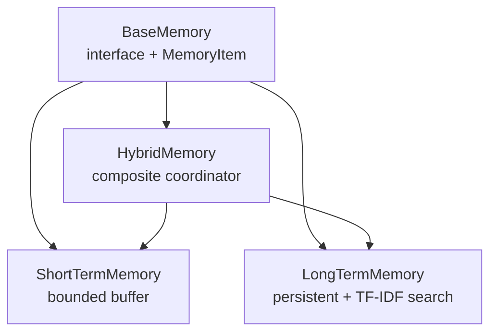
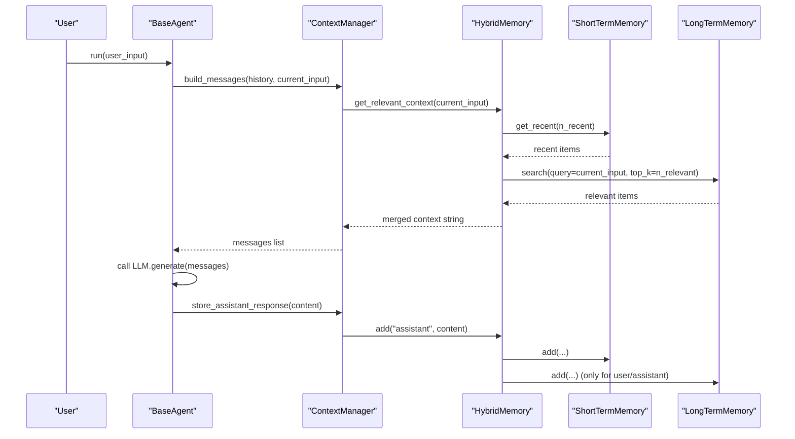
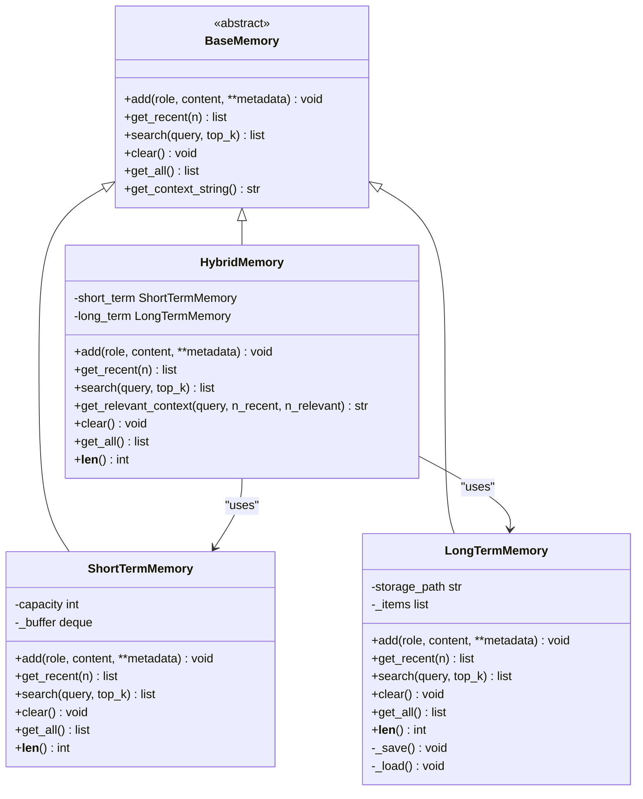
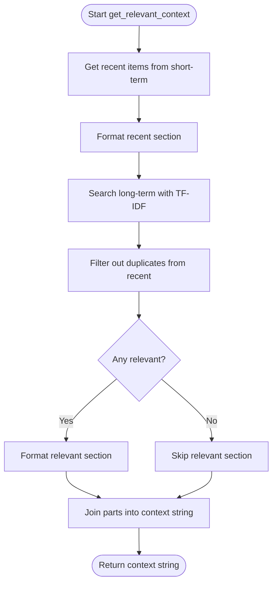
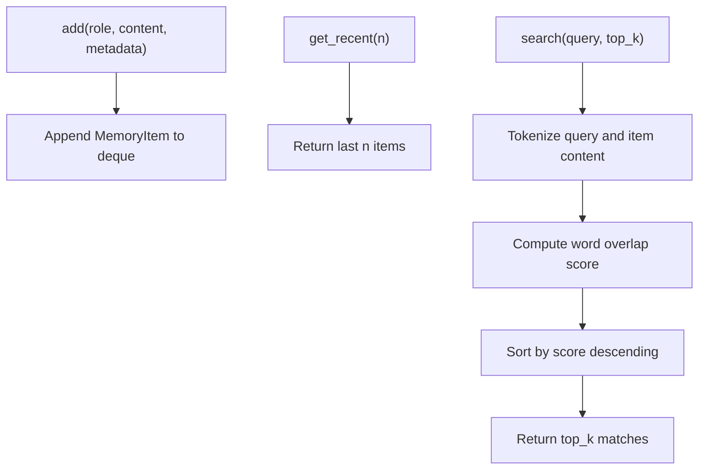
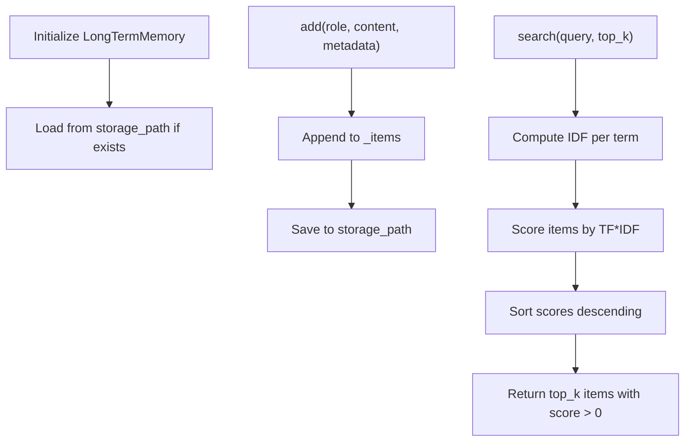
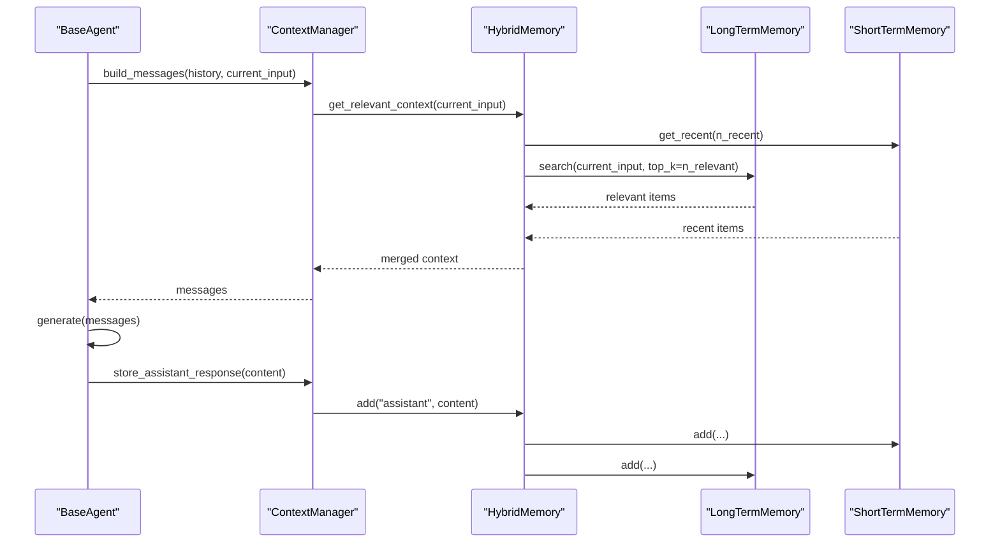
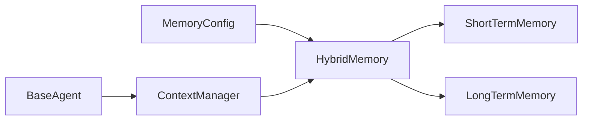

# Hybrid Memory

<cite>
**Referenced Files in This Document**
- [hybrid.py](file://harness/memory/hybrid.py)
- [short_term.py](file://harness/memory/short_term.py)
- [long_term.py](file://harness/memory/long_term.py)
- [base.py](file://harness/memory/base.py)
- [manager.py](file://harness/context/manager.py)
- [base.py](file://harness/agent/base.py)
- [config.py](file://harness/config.py)
- [demo_chat.py](file://demos/demo_chat.py)
</cite>

## Table of Contents
1. [Introduction](#introduction)
2. [Project Structure](#project-structure)
3. [Core Components](#core-components)
4. [Architecture Overview](#architecture-overview)
5. [Detailed Component Analysis](#detailed-component-analysis)
6. [Dependency Analysis](#dependency-analysis)
7. [Performance Considerations](#performance-considerations)
8. [Troubleshooting Guide](#troubleshooting-guide)
9. [Conclusion](#conclusion)
10. [Appendices](#appendices)

## Introduction
This document explains the Hybrid Memory sub-component, which combines short-term and long-term memory systems into a single production-ready interface. It focuses on:
- The composite pattern that unifies short-term (recent conversation buffer) and long-term (persistent knowledge store).
- The intelligent routing algorithm used to build context by combining recent messages with relevant past memories based on recency and relevance.
- Concrete examples from the codebase showing how hybrid memory coordinates storage backends, synchronizes data, and optimizes retrieval performance.
- Configuration options for balancing short-term vs long-term priorities, caching strategies, and fallback mechanisms.
- Why this approach is recommended for production: it leverages the strengths of both memory types while mitigating their limitations.

## Project Structure
The memory subsystem is organized around a base abstraction and multiple concrete implementations:
- BaseMemory defines the common interface and a default context formatter.
- ShortTermMemory provides a bounded FIFO buffer for recent messages.
- LongTermMemory persists items across sessions and supports TF-IDF-based retrieval.
- HybridMemory composes both to provide a unified API and intelligent context assembly.

**Diagram sources**
- [base.py:18-64](file://harness/memory/base.py#L18-L64)
- [short_term.py:16-50](file://harness/memory/short_term.py#L16-L50)
- [long_term.py:24-109](file://harness/memory/long_term.py#L24-L109)
- [hybrid.py:22-84](file://harness/memory/hybrid.py#L22-L84)

**Section sources**
- [base.py:18-64](file://harness/memory/base.py#L18-L64)
- [short_term.py:16-50](file://harness/memory/short_term.py#L16-L50)
- [long_term.py:24-109](file://harness/memory/long_term.py#L24-L109)
- [hybrid.py:22-84](file://harness/memory/hybrid.py#L22-L84)

## Core Components
- BaseMemory and MemoryItem define the shared contract and data model for all memory backends.
- ShortTermMemory uses a deque-backed buffer with capacity limits and simple keyword overlap scoring for quick local search.
- LongTermMemory persists items to JSON and implements TF-IDF scoring to retrieve semantically relevant past memories.
- HybridMemory orchestrates both backends: it writes to short-term for every message and to long-term for user/assistant content; it merges recent and relevant memories when building context.

Key responsibilities:
- Data ingestion: add() routes to short-term always and to long-term conditionally.
- Recent retrieval: get_recent() returns the most recent N items from short-term.
- Relevance retrieval: search() queries long-term using TF-IDF.
- Context composition: get_relevant_context() merges recent and relevant memories, deduplicating overlapping content.

**Section sources**
- [base.py:18-64](file://harness/memory/base.py#L18-L64)
- [short_term.py:16-50](file://harness/memory/short_term.py#L16-L50)
- [long_term.py:24-109](file://harness/memory/long_term.py#L24-L109)
- [hybrid.py:22-84](file://harness/memory/hybrid.py#L22-L84)

## Architecture Overview
Hybrid Memory acts as a composite coordinator between two specialized backends. The Context Manager integrates Hybrid Memory into the agent loop to assemble prompts with both recent conversation history and relevant past knowledge.

**Diagram sources**
- [manager.py:61-108](file://harness/context/manager.py#L61-L108)
- [hybrid.py:33-73](file://harness/memory/hybrid.py#L33-L73)
- [short_term.py:23-40](file://harness/memory/short_term.py#L23-L40)
- [long_term.py:32-68](file://harness/memory/long_term.py#L32-L68)
- [base.py:97-160](file://harness/agent/base.py#L97-L160)

## Detailed Component Analysis

### HybridMemory: Composite Coordinator
HybridMemory composes ShortTermMemory and LongTermMemory to provide a unified interface. Its key behaviors:
- Ingestion: add() writes to short-term for all roles and to long-term only for user and assistant roles.
- Retrieval: get_recent() delegates to short-term; search() delegates to long-term.
- Context assembly: get_relevant_context() builds a prompt-friendly string combining recent conversation and relevant past memories, removing duplicates already present in recent.

**Diagram sources**
- [base.py:18-64](file://harness/memory/base.py#L18-L64)
- [short_term.py:16-50](file://harness/memory/short_term.py#L16-L50)
- [long_term.py:24-109](file://harness/memory/long_term.py#L24-L109)
- [hybrid.py:22-84](file://harness/memory/hybrid.py#L22-L84)

**Section sources**
- [hybrid.py:22-84](file://harness/memory/hybrid.py#L22-L84)

### Intelligent Routing Algorithm: Recency and Relevance
HybridMemory’s get_relevant_context() implements an intelligent routing strategy that balances recency and relevance:
- Recency: Retrieves the most recent N messages from short-term to ensure immediate conversational continuity.
- Relevance: Queries long-term memory for top-K relevant items using TF-IDF scoring against the current query.
- Deduplication: Filters out any relevant items whose content already appears in recent to avoid redundancy.
- Composition: Concatenates sections for “Recent Conversation” and “Relevant Past Memories” into a single context string.

**Diagram sources**
- [hybrid.py:46-73](file://harness/memory/hybrid.py#L46-L73)

**Section sources**
- [hybrid.py:46-73](file://harness/memory/hybrid.py#L46-L73)

### Short-Term Memory: Bounded Buffer and Local Search
- Storage: Uses a deque with maxlen to enforce capacity and automatically evict oldest items (FIFO).
- Retrieval: get_recent() returns the last N items efficiently.
- Search: Implements simple keyword overlap scoring for fast local matching within the buffer.

**Diagram sources**
- [short_term.py:16-50](file://harness/memory/short_term.py#L16-L50)

**Section sources**
- [short_term.py:16-50](file://harness/memory/short_term.py#L16-L50)

### Long-Term Memory: Persistent Storage and TF-IDF Retrieval
- Persistence: Items are saved to a JSON file after each add or clear operation; loaded at initialization if available.
- Retrieval: Implements TF-IDF scoring over stored items to rank relevance against a query.
- Robustness: Includes logging for load/save errors and graceful handling of missing files.

**Diagram sources**
- [long_term.py:24-109](file://harness/memory/long_term.py#L24-L109)

**Section sources**
- [long_term.py:24-109](file://harness/memory/long_term.py#L24-L109)

### Integration with Context Manager and Agent Loop
- ContextManager.build_messages() uses HybridMemory.get_relevant_context() to inject relevant past context into the system message before appending conversation history and the current input.
- BaseAgent.run() drives the loop: build context, call LLM, handle tool calls, and persist assistant responses via ContextManager.store_assistant_response(), which writes to HybridMemory.

**Diagram sources**
- [manager.py:61-108](file://harness/context/manager.py#L61-L108)
- [base.py:97-160](file://harness/agent/base.py#L97-L160)
- [hybrid.py:33-73](file://harness/memory/hybrid.py#L33-L73)

**Section sources**
- [manager.py:61-108](file://harness/context/manager.py#L61-L108)
- [base.py:97-160](file://harness/agent/base.py#L97-L160)
- [hybrid.py:33-73](file://harness/memory/hybrid.py#L33-L73)

## Dependency Analysis
- HybridMemory depends on ShortTermMemory and LongTermMemory through composition.
- ContextManager depends on HybridMemory to assemble context; it also depends on ToolRegistry for tool descriptions.
- BaseAgent depends on ContextManager and HybridMemory to drive the agent loop and persist responses.
- Configuration module exposes MemoryConfig fields that align with HybridMemory parameters (capacity and persistence path), enabling environment-driven tuning.

**Diagram sources**
- [config.py:37-44](file://harness/config.py#L37-L44)
- [hybrid.py:22-31](file://harness/memory/hybrid.py#L22-L31)
- [manager.py:49-59](file://harness/context/manager.py#L49-L59)
- [base.py:73-95](file://harness/agent/base.py#L73-L95)

**Section sources**
- [config.py:37-44](file://harness/config.py#L37-L44)
- [hybrid.py:22-31](file://harness/memory/hybrid.py#L22-L31)
- [manager.py:49-59](file://harness/context/manager.py#L49-L59)
- [base.py:73-95](file://harness/agent/base.py#L73-L95)

## Performance Considerations
- Short-term memory uses a fixed-capacity deque, ensuring O(1) appends and efficient slicing for recent retrieval. Keyword overlap search is linear in buffer size but suitable for small buffers.
- Long-term memory performs TF-IDF scoring over all stored items, which scales with the number of items. For large datasets, consider replacing TF-IDF with vector embeddings and a vector database for faster similarity search.
- Context assembly deduplicates relevant items already present in recent to reduce redundant tokens in prompts.
- Persistence occurs on every add/clear; batched writes could be considered for high-throughput scenarios.

[No sources needed since this section provides general guidance]

## Troubleshooting Guide
Common issues and resolutions:
- Missing or corrupted memory file: LongTermMemory logs errors during load/save and handles missing files gracefully. Verify storage_path permissions and file integrity.
- No relevant results from long-term search: Ensure sufficient items exist and that query terms match stored content. Adjust top_k or refine queries.
- Excessive token usage in prompts: Tune n_recent and n_relevant in get_relevant_context() to balance context richness with token constraints.
- Fallback behavior: If the agent reaches max_iterations without a final answer, a fallback response is returned; inspect tool execution and memory context for bottlenecks.

**Section sources**
- [long_term.py:77-105](file://harness/memory/long_term.py#L77-L105)
- [base.py:97-160](file://harness/agent/base.py#L97-L160)

## Conclusion
Hybrid Memory provides a robust, production-oriented approach by combining:
- Short-term memory for immediate conversational continuity with bounded capacity and fast local search.
- Long-term memory for persistent knowledge with TF-IDF-based retrieval.
- An intelligent routing algorithm that merges recent and relevant contexts while avoiding duplication.
This design leverages the strengths of both memory types and mitigates their limitations, making it well-suited for scalable AI applications.

[No sources needed since this section summarizes without analyzing specific files]

## Appendices

### Configuration Options
- short_term_capacity: Controls the maximum number of recent messages retained in short-term memory.
- long_term_enabled: Indicates whether long-term persistence is active (conceptual flag aligned with configuration).
- memory_file: Path to the JSON file used by long-term memory for persistence.
- similarity_threshold: Intended threshold for relevance filtering (not enforced in current TF-IDF implementation).

These options are defined in MemoryConfig and can be adjusted to balance short-term vs long-term priorities.

**Section sources**
- [config.py:37-44](file://harness/config.py#L37-L44)

### Usage Examples
- Demo chat initializes HybridMemory with a custom storage path and integrates it with a ChatAgent and ToolRegistry.
- Agents and context managers default to HybridMemory unless explicitly overridden.

**Section sources**
- [demo_chat.py:15-28](file://demos/demo_chat.py#L15-L28)
- [base.py:73-95](file://harness/agent/base.py#L73-L95)
- [manager.py:49-59](file://harness/context/manager.py#L49-L59)