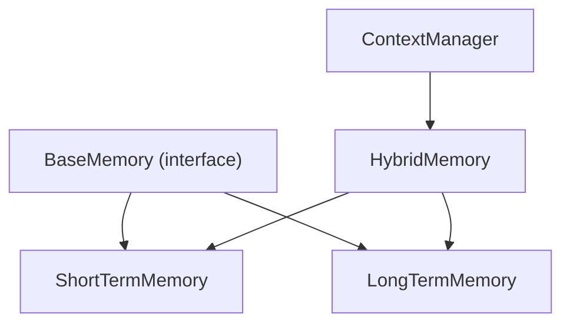
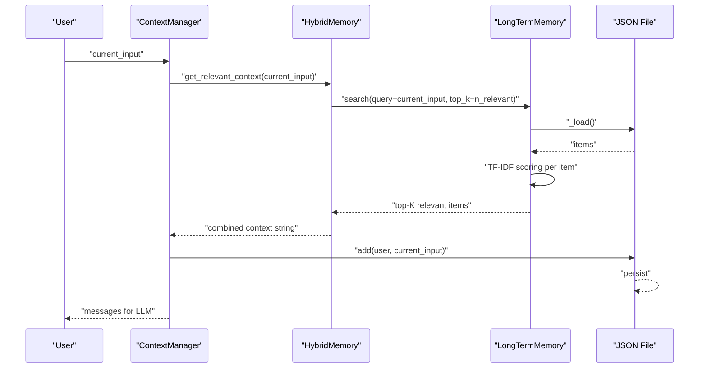
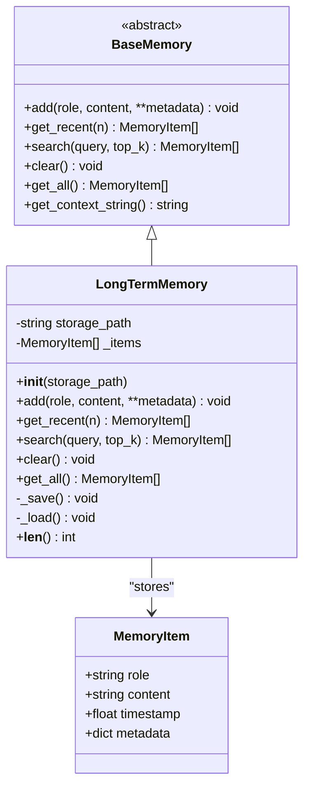
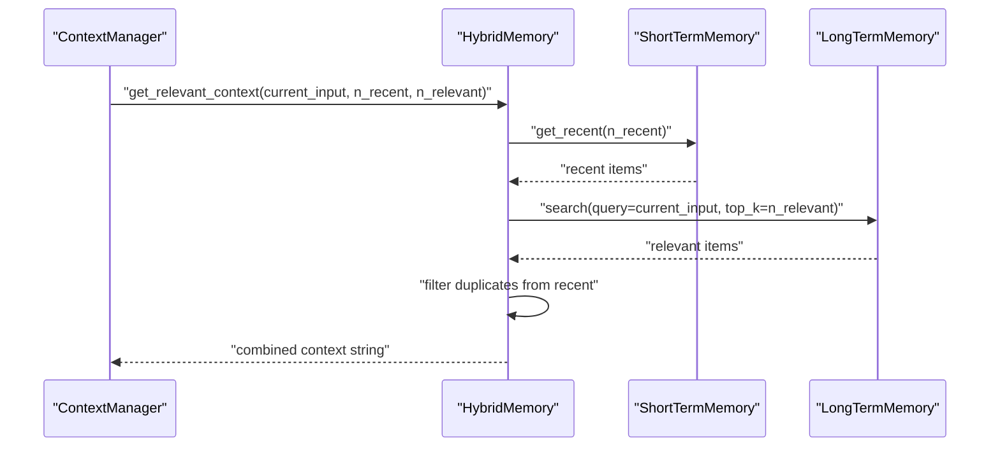
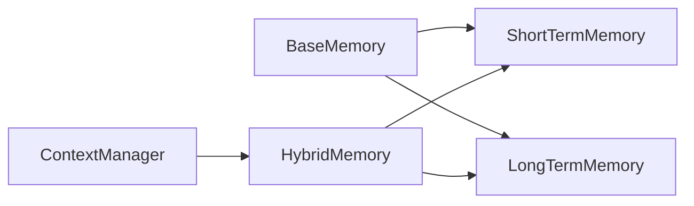

# Long-Term Memory

<cite>
**Referenced Files in This Document**
- [long_term.py](file://harness/memory/long_term.py)
- [base.py](file://harness/memory/base.py)
- [hybrid.py](file://harness/memory/hybrid.py)
- [short_term.py](file://harness/memory/short_term.py)
- [manager.py](file://harness/context/manager.py)
- [config.py](file://harness/config.py)
</cite>

## Table of Contents
1. [Introduction](#introduction)
2. [Project Structure](#project-structure)
3. [Core Components](#core-components)
4. [Architecture Overview](#architecture-overview)
5. [Detailed Component Analysis](#detailed-component-analysis)
6. [Dependency Analysis](#dependency-analysis)
7. [Performance Considerations](#performance-considerations)
8. [Troubleshooting Guide](#troubleshooting-guide)
9. [Conclusion](#conclusion)
10. [Appendices](#appendices)

## Introduction
This document explains the Long-Term Memory sub-component that provides persistent storage and TF-IDF-based retrieval for historical context. It covers how documents are stored, how semantic search is performed using a vector space model with TF-IDF scoring, and how retrieved memories are integrated into agent reasoning via context assembly. It also documents configuration options for indexing parameters, similarity thresholds, and storage backends, and provides guidance on performance optimization and retrieval accuracy tuning for large collections.

## Project Structure
The long-term memory system is part of a layered memory architecture:
- BaseMemory defines the interface and shared data structures.
- ShortTermMemory maintains a bounded buffer of recent messages.
- LongTermMemory persists items to JSON and supports TF-IDF retrieval.
- HybridMemory composes short-term and long-term memory and builds combined context.
- ContextManager integrates memory into prompts for LLM calls.

**Diagram sources**
- [base.py:18-64](file://harness/memory/base.py#L18-L64)
- [short_term.py:16-50](file://harness/memory/short_term.py#L16-L50)
- [long_term.py:24-109](file://harness/memory/long_term.py#L24-L109)
- [hybrid.py:22-84](file://harness/memory/hybrid.py#L22-L84)
- [manager.py:41-118](file://harness/context/manager.py#L41-L118)

**Section sources**
- [base.py:18-64](file://harness/memory/base.py#L18-L64)
- [short_term.py:16-50](file://harness/memory/short_term.py#L16-L50)
- [long_term.py:24-109](file://harness/memory/long_term.py#L24-L109)
- [hybrid.py:22-84](file://harness/memory/hybrid.py#L22-L84)
- [manager.py:41-118](file://harness/context/manager.py#L41-L118)

## Core Components
- MemoryItem: Dataclass representing a single memory entry with role, content, timestamp, and metadata.
- BaseMemory: Abstract interface defining add, get_recent, search, clear, get_all, and a helper to format recent memory as a string.
- LongTermMemory: Persistent store backed by JSON with TF-IDF retrieval over stored content.
- HybridMemory: Combines short-term buffer and long-term persistence; builds combined context from recent and relevant past memories.
- ContextManager: Assembles system prompt, tool descriptions, memory context, conversation history, and current input for each LLM call.

Key responsibilities:
- LongTermMemory stores user and assistant messages across sessions and retrieves relevant memories based on query terms using TF-IDF.
- HybridMemory merges recent conversation context with relevant long-term memories to form a richer prompt.
- ContextManager orchestrates the inclusion of memory context into the final message list.

**Section sources**
- [base.py:18-64](file://harness/memory/base.py#L18-L64)
- [long_term.py:24-109](file://harness/memory/long_term.py#L24-L109)
- [hybrid.py:22-84](file://harness/memory/hybrid.py#L22-L84)
- [manager.py:41-118](file://harness/context/manager.py#L41-L118)

## Architecture Overview
The long-term memory subsystem integrates with the broader harness to provide historical context for agent reasoning. The flow is:
- User input arrives at ContextManager.
- ContextManager requests relevant context from HybridMemory using the current input as a query.
- HybridMemory delegates retrieval to LongTermMemory’s TF-IDF search.
- Retrieved memories are appended to the prompt as system messages alongside recent conversation history.
- LongTermMemory persists all user and assistant messages to a JSON file for cross-session continuity.

**Diagram sources**
- [manager.py:61-104](file://harness/context/manager.py#L61-L104)
- [hybrid.py:46-73](file://harness/memory/hybrid.py#L46-L73)
- [long_term.py:40-68](file://harness/memory/long_term.py#L40-L68)
- [long_term.py:77-105](file://harness/memory/long_term.py#L77-L105)

## Detailed Component Analysis

### LongTermMemory: TF-IDF Retrieval and JSON Persistence
LongTermMemory implements a simple but effective keyword-based semantic search using TF-IDF over stored content. It persists all entries to a JSON file and loads them at initialization.

Vector Space Model and Similarity Calculation
- Term Frequency (TF): For each document (memory item), compute term frequency as the count of a term divided by the total number of words in that document.
- Inverse Document Frequency (IDF): Compute IDF for each query term using document frequency across all items, with smoothing to avoid division by zero.
- Scoring: Sum the product of TF and IDF across query terms present in the document to obtain a relevance score.
- Ranking: Sort items by descending score and return the top-K items with positive scores.

Note on Cosine Similarity
- The current implementation uses TF-IDF scoring rather than explicit cosine similarity between normalized vectors. While both operate in a vector space, this code computes a weighted sum of term contributions instead of normalizing vectors and computing dot products.
- To adopt cosine similarity, one would normalize TF-IDF vectors per document and compute dot products with the query vector. The existing approach is simpler and avoids normalization overhead while still providing meaningful ranking for keyword queries.

Storage Layer
- Persistence: Items are serialized to JSON with fields for role, content, timestamp, and metadata.
- Loading: On initialization, the store is loaded if it exists; errors are logged without failing the process.
- Clearing: Clears in-memory items and persists an empty state.

Configuration Options
- storage_path: Path to the JSON file used for persistence. Defaults to "memory_store.json".

Usage Examples (from code paths)
- Add a new memory item: call add(role, content, **metadata).
- Retrieve recent items: call get_recent(n).
- Perform semantic search: call search(query, top_k=5).
- Clear all memories: call clear().
- Get all stored items: call get_all().

Complexity
- Search time complexity is O(N * W) where N is the number of items and W is the average number of unique query terms considered per item. For large collections, consider precomputing indices or switching to a vector database for faster retrieval.

Error Handling
- Save/load operations catch exceptions and log errors, ensuring robustness against disk I/O issues.

**Section sources**
- [long_term.py:24-109](file://harness/memory/long_term.py#L24-L109)

#### Class Diagram

**Diagram sources**
- [base.py:18-64](file://harness/memory/base.py#L18-L64)
- [long_term.py:24-109](file://harness/memory/long_term.py#L24-L109)

### HybridMemory: Context Assembly with Long-Term Retrieval
HybridMemory combines short-term and long-term memory to build a comprehensive context for each turn:
- Adds user and assistant messages to both short-term and long-term stores.
- Retrieves relevant past memories using LongTermMemory’s search.
- Filters out duplicates already present in recent conversation.
- Formats a combined context string including recent conversation and relevant past memories.

Integration with ContextManager
- ContextManager calls HybridMemory.get_relevant_context(current_input) to inject relevant past context into the prompt before appending conversation history and current input.

Configuration Options
- short_term_capacity: Maximum number of recent messages retained in short-term memory.
- storage_path: Passed through to LongTermMemory for persistence path.

**Section sources**
- [hybrid.py:22-84](file://harness/memory/hybrid.py#L22-L84)
- [manager.py:61-104](file://harness/context/manager.py#L61-L104)

#### Sequence Diagram: Context Assembly

**Diagram sources**
- [hybrid.py:46-73](file://harness/memory/hybrid.py#L46-L73)
- [short_term.py:23-40](file://harness/memory/short_term.py#L23-L40)
- [long_term.py:40-68](file://harness/memory/long_term.py#L40-L68)

### ShortTermMemory: Recent Conversation Buffer
ShortTermMemory maintains a bounded FIFO buffer of recent messages. Its search method performs simple keyword overlap scoring for quick local retrieval within recent context.

Role in Long-Term Memory Workflow
- Provides immediate conversational context to ensure coherence.
- Works alongside LongTermMemory to avoid redundancy when building combined context.

**Section sources**
- [short_term.py:16-50](file://harness/memory/short_term.py#L16-L50)

### ContextManager: Prompt Assembly with Memory Integration
ContextManager constructs the full set of messages for each LLM call:
- System prompt with optional tool instructions.
- Relevant past context from HybridMemory (long-term retrieval).
- Conversation history from short-term memory.
- Current user input.
- Stores user input and assistant responses in memory for future turns.

Token Estimation
- Provides a rough token estimation to help manage context window constraints.

**Section sources**
- [manager.py:41-118](file://harness/context/manager.py#L41-L118)

## Dependency Analysis
The long-term memory component depends on:
- BaseMemory for the common interface and data structure.
- ShortTermMemory for recent context.
- HybridMemory for combining sources and building context.
- ContextManager for integrating memory into prompts.

**Diagram sources**
- [base.py:18-64](file://harness/memory/base.py#L18-L64)
- [short_term.py:16-50](file://harness/memory/short_term.py#L16-L50)
- [long_term.py:24-109](file://harness/memory/long_term.py#L24-L109)
- [hybrid.py:22-84](file://harness/memory/hybrid.py#L22-L84)
- [manager.py:41-118](file://harness/context/manager.py#L41-L118)

**Section sources**
- [base.py:18-64](file://harness/memory/base.py#L18-L64)
- [hybrid.py:22-84](file://harness/memory/hybrid.py#L22-L84)
- [manager.py:41-118](file://harness/context/manager.py#L41-L118)

## Performance Considerations
Indexing Strategies
- Current approach recomputes TF-IDF scores per query. For large collections, consider:
  - Precomputing term frequencies and document frequencies once and caching them.
  - Building inverted indexes mapping terms to lists of document IDs for faster candidate selection.
  - Using sparse vector representations and efficient libraries for scoring.

Retrieval Accuracy Tuning
- Adjust top_k to balance recall vs. precision.
- Tune query preprocessing (tokenization, stopword removal, stemming/lemmatization) to improve matching.
- Consider adding metadata weighting (e.g., boosting titles or tags) to influence scores.
- If adopting cosine similarity, normalize TF-IDF vectors and tune thresholding to filter low-similarity results.

Storage Backend Optimization
- JSON persistence is simple but can become slow with very large files. Consider:
  - Chunked writes or append-only logs with periodic compaction.
  - Switching to a lightweight embedded database (e.g., SQLite) for larger datasets.
  - Using a vector database (FAISS, Pinecone, Chroma) for production-scale semantic search.

Query-Time Complexity
- Search is O(N * W) per query. For high-throughput scenarios, reduce N via filtering (e.g., by date or tags) or use approximate nearest neighbor methods.

[No sources needed since this section provides general guidance]

## Troubleshooting Guide
Common Issues and Resolutions
- Empty retrieval results: Ensure items have been added and persisted; verify storage_path exists and is writable. Check that query terms match content tokens.
- Slow searches: Reduce top_k, filter by metadata, or implement inverted indexes. Consider moving to a vector database for large collections.
- Persistence failures: Inspect logs for save/load errors; ensure disk permissions and available space.

Relevant Code Paths
- Save and load operations log errors and handle exceptions gracefully.

**Section sources**
- [long_term.py:77-105](file://harness/memory/long_term.py#L77-L105)

## Conclusion
The Long-Term Memory component provides a practical, dependency-light solution for persistent knowledge and keyword-based semantic search using TF-IDF. It integrates seamlessly with HybridMemory and ContextManager to enrich agent reasoning with relevant historical context. For production systems handling large document collections, consider advanced indexing strategies, vector embeddings, and dedicated vector databases to improve scalability and retrieval accuracy.

[No sources needed since this section summarizes without analyzing specific files]

## Appendices

### Configuration Options
- MemoryConfig includes:
  - short_term_capacity: Controls the size of the short-term buffer.
  - long_term_enabled: Flag to enable/disable long-term persistence.
  - memory_file: Path to the JSON persistence file.
  - similarity_threshold: Intended minimum similarity for retrieval (not currently enforced in LongTermMemory search).

Notes
- similarity_threshold is defined but not applied in the current LongTermMemory.search implementation. To enforce it, add a threshold check after scoring and filter out items below the threshold.

**Section sources**
- [config.py:37-44](file://harness/config.py#L37-L44)

### Concrete Usage Patterns (from code paths)
- Storing documents:
  - Use HybridMemory.add(role="user"/"assistant", content, **metadata) to persist across sessions.
  - LongTermMemory.add creates a MemoryItem and saves to JSON.
- Performing similarity searches:
  - Call HybridMemory.search(query, top_k) which delegates to LongTermMemory.search.
  - LongTermMemory.search computes TF-IDF scores and returns top-K items with positive scores.
- Managing persistent storage:
  - LongTermMemory._save serializes items to JSON; _load reconstructs items on startup.
  - Clearing memory removes items and updates the JSON file.

**Section sources**
- [hybrid.py:33-44](file://harness/memory/hybrid.py#L33-L44)
- [long_term.py:32-68](file://harness/memory/long_term.py#L32-L68)
- [long_term.py:77-105](file://harness/memory/long_term.py#L77-L105)