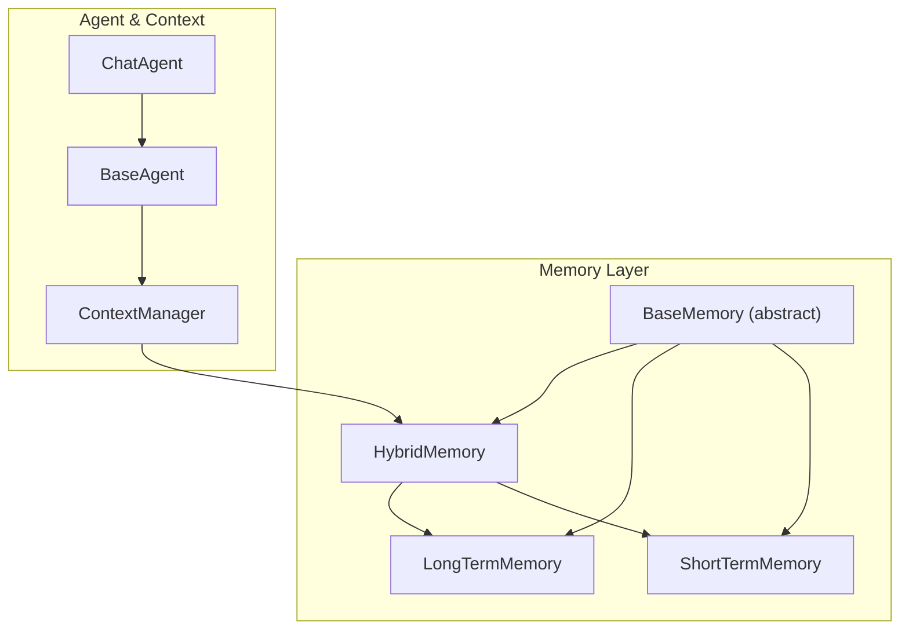
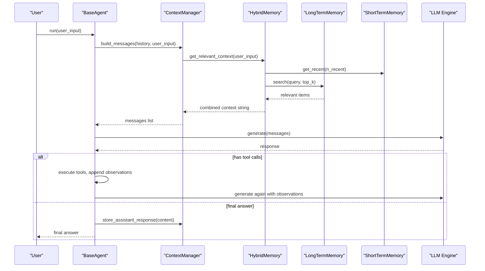
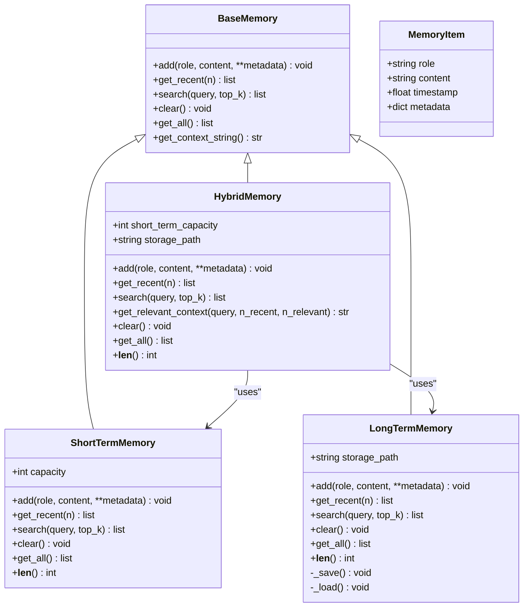
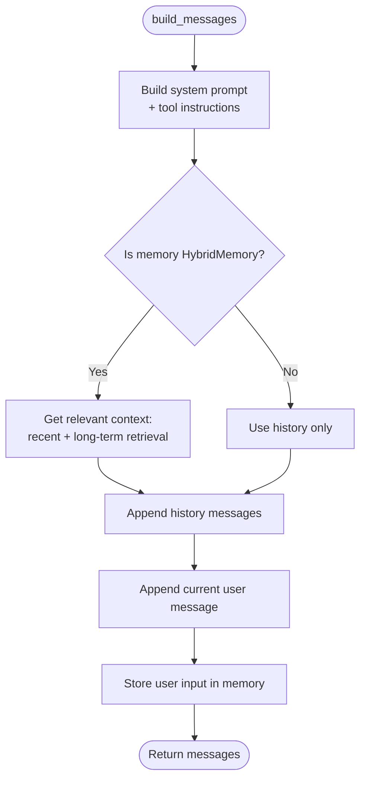
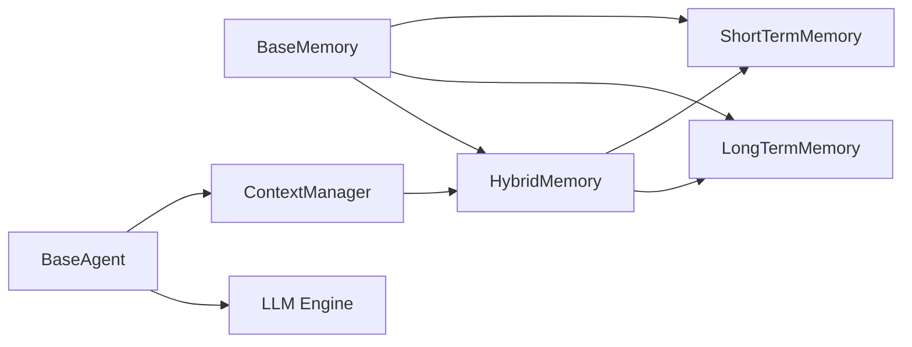

# Memory Architecture Overview

<cite>
**Referenced Files in This Document**
- [base.py](file://harness/memory/base.py)
- [short_term.py](file://harness/memory/short_term.py)
- [long_term.py](file://harness/memory/long_term.py)
- [hybrid.py](file://harness/memory/hybrid.py)
- [manager.py](file://harness/context/manager.py)
- [base.py](file://harness/agent/base.py)
- [chat.py](file://harness/agent/chat.py)
- [engine.py](file://harness/llm/engine.py)
- [manager.py](file://harness/session/manager.py)
- [README.md](file://README.md)
</cite>

## Table of Contents
1. Introduction
2. Project Structure
3. Core Components
4. Architecture Overview
5. Detailed Component Analysis
6. Dependency Analysis
7. Performance Considerations
8. Troubleshooting Guide
9. Conclusion
10. Appendices

## Introduction
This document explains the foundational design patterns and interfaces that enable the three-tiered memory system: short-term, long-term, and hybrid memory. It focuses on the BaseMemory abstract class, common storage and retrieval operations, and how these components simulate human cognitive processes (working memory vs. episodic knowledge). It also documents the memory lifecycle, state management patterns, integration with the agent system, examples for extending functionality, performance considerations, scalability patterns, and best practices.

## Project Structure
The memory subsystem is organized around a clear abstraction layer and concrete implementations:
- Abstraction: BaseMemory defines the contract for all memory types.
- Short-term memory: A bounded buffer using FIFO eviction to hold recent conversation context.
- Long-term memory: Persistent storage with TF-IDF retrieval for relevant past experiences.
- Hybrid memory: Combines short-term and long-term to build rich prompts by merging recent messages with relevant historical memories.

**Diagram sources**
- [base.py:27-64](file://harness/memory/base.py#L27-L64)
- [short_term.py:16-50](file://harness/memory/short_term.py#L16-L50)
- [long_term.py:24-109](file://harness/memory/long_term.py#L24-L109)
- [hybrid.py:22-84](file://harness/memory/hybrid.py#L22-L84)
- [manager.py:41-118](file://harness/context/manager.py#L41-L118)
- [base.py:63-165](file://harness/agent/base.py#L63-L165)
- [chat.py:25-60](file://harness/agent/chat.py#L25-L60)

**Section sources**
- [base.py:1-64](file://harness/memory/base.py#L1-L64)
- [short_term.py:1-50](file://harness/memory/short_term.py#L1-L50)
- [long_term.py:1-109](file://harness/memory/long_term.py#L1-L109)
- [hybrid.py:1-84](file://harness/memory/hybrid.py#L1-L84)
- [manager.py:1-118](file://harness/context/manager.py#L1-L118)
- [base.py:1-165](file://harness/agent/base.py#L1-L165)
- [chat.py:1-60](file://harness/agent/chat.py#L1-L60)

## Core Components
- BaseMemory: Abstract interface defining add, get_recent, search, clear, get_all, and a helper to format recent memory as a prompt string.
- MemoryItem: Dataclass representing a stored item with role, content, timestamp, and metadata.
- ShortTermMemory: Bounded deque-based buffer with FIFO eviction; keyword overlap search for quick relevance within recent context.
- LongTermMemory: Persistent JSON-backed store with TF-IDF scoring for retrieving top-K relevant items across sessions.
- HybridMemory: Orchestrates both short-term and long-term; builds combined context strings by merging recent conversation and retrieved relevant memories.

Key responsibilities:
- Short-term: Keep only the most recent N messages to fit within model context windows.
- Long-term: Persist and retrieve meaningful facts or episodes beyond immediate conversation.
- Hybrid: Provide a unified interface and smart context assembly for agents.

**Section sources**
- [base.py:18-64](file://harness/memory/base.py#L18-L64)
- [short_term.py:16-50](file://harness/memory/short_term.py#L16-L50)
- [long_term.py:24-109](file://harness/memory/long_term.py#L24-L109)
- [hybrid.py:22-84](file://harness/memory/hybrid.py#L22-L84)

## Architecture Overview
The memory architecture mirrors human cognition:
- Working memory (short-term): Holds recent turns for immediate reasoning.
- Episodic/semantic memory (long-term): Stores durable knowledge and past experiences.
- Retrieval-augmented prompting (hybrid): Merges working memory with relevant long-term memories to inform responses.

Integration points:
- ContextManager composes the final prompt by injecting system instructions, tool descriptions, relevant long-term memories, recent history, and current input.
- Agent loop uses ContextManager to build messages, calls the LLM, executes tools if needed, and stores assistant responses back into memory.

**Diagram sources**
- [base.py:97-165](file://harness/agent/base.py#L97-L165)
- [manager.py:61-108](file://harness/context/manager.py#L61-L108)
- [hybrid.py:33-84](file://harness/memory/hybrid.py#L33-L84)
- [long_term.py:40-68](file://harness/memory/long_term.py#L40-L68)
- [short_term.py:23-46](file://harness/memory/short_term.py#L23-L46)
- [engine.py:127-241](file://harness/llm/engine.py#L127-L241)

## Detailed Component Analysis

### BaseMemory and MemoryItem
- Purpose: Define a uniform API for all memory strategies and a lightweight data structure for items.
- Key methods:
  - add(role, content, **metadata): Store an item.
  - get_recent(n): Return the n most recent items.
  - search(query, top_k=5): Retrieve relevant items based on query.
  - clear(): Reset memory.
  - get_all(): Export all items.
  - get_context_string(): Format recent items for prompts.

Design notes:
- Using an abstract base ensures interchangeable memory backends.
- MemoryItem includes timestamps and metadata to support advanced retrieval and filtering later.

**Section sources**
- [base.py:18-64](file://harness/memory/base.py#L18-L64)

### ShortTermMemory
- Implementation: Uses a bounded deque with capacity-based FIFO eviction.
- Search strategy: Simple keyword overlap scoring to quickly surface relevant recent messages.
- Use case: Keeps conversation coherent within token limits while preserving recency bias.

Complexity:
- add: O(1) amortized due to deque.
- get_recent: O(n) to slice last n items.
- search: O(N) where N is number of items in buffer; simple word overlap scoring.

**Section sources**
- [short_term.py:16-50](file://harness/memory/short_term.py#L16-L50)

### LongTermMemory
- Implementation: In-memory list persisted to JSON; loads on init and saves after mutations.
- Retrieval: TF-IDF scoring over content tokens to compute relevance against query terms.
- Persistence: Saves entire index to file; logs errors on load/save failures.

Complexity:
- add: O(1) append + I/O cost to save.
- get_recent: O(n) slice from end.
- search: O(D * W) where D is number of documents and W is average words per document; IDF precomputation not cached here but could be optimized.

Scalability considerations:
- For large corpora, consider vector embeddings and a vector database (e.g., FAISS, Pinecone, Chroma) as noted in comments.
- Indexing optimizations: cache term frequencies, incremental IDF updates, batch writes.

**Section sources**
- [long_term.py:24-109](file://harness/memory/long_term.py#L24-L109)

### HybridMemory
- Composition: Maintains both ShortTermMemory and LongTermMemory instances.
- Add policy: Persists user and assistant messages to long-term; always adds to short-term.
- Context building: get_relevant_context merges recent conversation with relevant past memories, deduplicating overlapping content.

Usage:
- Recommended for production because it balances immediacy and recall.
- Integrates directly with ContextManager to enrich prompts.

**Section sources**
- [hybrid.py:22-84](file://harness/memory/hybrid.py#L22-L84)

### Integration with Agent and Context
- ContextManager.build_messages constructs the full message list:
  - System prompt with optional tool instructions.
  - Relevant past context via HybridMemory.get_relevant_context.
  - Conversation history (short-term).
  - Current user input.
  - Stores user input in memory for future use.
- BaseAgent.run orchestrates the loop:
  - Builds messages, calls LLM, handles tool calls, appends observations, and stores assistant responses.

State management:
- History is maintained in BaseAgent and passed to ContextManager each iteration.
- Memory persists across sessions via LongTermMemory; session-level isolation is handled by SessionManager.

**Section sources**
- [manager.py:41-118](file://harness/context/manager.py#L41-L118)
- [base.py:63-165](file://harness/agent/base.py#L63-L165)

### Class Relationships

**Diagram sources**
- [base.py:18-64](file://harness/memory/base.py#L18-L64)
- [short_term.py:16-50](file://harness/memory/short_term.py#L16-L50)
- [long_term.py:24-109](file://harness/memory/long_term.py#L24-L109)
- [hybrid.py:22-84](file://harness/memory/hybrid.py#L22-L84)

### Sequence: Building Context with Hybrid Memory

**Diagram sources**
- [manager.py:61-108](file://harness/context/manager.py#L61-L108)
- [hybrid.py:46-73](file://harness/memory/hybrid.py#L46-L73)

## Dependency Analysis
- BaseMemory is the central abstraction; all concrete memory classes depend on it.
- HybridMemory depends on both ShortTermMemory and LongTermMemory.
- ContextManager depends on BaseMemory (typically HybridMemory) to assemble prompts.
- BaseAgent depends on ContextManager and memory to drive the agent loop.
- LLM engine provides Message, ToolCall, LLMResponse used throughout.

**Diagram sources**
- [base.py:27-64](file://harness/memory/base.py#L27-L64)
- [short_term.py:16-50](file://harness/memory/short_term.py#L16-L50)
- [long_term.py:24-109](file://harness/memory/long_term.py#L24-L109)
- [hybrid.py:22-84](file://harness/memory/hybrid.py#L22-L84)
- [manager.py:41-118](file://harness/context/manager.py#L41-L118)
- [base.py:63-165](file://harness/agent/base.py#L63-L165)
- [engine.py:23-57](file://harness/llm/engine.py#L23-L57)

**Section sources**
- [base.py:27-64](file://harness/memory/base.py#L27-L64)
- [hybrid.py:22-84](file://harness/memory/hybrid.py#L22-L84)
- [manager.py:41-118](file://harness/context/manager.py#L41-L118)
- [base.py:63-165](file://harness/agent/base.py#L63-L165)
- [engine.py:23-57](file://harness/llm/engine.py#L23-L57)

## Performance Considerations
- Short-term memory:
  - Bounded deque ensures constant-time appends and bounded memory usage.
  - Keyword overlap search is fast for small buffers; complexity scales linearly with buffer size.
- Long-term memory:
  - TF-IDF search is O(D*W); for large datasets, consider caching term frequencies and precomputing IDF.
  - JSON persistence introduces I/O latency; batch writes or asynchronous saves can reduce blocking.
  - For production-scale retrieval, replace TF-IDF with vector embeddings and a vector DB for near real-time similarity search.
- Hybrid memory:
  - Context assembly combines two sources; ensure deduplication to avoid redundant tokens in prompts.
  - Tune n_recent and top_k to balance context richness and token budget.
- Token estimation:
  - ContextManager provides a rough token estimator; integrate precise tokenizer-based counting for strict context window control.

[No sources needed since this section provides general guidance]

## Troubleshooting Guide
Common issues and remedies:
- Long-term memory load/save failures:
  - Check file permissions and disk space; inspect logs for exceptions during _load/_save.
  - Validate JSON integrity; corrupted files may need manual repair or deletion.
- Empty or stale context:
  - Ensure HybridMemory is configured and used by ContextManager.
  - Verify that user and assistant messages are added to long-term; other roles may be filtered intentionally.
- Excessive token usage:
  - Reduce short_term_capacity, n_recent, and top_k.
  - Implement stricter pruning or summarization before adding to context.
- Slow retrieval:
  - Optimize LongTermMemory indexing; consider embedding-based search for large corpora.
  - Cache frequent queries or precompute statistics.

**Section sources**
- [long_term.py:77-105](file://harness/memory/long_term.py#L77-L105)
- [manager.py:110-118](file://harness/context/manager.py#L110-L118)

## Conclusion
The memory system implements a cognitively inspired three-tier design:
- Short-term memory maintains conversational coherence within token limits.
- Long-term memory provides persistent, retrievable knowledge across sessions.
- Hybrid memory integrates both to produce informed, context-rich prompts.

By adhering to the BaseMemory interface and leveraging ContextManager and BaseAgent, developers can extend or replace memory strategies without disrupting the agent loop. For production systems, prioritize scalable retrieval (embeddings/vector DBs), efficient indexing, and careful token budgeting.

[No sources needed since this section summarizes without analyzing specific files]

## Appendices

### Extending BaseMemory: Custom Strategy Example
To implement a custom memory strategy:
- Subclass BaseMemory and implement add, get_recent, search, clear, get_all.
- Optionally override get_context_string to tailor formatting.
- Integrate with ContextManager by passing your implementation when constructing BaseAgent or ContextManager.

Example pattern:
- Create a new class implementing BaseMemory.
- Use appropriate storage (in-memory, file, database) and retrieval (keyword, semantic, hybrid).
- Register or inject into ContextManager/BaseAgent as needed.

**Section sources**
- [base.py:27-64](file://harness/memory/base.py#L27-L64)
- [manager.py:49-59](file://harness/context/manager.py#L49-L59)
- [base.py:73-95](file://harness/agent/base.py#L73-L95)

### Best Practices
- Prefer HybridMemory for production to combine recency and relevance.
- Keep short-term capacity aligned with model context windows.
- Use robust error handling for persistence operations.
- Monitor token counts and adjust retrieval parameters dynamically.
- Plan for scaling retrieval with embeddings and vector databases as data grows.

[No sources needed since this section provides general guidance]