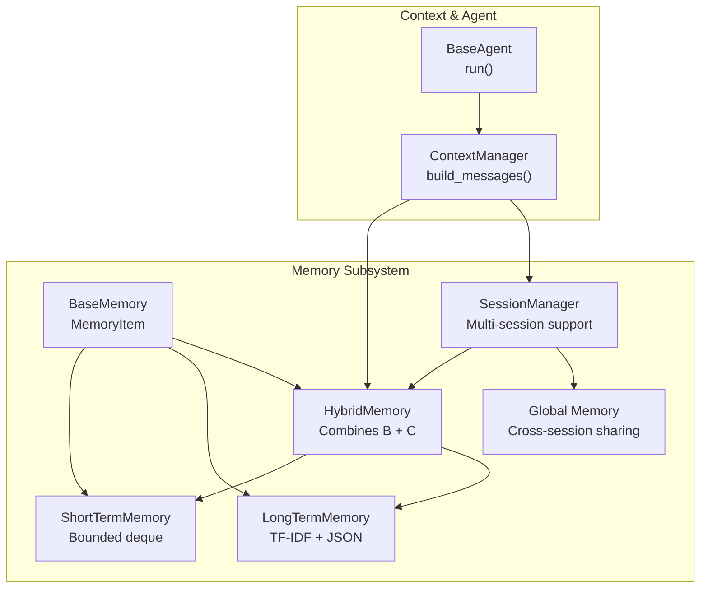
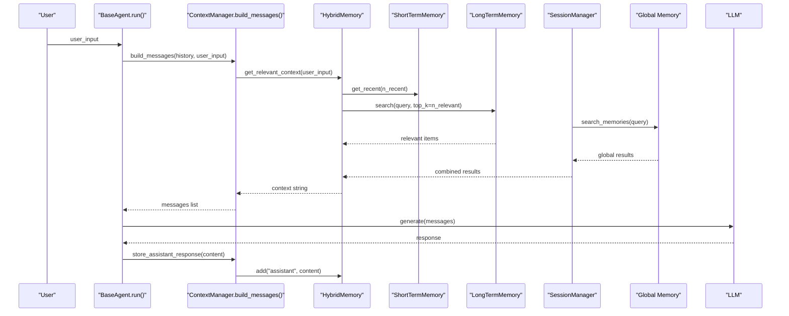
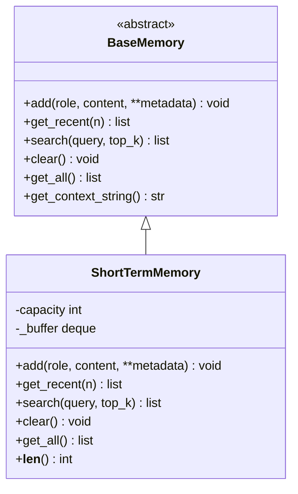
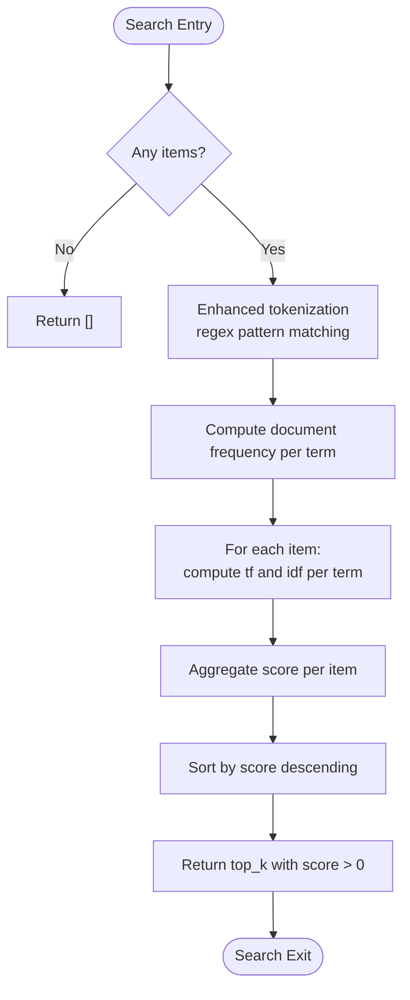
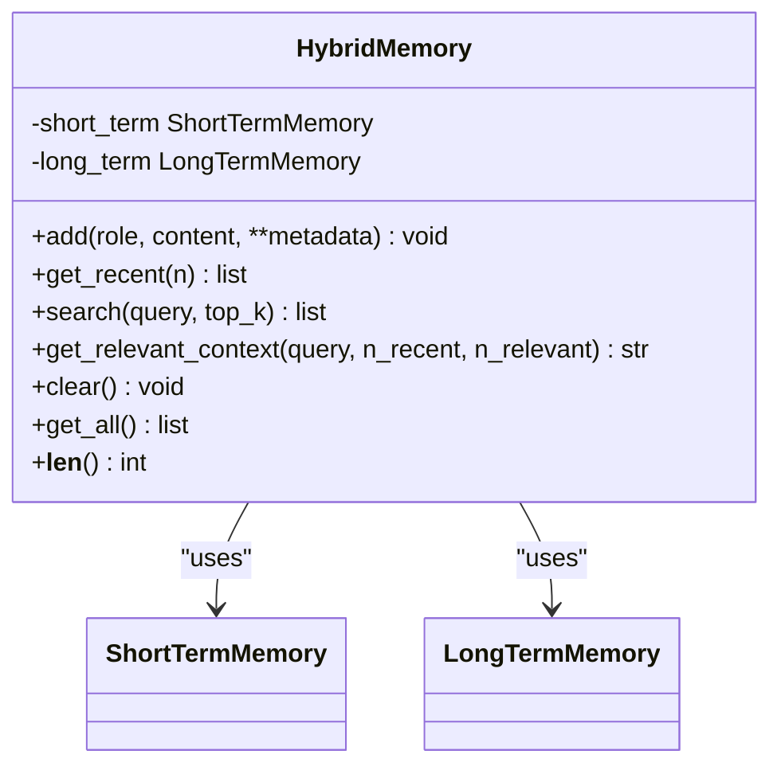
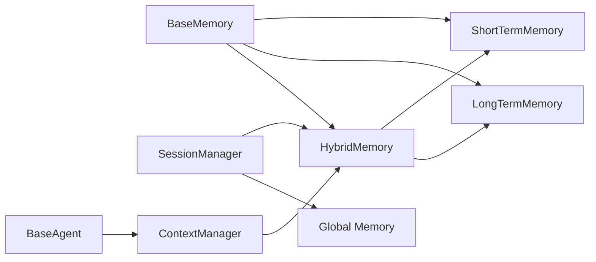

# Memory System

<cite>
**Referenced Files in This Document**
- [base.py](file://harness/memory/base.py)
- [short_term.py](file://harness/memory/short_term.py)
- [long_term.py](file://harness/memory/long_term.py)
- [hybrid.py](file://harness/memory/hybrid.py)
- [manager.py](file://harness/session/manager.py)
- [manager.py](file://harness/context/manager.py)
- [base.py](file://harness/agent/base.py)
- [config.py](file://harness/config.py)
- [demo_memory.py](file://demos/demo_memory.py)
</cite>

## Update Summary
**Changes Made**
- Added comprehensive documentation for session isolation architecture
- Documented global shared memory system for cross-session knowledge
- Enhanced TF-IDF tokenization improvements for better search accuracy
- Updated hybrid memory integration with session management
- Added practical examples from demo files showing multi-session usage
- Expanded troubleshooting guide for session-related issues

## Table of Contents
1. [Introduction](#introduction)
2. [Project Structure](#project-structure)
3. [Core Components](#core-components)
4. [Architecture Overview](#architecture-overview)
5. [Detailed Component Analysis](#detailed-component-analysis)
6. [Session Isolation and Global Memory](#session-isolation-and-global-memory)
7. [Enhanced Tokenization and Search Accuracy](#enhanced-tokenization-and-search-accuracy)
8. [Dependency Analysis](#dependency-analysis)
9. [Performance Considerations](#performance-considerations)
10. [Troubleshooting Guide](#troubleshooting-guide)
11. [Conclusion](#conclusion)
12. [Appendices](#appendices)

## Introduction
This document explains the enhanced Memory System sub-component that implements a sophisticated three-tiered memory architecture inspired by human cognition, now featuring session isolation and global shared memory capabilities:
- Short-term memory for recent conversation context (bounded buffer).
- Long-term memory for persistent knowledge with improved TF-IDF retrieval and JSON persistence.
- Hybrid memory that combines both approaches with session-aware orchestration.
- Session isolation ensuring complete separation between different conversations.
- Global shared memory providing cross-session knowledge sharing.

The system integrates tightly with Context Management and Agent execution to influence how agents behave across turns and sessions, with enhanced tokenization for better search accuracy and comprehensive session management capabilities.

## Project Structure
The enhanced memory subsystem is organized into focused modules with session management capabilities:
- Base abstractions and data model
- Short-term memory with bounded FIFO buffer
- Long-term memory with improved TF-IDF search and JSON persistence
- Hybrid memory orchestrating short-term and long-term with session awareness
- Session Manager for isolated conversation management
- Global memory system for cross-session knowledge sharing
- Integration points with Context Manager and Agent loop



**Diagram sources**
- [base.py:18-64](file://harness/memory/base.py#L18-L64)
- [short_term.py:16-50](file://harness/memory/short_term.py#L16-L50)
- [long_term.py:24-119](file://harness/memory/long_term.py#L24-L119)
- [hybrid.py:22-84](file://harness/memory/hybrid.py#L22-L84)
- [manager.py:84-306](file://harness/session/manager.py#L84-L306)
- [manager.py:41-118](file://harness/context/manager.py#L41-L118)
- [base.py:63-177](file://harness/agent/base.py#L63-L177)

**Section sources**
- [base.py:18-64](file://harness/memory/base.py#L18-L64)
- [short_term.py:16-50](file://harness/memory/short_term.py#L16-L50)
- [long_term.py:24-119](file://harness/memory/long_term.py#L24-L119)
- [hybrid.py:22-84](file://harness/memory/hybrid.py#L22-L84)
- [manager.py:84-306](file://harness/session/manager.py#L84-L306)
- [manager.py:41-118](file://harness/context/manager.py#L41-L118)
- [base.py:63-177](file://harness/agent/base.py#L63-L177)

## Core Components
- MemoryItem: Dataclass representing a stored message with role, content, timestamp, and metadata.
- BaseMemory: Abstract interface defining add, get_recent, search, clear, get_all, and get_context_string.
- ShortTermMemory: Bounded FIFO buffer using a deque; simple keyword overlap search.
- LongTermMemory: Persistent store backed by JSON; improved TF-IDF scoring with enhanced tokenization; load/save on mutations.
- HybridMemory: Orchestrates short-term and long-term; builds combined context strings for prompts with session awareness.
- SessionManager: Manages multiple independent conversation sessions with isolated memory stores and global shared memory.

Key behaviors:
- Short-term memory enforces capacity via deque(maxlen=capacity), dropping oldest items when full.
- Long-term memory persists all additions and supports retrieval by query with top_k results using improved tokenization.
- Hybrid memory writes user and assistant messages to long-term while keeping all messages in short-term.
- Session isolation ensures complete separation between different conversations with dedicated storage.
- Global memory provides cross-session knowledge sharing for user preferences and facts.

**Section sources**
- [base.py:18-64](file://harness/memory/base.py#L18-L64)
- [short_term.py:16-50](file://harness/memory/short_term.py#L16-L50)
- [long_term.py:24-119](file://harness/memory/long_term.py#L24-L119)
- [hybrid.py:22-84](file://harness/memory/hybrid.py#L22-L84)
- [manager.py:84-306](file://harness/session/manager.py#L84-L306)

## Architecture Overview
The enhanced memory system sits between the Agent loop and the LLM prompt assembly, with session-aware context management. The Context Manager composes the final prompt by combining:
- System instructions and tool descriptions
- Relevant past memories from HybridMemory (recent + retrieved long-term)
- Conversation history (short-term)
- Current user input
- Session-specific and global context when applicable



**Diagram sources**
- [base.py:107-177](file://harness/agent/base.py#L107-L177)
- [manager.py:61-108](file://harness/context/manager.py#L61-L108)
- [hybrid.py:33-73](file://harness/memory/hybrid.py#L33-L73)
- [short_term.py:23-46](file://harness/memory/short_term.py#L23-L46)
- [long_term.py:32-78](file://harness/memory/long_term.py#L32-L78)
- [manager.py:154-184](file://harness/session/manager.py#L154-L184)

## Detailed Component Analysis

### ShortTermMemory: Bounded Buffer and Keyword Search
- Storage: Uses a deque with maxlen set to capacity to enforce a fixed-size buffer. When full, oldest entries are evicted automatically.
- Add: Appends new MemoryItem instances.
- Get Recent: Returns up to n most recent items from the buffer.
- Search: Performs simple keyword overlap scoring against item contents; returns top_k matches sorted by overlap count.
- Clear and All: Standard operations to reset or enumerate memory.

Complexity:
- Add: O(1) amortized due to deque append.
- Get Recent: O(n) to slice last n items.
- Search: O(m * w) where m is number of items and w is average word count per item; uses set intersection for overlap counting.

Configuration:
- capacity: Controls maximum number of recent messages retained.

Example usage patterns:
- Store recent conversation turns during an agent turn.
- Retrieve recent context for prompt assembly.
- Quick keyword-based recall within the current session.

**Section sources**
- [short_term.py:16-50](file://harness/memory/short_term.py#L16-L50)
- [base.py:18-64](file://harness/memory/base.py#L18-L64)

#### Class Diagram: ShortTermMemory


**Diagram sources**
- [base.py:27-64](file://harness/memory/base.py#L27-L64)
- [short_term.py:16-50](file://harness/memory/short_term.py#L16-L50)

### LongTermMemory: Enhanced TF-IDF Retrieval and JSON Persistence
- Storage: In-memory list of MemoryItem with JSON file persistence.
- Add: Creates MemoryItem and persists immediately to storage_path.
- Search: Implements improved TF-IDF scoring with enhanced tokenization:
  - Uses regex pattern `[a-z0-9']+` for reliable word tokenization that strips punctuation.
  - Tokenizes query and item contents into words with proper lowercase normalization.
  - Computes term frequency (tf) per item.
  - Computes inverse document frequency (idf) based on document frequency across all items.
  - Scores each item by summing tf*idf for matching terms; returns top_k positive-scoring items.
- Load/Save: On initialization, loads existing items if present; after add/clear, saves state to disk.

Complexity:
- Add: O(1) plus I/O cost to write JSON.
- Search: O(d * w) where d is number of items and w is average word count; IDF computation is linear over items.
- Save/Load: O(d) serialization/deserialization.

Configuration:
- storage_path: File path for JSON persistence.

Retrieval strategy details:
- Enhanced tokenization splits text using regex pattern for reliable word extraction.
- IDF smoothing uses log((N+1)/(df+1)) + 1 to avoid zero scores.
- Only items with score > 0 are returned.

**Section sources**
- [long_term.py:24-119](file://harness/memory/long_term.py#L24-L119)

#### Sequence Diagram: Enhanced TF-IDF Search Flow


**Diagram sources**
- [long_term.py:36-78](file://harness/memory/long_term.py#L36-L78)

### HybridMemory: Session-Aware Combination of Short-Term and Long-Term
- Composition: Holds a ShortTermMemory instance and a LongTermMemory instance.
- Add: Writes every message to short-term; only user and assistant roles are persisted to long-term.
- Get Recent: Delegates to short-term.
- Search: Delegates to long-term.
- get_relevant_context: Builds a prompt-friendly context string by merging:
  - Recent conversation (from short-term)
  - Relevant past memories (from long-term search), excluding duplicates already in recent.
- Clear and All: Clears both stores; enumerates long-term.

Behavioral impact:
- Ensures immediate context (recent) is always available.
- Augments prompts with historically relevant facts discovered via retrieval.
- Reduces duplication by filtering out recent contents from retrieved results.
- Integrates seamlessly with session management for isolated contexts.

**Section sources**
- [hybrid.py:22-84](file://harness/memory/hybrid.py#L22-L84)

#### Class Diagram: HybridMemory


**Diagram sources**
- [hybrid.py:22-84](file://harness/memory/hybrid.py#L22-L84)
- [short_term.py:16-50](file://harness/memory/short_term.py#L16-L50)
- [long_term.py:24-119](file://harness/memory/long_term.py#L24-L119)

### Integration with Context Management and Agent Behavior
- Context Manager:
  - Builds messages including system prompt, tool instructions, relevant memory context, conversation history, and current input.
  - For HybridMemory, injects a system message containing recent and relevant past memories derived from get_relevant_context.
  - Stores user inputs and assistant responses back into memory for continuity.
- Agent Loop:
  - Calls Context Manager to assemble messages, invokes LLM, handles tool calls, and persists assistant responses to memory.
  - Supports runtime memory switching for session changes via set_memory method.
  - Limits iterations to prevent infinite loops and ensures fallback behavior.

Influence on behavior:
- Memories shape what the LLM sees, improving relevance and reducing repetition.
- Short-term ensures coherence within a single turn; long-term enables cross-session knowledge reuse.
- Session isolation prevents context pollution between unrelated conversations.

**Section sources**
- [manager.py:41-118](file://harness/context/manager.py#L41-L118)
- [base.py:63-177](file://harness/agent/base.py#L63-L177)

## Session Isolation and Global Memory

### Session Manager Architecture
The SessionManager provides comprehensive multi-session support with complete isolation between conversations:

- **Isolated Storage**: Each session maintains its own directory structure with separate memory.json files, ensuring no data leakage between sessions.
- **Global Shared Memory**: A centralized memory store accessible to all sessions for user-level preferences and cross-cutting knowledge.
- **Combined Search**: The search_memories method merges results from both global and session-specific memory stores with deduplication.
- **Append-Only Persistence**: Messages are stored in JSONL format for efficient O(1) writes and easy replay.

### Storage Layout
```
.sessions/
├── global_memory.json          # Shared across all sessions
├── <session_id>/
│   ├── meta.json              # Session metadata (title, timestamps)
│   ├── messages.jsonl         # Append-only message log
│   └── memory.json            # Isolated long-term memory
```

### Key Features
- **Lazy Initialization**: Memory instances are created on-demand to optimize resource usage.
- **Session Switching**: Seamless switching between active sessions without data loss.
- **Metadata Management**: Rich session metadata including creation time, titles, and custom fields.
- **Cleanup Operations**: Comprehensive deletion of session data including all associated files.

**Section sources**
- [manager.py:84-306](file://harness/session/manager.py#L84-L306)

### Practical Usage Examples
From the demo implementation:
- Creating multiple isolated sessions for different topics (e.g., "Python Coding" vs "AI Research")
- Storing session-specific knowledge that remains private to each conversation
- Sharing user preferences globally (e.g., "I prefer concise answers") across all sessions
- Searching combined memory sources with source attribution (global vs session)

**Section sources**
- [demo_memory.py:175-247](file://demos/demo_memory.py#L175-L247)

## Enhanced Tokenization and Search Accuracy

### Improved Tokenization Strategy
The LongTermMemory now uses enhanced tokenization for better search accuracy:

- **Regex-Based Pattern Matching**: Uses `r"[a-z0-9']+"` pattern to extract meaningful word tokens while stripping punctuation.
- **Case Normalization**: All text is converted to lowercase before tokenization for consistent matching.
- **Robust Word Extraction**: Handles various text formats and edge cases more reliably than simple whitespace splitting.

### Benefits of Enhanced Tokenization
- **Better Keyword Matching**: More accurate identification of relevant terms in queries and stored content.
- **Reduced Noise**: Punctuation and special characters don't interfere with search results.
- **Improved Performance**: Efficient regex-based tokenization scales well with large memory stores.

### Search Algorithm Improvements
- **Enhanced TF-IDF Calculation**: Better term frequency and inverse document frequency calculations.
- **Smoothing Techniques**: Log-based IDF smoothing prevents zero scores and improves ranking quality.
- **Relevance Filtering**: Only returns items with positive scores to ensure result quality.

**Section sources**
- [long_term.py:24-78](file://harness/memory/long_term.py#L24-L78)

## Dependency Analysis
- BaseMemory defines the contract implemented by ShortTermMemory, LongTermMemory, and HybridMemory.
- HybridMemory depends on both ShortTermMemory and LongTermMemory.
- SessionManager coordinates multiple HybridMemory instances with global memory sharing.
- Context Manager depends on BaseMemory (defaulting to HybridMemory) to retrieve and format memory context.
- Agent depends on Context Manager and memory to drive the execution loop with session awareness.



**Diagram sources**
- [base.py:27-64](file://harness/memory/base.py#L27-L64)
- [short_term.py:16-50](file://harness/memory/short_term.py#L16-L50)
- [long_term.py:24-119](file://harness/memory/long_term.py#L24-L119)
- [hybrid.py:22-84](file://harness/memory/hybrid.py#L22-L84)
- [manager.py:84-306](file://harness/session/manager.py#L84-L306)
- [manager.py:41-118](file://harness/context/manager.py#L41-L118)
- [base.py:63-177](file://harness/agent/base.py#L63-L177)

**Section sources**
- [base.py:27-64](file://harness/memory/base.py#L27-L64)
- [hybrid.py:22-84](file://harness/memory/hybrid.py#L22-L84)
- [manager.py:84-306](file://harness/session/manager.py#L84-L306)
- [manager.py:41-118](file://harness/context/manager.py#L41-L118)
- [base.py:63-177](file://harness/agent/base.py#L63-L177)

## Performance Considerations
- Short-term memory:
  - Capacity tuning: Increase capacity to retain more recent context but watch token limits in prompts.
  - Eviction policy: FIFO via deque ensures constant-time appends and bounded memory usage.
- Long-term memory:
  - Enhanced TF-IDF retrieval scales linearly with the number of stored items; consider chunking or indexing for very large stores.
  - JSON persistence incurs I/O on every add/clear; batch updates or periodic flushes can reduce overhead.
  - Improved tokenization reduces false positives in search results.
  - IDF smoothing avoids zero scores but may dilute rare term importance; adjust retrieval thresholds if needed.
- Hybrid memory:
  - Duplicate filtering prevents redundant context; ensure recent vs relevant sets remain small to keep prompt size manageable.
  - get_relevant_context merges two sources; tune n_recent and n_relevant to balance freshness and breadth.
- Session management:
  - Isolated storage prevents memory leaks between sessions but increases disk usage.
  - Global memory provides efficient cross-session sharing without duplicating common knowledge.
  - Combined search operations require careful deduplication to avoid redundant results.
- Context management:
  - Estimate tokens to stay within LLM context windows; trim or prioritize context if approaching limits.
  - Tool instructions and system prompts consume tokens; minimize unnecessary text.

## Troubleshooting Guide
Common issues and remedies:
- Memory overflow in short-term:
  - Symptom: Older messages drop unexpectedly.
  - Cause: Bounded deque capacity reached.
  - Fix: Increase capacity or implement smarter eviction (e.g., importance-based).
- Retrieval accuracy in long-term:
  - Symptom: Irrelevant or missing results.
  - Causes: Limited vocabulary overlap, noisy queries, or sparse documents.
  - Fixes: Improve query normalization, add synonyms, or augment metadata; enhanced tokenization helps with this.
- Performance degradation with large stores:
  - Symptom: Slow search or save operations.
  - Causes: Linear scan over many items and frequent JSON writes.
  - Fixes: Reduce top_k, pre-filter by metadata, batch writes, or migrate to vector databases for scalable retrieval.
- Prompt bloat:
  - Symptom: Exceeding token limits or degraded quality.
  - Causes: Too much context included.
  - Fixes: Tune n_recent and n_relevant; use get_context_string to limit recent items; prune tool descriptions.
- Session isolation issues:
  - Symptom: Cross-contamination between conversations.
  - Cause: Improper session management or shared memory misuse.
  - Fix: Ensure proper session switching and verify storage paths are isolated.
- Global memory conflicts:
  - Symptom: Conflicting information in shared memory.
  - Cause: Multiple sessions writing to global memory simultaneously.
  - Fix: Implement proper locking mechanisms or use session-specific prefixes for global entries.

Operational tips:
- Validate storage_path permissions and disk space for long-term persistence.
- Log errors from load/save to detect corruption or permission issues.
- Use verbose mode in agents to trace memory interactions during debugging.
- Monitor session storage growth and implement cleanup policies for old sessions.
- Regularly backup global memory to preserve user preferences across system restarts.

**Section sources**
- [short_term.py:16-50](file://harness/memory/short_term.py#L16-L50)
- [long_term.py:87-119](file://harness/memory/long_term.py#L87-L119)
- [manager.py:203-216](file://harness/session/manager.py#L203-L216)
- [manager.py:110-118](file://harness/context/manager.py#L110-L118)

## Conclusion
The enhanced Memory System provides a cognitively inspired, layered approach to maintaining conversational continuity and knowledge reuse with advanced session management capabilities:
- Short-term memory ensures fresh context with bounded storage.
- Long-term memory offers persistent, searchable knowledge via improved TF-IDF and JSON persistence.
- Hybrid memory orchestrates both to produce high-quality prompts that guide agent behavior effectively.
- Session isolation provides complete separation between different conversations while enabling global knowledge sharing.
- Enhanced tokenization improves search accuracy and relevance of retrieved memories.

By tuning capacity, retention, and retrieval parameters, leveraging session isolation for multi-conversation scenarios, and integrating closely with Context Management and the Agent loop, teams can build robust, scalable assistants that remember what matters and respond with relevant, coherent answers across diverse use cases.

## Appendices

### Configuration Options
- MemoryConfig fields:
  - short_term_capacity: Maximum messages in short-term buffer.
  - long_term_enabled: Flag to enable/disable long-term persistence.
  - memory_file: Path to JSON file for long-term storage.
  - similarity_threshold: Minimum threshold for retrieval relevance (conceptual; not enforced in current TF-IDF implementation).
- SessionManager configuration:
  - storage_dir: Directory for session storage organization.
  - Global memory path: Automatically managed under storage_dir/global_memory.json.
- Context Manager:
  - max_context_tokens: Upper bound for assembled prompt tokens; used to estimate and manage context size.
- Agent:
  - max_iterations: Limits tool-call loops to prevent runaway behavior.
  - set_memory(): Runtime method for switching between session memories.

Practical recommendations:
- Set short_term_capacity to align with typical conversation spans and token budgets.
- Choose durable storage_path for long-term memory and ensure backups.
- Adjust n_recent and n_relevant in get_relevant_context to balance freshness and relevance.
- Organize sessions logically with descriptive titles for easy management.
- Use global memory sparingly for truly cross-cutting knowledge that applies to all sessions.

**Section sources**
- [config.py:37-70](file://harness/config.py#L37-L70)
- [manager.py:97-103](file://harness/session/manager.py#L97-L103)
- [manager.py:49-59](file://harness/context/manager.py#L49-L59)
- [base.py:73-106](file://harness/agent/base.py#L73-L106)

### Concrete Examples from Codebase
- Storing and retrieving short-term context:
  - Add recent messages and fetch the most recent N items for prompt assembly.
  - Reference: [short_term.py:23-46](file://harness/memory/short_term.py#L23-L46)
- Persisting and searching long-term knowledge:
  - Add user/assistant messages to long-term and retrieve top_k relevant items via enhanced TF-IDF.
  - Reference: [long_term.py:32-78](file://harness/memory/long_term.py#L32-L78)
- Building hybrid context for prompts:
  - Combine recent conversation and relevant past memories, removing duplicates.
  - Reference: [hybrid.py:46-73](file://harness/memory/hybrid.py#L46-L73)
- Managing session isolation:
  - Create isolated sessions with separate memory stores and switch between them.
  - Reference: [manager.py:107-137](file://harness/session/manager.py#L107-L137)
- Using global shared memory:
  - Store user preferences accessible across all sessions and perform combined searches.
  - Reference: [manager.py:139-184](file://harness/session/manager.py#L139-L184)
- Integrating with agent loop:
  - Context Manager injects memory context and persists assistant responses with session awareness.
  - Reference: [manager.py:61-108](file://harness/context/manager.py#L61-L108), [base.py:107-177](file://harness/agent/base.py#L107-L177)
- Demo implementations:
  - Complete examples showing all memory types and session management features.
  - Reference: [demo_memory.py:56-267](file://demos/demo_memory.py#L56-L267)