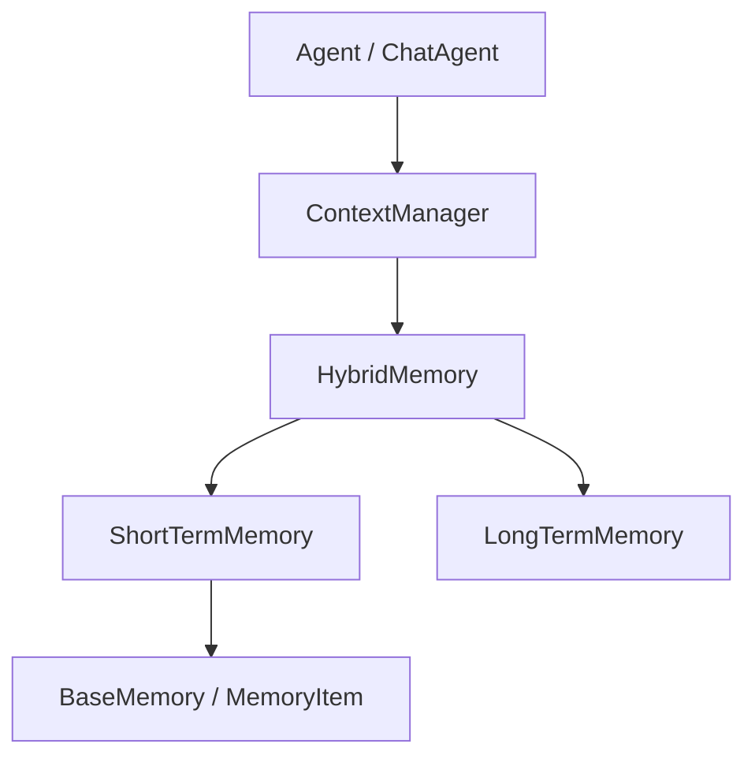
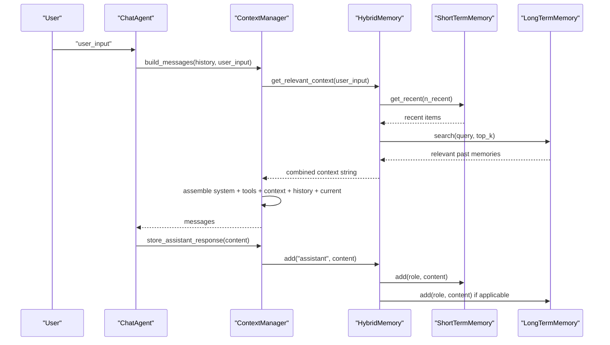
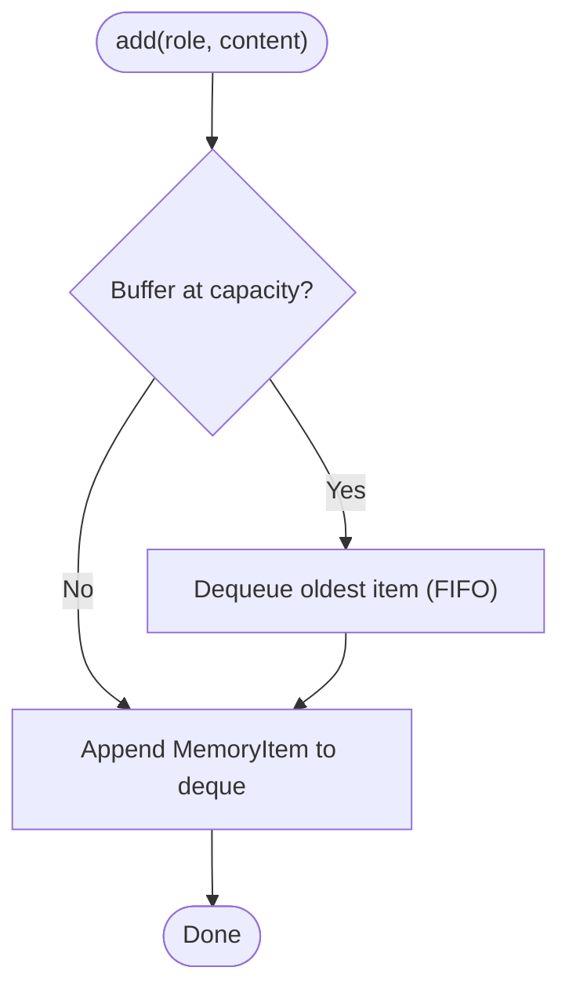
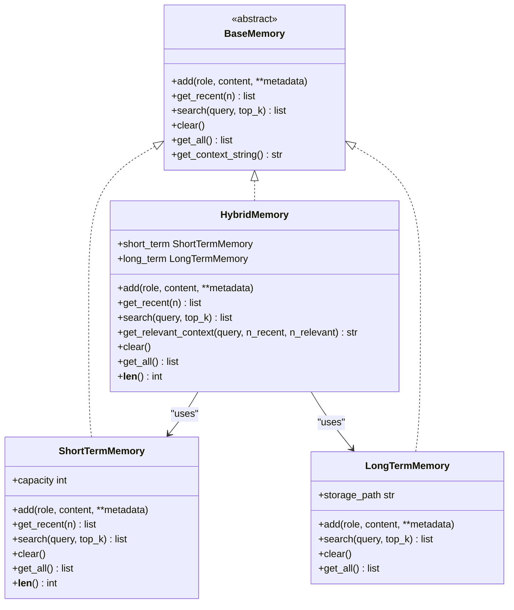
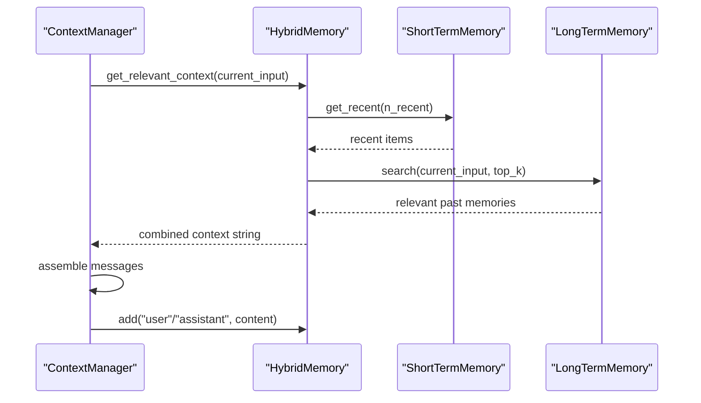
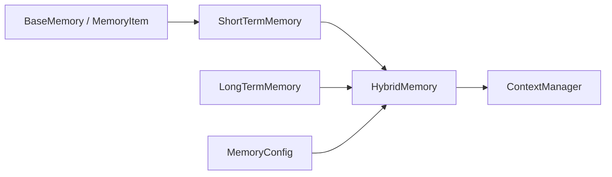

# Short-Term Memory

<cite>
**Referenced Files in This Document**
- [short_term.py](file://harness/memory/short_term.py)
- [base.py](file://harness/memory/base.py)
- [hybrid.py](file://harness/memory/hybrid.py)
- [manager.py](file://harness/context/manager.py)
- [config.py](file://harness/config.py)
- [demo_chat.py](file://demos/demo_chat.py)
</cite>

## Table of Contents
1. Introduction
2. Project Structure
3. Core Components
4. Architecture Overview
5. Detailed Component Analysis
6. Dependency Analysis
7. Performance Considerations
8. Troubleshooting Guide
9. Conclusion
10. Appendices

## Introduction
This document explains the Short-Term Memory sub-component that implements a bounded buffer to simulate working memory for conversational agents. It focuses on:
- The FIFO queue mechanism and capacity management
- Automatic eviction policies when the buffer overflows
- How short-term memory integrates with context management to influence immediate agent decisions
- Practical configuration examples from the codebase
- Common issues such as memory saturation, retrieval latency, and strategies for managing conversation history effectively

## Project Structure
Short-term memory is part of the memory subsystem and is used by higher-level components (context manager, hybrid memory, and agents) to assemble prompts and maintain conversational continuity.

**Diagram sources**
- [manager.py:41-108](file://harness/context/manager.py#L41-L108)
- [hybrid.py:22-83](file://harness/memory/hybrid.py#L22-L83)
- [short_term.py:16-49](file://harness/memory/short_term.py#L16-L49)
- [base.py:18-63](file://harness/memory/base.py#L18-L63)

**Section sources**
- [short_term.py:1-49](file://harness/memory/short_term.py#L1-L49)
- [base.py:1-63](file://harness/memory/base.py#L1-L63)
- [hybrid.py:1-83](file://harness/memory/hybrid.py#L1-L83)
- [manager.py:1-118](file://harness/context/manager.py#L1-L118)

## Core Components
- ShortTermMemory: A bounded FIFO buffer using a deque with a fixed maximum length. When full, the oldest items are automatically evicted on each append.
- BaseMemory and MemoryItem: Abstract interface and data model shared across memory implementations.
- HybridMemory: Combines short-term and long-term memory; delegates recent retrieval to short-term and relevant past retrieval to long-term.
- ContextManager: Builds messages for LLM calls, including system prompt, tool descriptions, relevant long-term context, conversation history, and current input. It also stores user inputs and assistant responses into memory.

Key responsibilities:
- Maintain a bounded set of recent messages for immediate context
- Provide efficient retrieval of recent items and simple keyword-based search within short-term scope
- Integrate with context building to ensure only necessary content is included in prompts

**Section sources**
- [short_term.py:16-49](file://harness/memory/short_term.py#L16-L49)
- [base.py:18-63](file://harness/memory/base.py#L18-L63)
- [hybrid.py:22-83](file://harness/memory/hybrid.py#L22-L83)
- [manager.py:41-108](file://harness/context/manager.py#L41-L108)

## Architecture Overview
The short-term memory sits at the core of prompt assembly. During each turn:
- The ContextManager builds a message list that includes system instructions, optional tool guidance, relevant long-term context (via HybridMemory), conversation history, and the current user input.
- User inputs and assistant responses are stored in memory so subsequent turns can reference them.
- Short-term memory ensures only the most recent messages are available for immediate recall, while older but relevant facts may be retrieved from long-term memory.

**Diagram sources**
- [manager.py:61-108](file://harness/context/manager.py#L61-L108)
- [hybrid.py:33-73](file://harness/memory/hybrid.py#L33-L73)
- [short_term.py:23-49](file://harness/memory/short_term.py#L23-L49)

## Detailed Component Analysis

### ShortTermMemory: Bounded FIFO Buffer
- Data structure: Uses a deque with maxlen equal to capacity. Appending beyond capacity automatically drops the oldest item (FIFO).
- Capacity management: Set via constructor parameter capacity. Default value is provided; you can configure it per instance or through higher-level wrappers.
- Eviction policy: Strict FIFO—when the buffer reaches capacity, each new addition removes the earliest entry. There is no selective retention or TTL; eviction is purely based on insertion order.
- Retrieval:
  - get_recent(n): Returns up to n most recent items. If n exceeds buffer size, returns all items.
  - search(query, top_k): Simple keyword overlap scoring within the short-term buffer; not semantic embedding-based.
  - get_all(): Returns all items currently in the buffer.
  - clear(): Empties the buffer.
- Integration: Implements BaseMemory, enabling use anywhere a memory abstraction is expected.

**Diagram sources**
- [short_term.py:19-24](file://harness/memory/short_term.py#L19-L24)

**Section sources**
- [short_term.py:16-49](file://harness/memory/short_term.py#L16-L49)
- [base.py:18-63](file://harness/memory/base.py#L18-L63)

### HybridMemory: Combining Short- and Long-Term
- Delegates recent retrieval to ShortTermMemory and relevant past retrieval to LongTermMemory.
- Provides get_relevant_context(query, n_recent, n_relevant) to merge recent conversation and relevant past memories into a single string for prompts.
- Persists only user and assistant messages to long-term storage.

**Diagram sources**
- [base.py:18-63](file://harness/memory/base.py#L18-L63)
- [short_term.py:16-49](file://harness/memory/short_term.py#L16-L49)
- [hybrid.py:22-83](file://harness/memory/hybrid.py#L22-L83)

**Section sources**
- [hybrid.py:22-83](file://harness/memory/hybrid.py#L22-L83)

### Context Management Interaction
- ContextManager builds messages for each LLM call, including:
  - System prompt and tool instructions
  - Relevant long-term context (via HybridMemory.get_relevant_context)
  - Conversation history (passed in)
  - Current user input
- It stores user inputs and assistant responses into memory for future turns.
- Token estimation helper is provided to approximate token usage for context window management.

**Diagram sources**
- [manager.py:61-108](file://harness/context/manager.py#L61-L108)
- [hybrid.py:33-73](file://harness/memory/hybrid.py#L33-L73)

**Section sources**
- [manager.py:41-118](file://harness/context/manager.py#L41-L118)

## Dependency Analysis
- ShortTermMemory depends on BaseMemory and MemoryItem for interface and data modeling.
- HybridMemory composes both ShortTermMemory and LongTermMemory and orchestrates their use during context building.
- ContextManager depends on BaseMemory (typically HybridMemory) to retrieve and store context.
- Configuration for memory behavior is centralized in HarnessConfig/MemoryConfig, allowing tuning of short-term capacity and other settings.

**Diagram sources**
- [base.py:18-63](file://harness/memory/base.py#L18-L63)
- [short_term.py:16-49](file://harness/memory/short_term.py#L16-L49)
- [hybrid.py:22-83](file://harness/memory/hybrid.py#L22-L83)
- [manager.py:41-108](file://harness/context/manager.py#L41-L108)
- [config.py:37-43](file://harness/config.py#L37-L43)

**Section sources**
- [config.py:37-69](file://harness/config.py#L37-L69)

## Performance Considerations
- Eviction cost: O(1) per append due to deque with maxlen; oldest item is dropped automatically.
- Retrieval cost:
  - get_recent(n): Converts deque to list and slices; O(k) where k is number of items returned.
  - search(query, top_k): Linear scan over buffer with word overlap scoring; O(m) where m is buffer size. For large buffers or frequent searches, consider reducing short-term capacity or offloading semantic search to long-term memory.
- Context size: Use ContextManager.estimate_tokens to approximate token usage and avoid exceeding model limits. Adjust short-term capacity and n_recent/n_relevant in HybridMemory.get_relevant_context to balance coherence and token budget.

[No sources needed since this section provides general guidance]

## Troubleshooting Guide
Common issues and strategies:
- Memory saturation (buffer full):
  - Symptom: Older messages are evicted quickly; agent loses recent context.
  - Fix: Increase ShortTermMemory.capacity or adjust HybridMemory.n_recent to include more recent items in prompts.
  - Reference: Configure capacity in ShortTermMemory and HybridMemory constructors.
  - Section sources
    - [short_term.py:19-24](file://harness/memory/short_term.py#L19-L24)
    - [hybrid.py:25-31](file://harness/memory/hybrid.py#L25-L31)
- Retrieval latency:
  - Symptom: Slow search responses due to scanning the entire short-term buffer.
  - Fix: Reduce short-term capacity, rely more on long-term semantic search, or pre-filter queries before calling search.
  - Section sources
    - [short_term.py:30-40](file://harness/memory/short_term.py#L30-L40)
- Managing conversation history effectively:
  - Strategy: Use HybridMemory.get_relevant_context to combine recent conversation with relevant past memories, avoiding duplication.
  - Strategy: Use ContextManager.build_messages to assemble prompts with controlled token budgets.
  - Section sources
    - [hybrid.py:46-73](file://harness/memory/hybrid.py#L46-L73)
    - [manager.py:61-108](file://harness/context/manager.py#L61-L108)
- Overflow scenarios:
  - Behavior: FIFO eviction ensures newest messages are retained; oldest are dropped automatically.
  - Monitoring: Track len(memory) and adjust capacity accordingly.
  - Section sources
    - [short_term.py:19-24](file://harness/memory/short_term.py#L19-L24)

## Conclusion
Short-term memory provides a fast, bounded FIFO buffer that keeps the most recent conversation context readily available for immediate decision-making. Combined with long-term memory and context management, it enables coherent multi-turn interactions while respecting token limits. Properly configuring capacity and retrieval parameters helps avoid saturation and optimize performance.

[No sources needed since this section summarizes without analyzing specific files]

## Appendices

### Configuration Examples from the Codebase
- Creating a hybrid memory with default short-term capacity:
  - See usage in demo chat setup.
  - Section sources
    - [demo_chat.py:23-28](file://demos/demo_chat.py#L23-L28)
- Memory configuration options:
  - short_term_capacity, long_term_enabled, memory_file, similarity_threshold.
  - Section sources
    - [config.py:37-43](file://harness/config.py#L37-L43)

### Practical Usage Patterns
- Direct short-term memory usage:
  - Instantiate ShortTermMemory with desired capacity and add messages; retrieve recent items or search within the buffer.
  - Section sources
    - [short_term.py:19-49](file://harness/memory/short_term.py#L19-L49)
- Using hybrid memory for end-to-end context:
  - Add messages; rely on HybridMemory to manage short-term and long-term storage and to build relevant context strings for prompts.
  - Section sources
    - [hybrid.py:33-73](file://harness/memory/hybrid.py#L33-L73)
- Integrating with context manager:
  - Build messages with ContextManager, which will store inputs and responses in memory and assemble prompts with appropriate context.
  - Section sources
    - [manager.py:61-108](file://harness/context/manager.py#L61-L108)