# Project Overview

<cite>
**Referenced Files in This Document**
- [README.md](file://README.md)
- [harness/__init__.py](file://harness/__init__.py)
- [run.py](file://run.py)
- [harness/agent/base.py](file://harness/agent/base.py)
- [harness/context/manager.py](file://harness/context/manager.py)
- [harness/memory/base.py](file://harness/memory/base.py)
- [harness/tools/base.py](file://harness/tools/base.py)
- [harness/mcp/protocol.py](file://harness/mcp/protocol.py)
- [harness/skill/base.py](file://harness/skill/base.py)
- [harness/session/manager.py](file://harness/session/manager.py)
- [harness/agent/orchestrator.py](file://harness/agent/orchestrator.py)
- [harness/llm/engine.py](file://harness/llm/engine.py)
- [demos/demo_agent.py](file://demos/demo_agent.py)
</cite>

## Table of Contents
1. Introduction
2. Project Structure
3. Core Components
4. Architecture Overview
5. Detailed Component Analysis
6. Dependency Analysis
7. Performance Considerations
8. Troubleshooting Guide
9. Conclusion

## Introduction
HarnessAIDemo is a comprehensive, educational demonstration of an industrial-grade AI Agent Harness built around HuggingFace models. It shows how to transform a large language model from a simple chatbot into an autonomous agent that can plan multi-step reasoning, call tools, remember context across turns, and collaborate with other agents. The project implements the core concepts needed for production-like systems: an Agent Loop, Context Management, Memory System, Tool System, MCP Protocol, Skill System, Session Management, and Multi-Agent orchestration. It provides both conceptual overviews for beginners and concrete implementation details for experienced developers, along with runnable demos using either a mock backend or real models via Transformers.

## Project Structure
The repository is organized into a clear separation between the harness framework and demo scripts:
- harness/: Core framework modules (LLM engine, agent loop, memory, tools, context, MCP, skills, sessions, orchestrator)
- demos/: Runnable examples demonstrating each feature
- run.py: CLI entry point to launch different demos
- README.md: End-to-end overview, quick start, and learning path

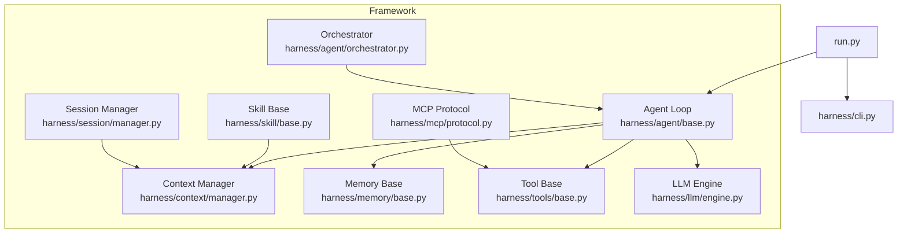

**Diagram sources**
- [run.py:1-28](file://run.py#L1-L28)
- [harness/agent/base.py:63-160](file://harness/agent/base.py#L63-L160)
- [harness/context/manager.py:41-104](file://harness/context/manager.py#L41-L104)
- [harness/memory/base.py:27-64](file://harness/memory/base.py#L27-L64)
- [harness/tools/base.py:30-67](file://harness/tools/base.py#L30-L67)
- [harness/mcp/protocol.py:68-210](file://harness/mcp/protocol.py#L68-L210)
- [harness/skill/base.py:34-70](file://harness/skill/base.py#L34-L70)
- [harness/session/manager.py:71-146](file://harness/session/manager.py#L71-L146)
- [harness/agent/orchestrator.py:31-152](file://harness/agent/orchestrator.py#L31-L152)
- [harness/llm/engine.py:127-250](file://harness/llm/engine.py#L127-L250)

**Section sources**
- [README.md:73-131](file://README.md#L73-L131)
- [run.py:1-28](file://run.py#L1-L28)

## Core Components
This section introduces the key building blocks that make the harness work as an autonomous agent system.

- Agent Loop: The central execution cycle that builds context, calls the LLM, executes tool calls when requested, feeds results back, and repeats until a final answer is produced. It includes safeguards like max iterations to prevent infinite loops.
- Context Management: Assembles the full prompt for each LLM call by combining system instructions, tool descriptions, relevant long-term memory, recent conversation history, and the current user input. It also estimates token usage to respect context windows.
- Memory System: Provides short-term (recent messages), long-term (persistent, searchable knowledge), and hybrid memory strategies to maintain continuity across turns and sessions.
- Tool System: Defines a base class for tools with name, description, parameters, and execute method; a registry to discover and invoke tools; and built-in tools for common tasks.
- MCP Protocol: Implements a simplified Model Context Protocol with server/client abstractions, JSON-RPC style requests/responses, and integration to expose tools, resources, and prompts.
- Skill System: Loads reusable capabilities defined via Markdown files (SKILL.md) with metadata and instructions, which are injected into prompts to guide behavior.
- Session Management: Manages multiple independent conversations with persistence, switching, listing, and deletion. Each session maintains its own message history and metadata.
- Multi-Agent Orchestration: Coordinates multiple specialized agents through a supervisor pattern, delegating tasks based on intent and aggregating results.

These components together enable LLMs to act as autonomous agents capable of planning, tool use, and collaboration.

**Section sources**
- [harness/agent/base.py:63-160](file://harness/agent/base.py#L63-L160)
- [harness/context/manager.py:41-118](file://harness/context/manager.py#L41-L118)
- [harness/memory/base.py:27-64](file://harness/memory/base.py#L27-L64)
- [harness/tools/base.py:30-67](file://harness/tools/base.py#L30-L67)
- [harness/mcp/protocol.py:68-210](file://harness/mcp/protocol.py#L68-L210)
- [harness/skill/base.py:34-70](file://harness/skill/base.py#L34-L70)
- [harness/session/manager.py:71-146](file://harness/session/manager.py#L71-L146)
- [harness/agent/orchestrator.py:31-152](file://harness/agent/orchestrator.py#L31-L152)

## Architecture Overview
At a high level, the harness composes several layers:
- LLM Engine: Abstract interface with backends (Transformers for real models, Mock for demos).
- Agent Layer: BaseAgent implements the Agent Loop; specialized agents extend it; Orchestrator coordinates multiple agents.
- Support Layers: ContextManager, Memory, Tools, Skills, Sessions, and MCP integrate with the Agent Loop to provide rich capabilities.

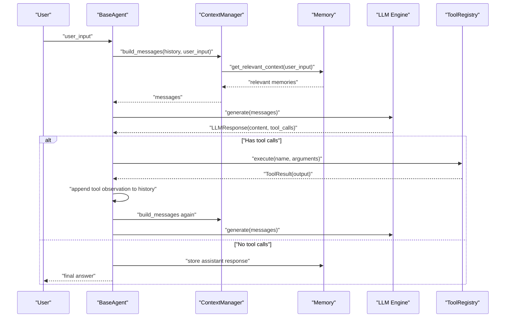

**Diagram sources**
- [harness/agent/base.py:97-160](file://harness/agent/base.py#L97-L160)
- [harness/context/manager.py:61-104](file://harness/context/manager.py#L61-L104)
- [harness/memory/base.py:27-64](file://harness/memory/base.py#L27-L64)
- [harness/llm/engine.py:127-250](file://harness/llm/engine.py#L127-L250)

## Detailed Component Analysis

### Agent Loop
The Agent Loop is the heart of the harness. It repeatedly:
- Builds context via ContextManager
- Calls the LLM
- Executes tool calls if present
- Feeds tool results back as observations
- Stops when the LLM returns a final answer without tool calls

It tracks execution steps for debugging and enforces a maximum iteration limit to avoid infinite loops.

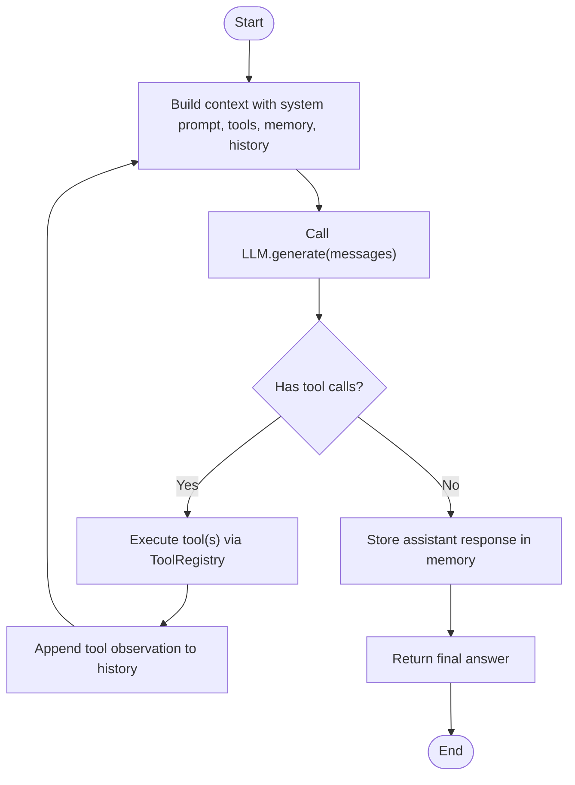

**Diagram sources**
- [harness/agent/base.py:97-160](file://harness/agent/base.py#L97-L160)

**Section sources**
- [harness/agent/base.py:63-160](file://harness/agent/base.py#L63-L160)

### Context Management
ContextManager constructs the complete message list for each LLM call:
- System prompt augmented with tool instructions and available tools
- Relevant long-term memory retrieved via HybridMemory
- Recent conversation history
- Current user input
It also stores assistant responses and provides rough token estimation to manage context window constraints.

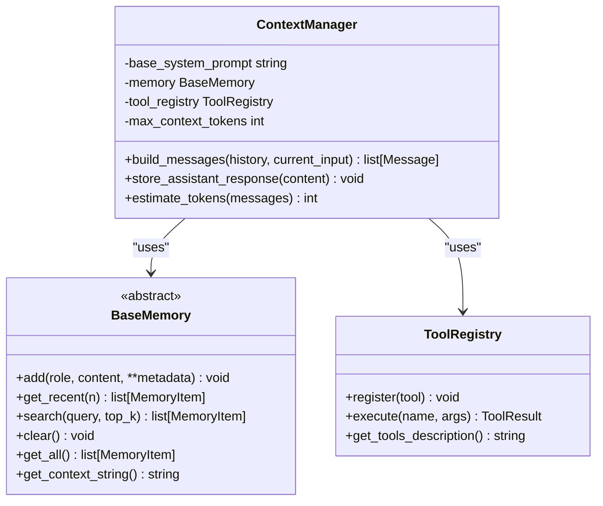

**Diagram sources**
- [harness/context/manager.py:41-118](file://harness/context/manager.py#L41-L118)
- [harness/memory/base.py:27-64](file://harness/memory/base.py#L27-L64)

**Section sources**
- [harness/context/manager.py:41-118](file://harness/context/manager.py#L41-L118)

### Memory System
Memory provides continuity across turns and sessions:
- Short-term memory: bounded buffer of recent messages
- Long-term memory: persistent, searchable knowledge with retrieval
- Hybrid memory: combines short and long-term strategies

The base defines the interface for adding, retrieving, searching, and formatting memory items.

**Section sources**
- [harness/memory/base.py:27-64](file://harness/memory/base.py#L27-L64)

### Tool System
Tools allow agents to interact with external systems:
- BaseTool defines name, description, parameters, and execute method
- ToolRegistry manages registration and invocation
- Built-in tools demonstrate calculator, datetime, and file operations

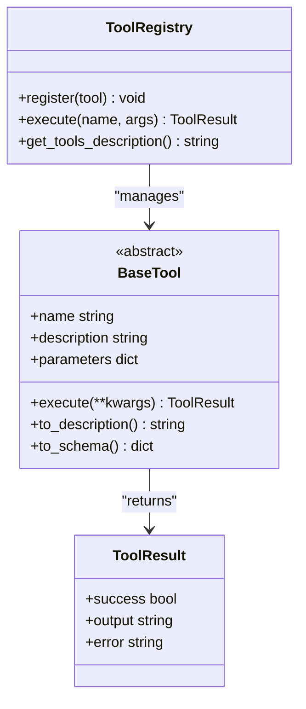

**Diagram sources**
- [harness/tools/base.py:30-67](file://harness/tools/base.py#L30-L67)

**Section sources**
- [harness/tools/base.py:30-67](file://harness/tools/base.py#L30-L67)

### MCP Protocol
The MCP layer standardizes how agents interact with external tools and data:
- MCPServer exposes tools, resources, and prompts
- MCPClient discovers and invokes tools across servers
- JSON-RPC style request/response objects define protocol messages

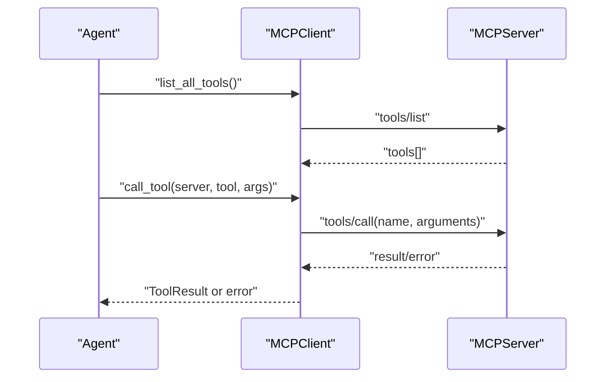

**Diagram sources**
- [harness/mcp/protocol.py:68-210](file://harness/mcp/protocol.py#L68-L210)

**Section sources**
- [harness/mcp/protocol.py:68-210](file://harness/mcp/protocol.py#L68-L210)

### Skill System
Skills encapsulate reusable behaviors defined in Markdown:
- SKILL.md contains metadata (name, description, tags) and instructions
- SkillLoader parses and loads skills
- Skills inject instructions into prompts to guide agent behavior

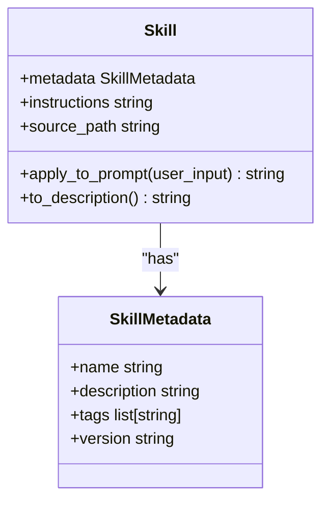

**Diagram sources**
- [harness/skill/base.py:25-70](file://harness/skill/base.py#L25-L70)

**Section sources**
- [harness/skill/base.py:34-70](file://harness/skill/base.py#L34-L70)

### Session Management
Sessions isolate conversations:
- Session holds id, title, messages, and metadata
- SessionManager creates, switches, lists, deletes, and persists sessions
- Persistence uses JSON files per session

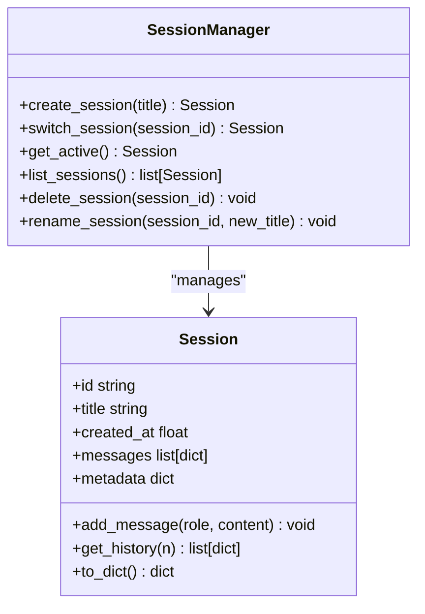

**Diagram sources**
- [harness/session/manager.py:32-146](file://harness/session/manager.py#L32-L146)

**Section sources**
- [harness/session/manager.py:71-146](file://harness/session/manager.py#L71-L146)

### Multi-Agent Orchestration
The orchestrator acts as a supervisor:
- Registers specialist agents with descriptions
- Routes user requests to the best agent using LLM-based selection with keyword fallback
- Supports running all agents and aggregating results

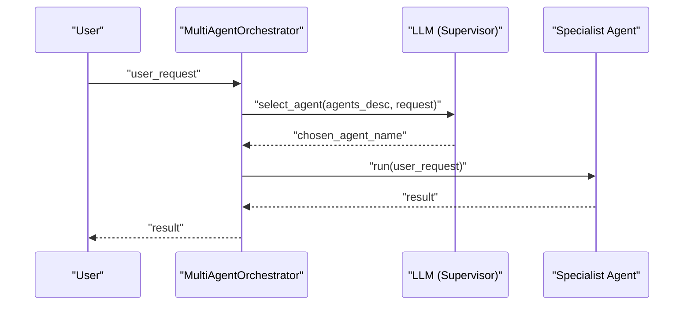

**Diagram sources**
- [harness/agent/orchestrator.py:61-152](file://harness/agent/orchestrator.py#L61-L152)

**Section sources**
- [harness/agent/orchestrator.py:31-152](file://harness/agent/orchestrator.py#L31-L152)

### LLM Engine
The LLM engine abstracts model inference:
- BaseLLM defines generate and get_model_info
- TransformersBackend loads models from HuggingFace, applies chat templates, generates tokens, and parses tool calls
- MockBackend simulates tool calling for demos without GPU
- create_llm factory selects backend based on configuration

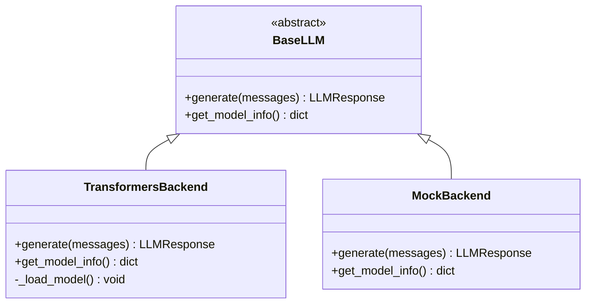

**Diagram sources**
- [harness/llm/engine.py:127-250](file://harness/llm/engine.py#L127-L250)
- [harness/llm/engine.py:254-421](file://harness/llm/engine.py#L254-L421)

**Section sources**
- [harness/llm/engine.py:127-421](file://harness/llm/engine.py#L127-L421)

## Dependency Analysis
Key dependencies and relationships:
- BaseAgent depends on LLM, ToolRegistry, Memory, and ContextManager
- ContextManager depends on Memory and ToolRegistry
- Orchestrator depends on BaseAgent and LLM
- MCP integrates with ToolSystem to expose tools via protocol
- SessionManager persists and isolates conversation state used by agents

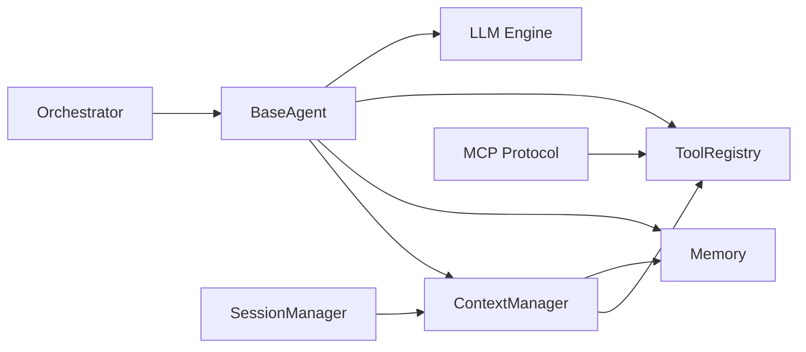

**Diagram sources**
- [harness/agent/base.py:63-160](file://harness/agent/base.py#L63-L160)
- [harness/context/manager.py:41-118](file://harness/context/manager.py#L41-L118)
- [harness/agent/orchestrator.py:31-152](file://harness/agent/orchestrator.py#L31-L152)
- [harness/mcp/protocol.py:68-210](file://harness/mcp/protocol.py#L68-L210)
- [harness/session/manager.py:71-146](file://harness/session/manager.py#L71-L146)

**Section sources**
- [harness/agent/base.py:63-160](file://harness/agent/base.py#L63-L160)
- [harness/context/manager.py:41-118](file://harness/context/manager.py#L41-L118)
- [harness/agent/orchestrator.py:31-152](file://harness/agent/orchestrator.py#L31-L152)
- [harness/mcp/protocol.py:68-210](file://harness/mcp/protocol.py#L68-L210)
- [harness/session/manager.py:71-146](file://harness/session/manager.py#L71-L146)

## Performance Considerations
- Context window management: Use ContextManager’s token estimation to avoid exceeding limits; prioritize recent and relevant memory.
- Iteration limits: Configure max_iterations to balance thoroughness and efficiency; monitor tool call loops.
- Backend choice: Use MockBackend for fast iteration and testing; switch to TransformersBackend for real model behavior.
- Memory retrieval: Tune top_k and relevance thresholds in memory search to reduce noise and improve performance.
- Tool execution: Keep tools lightweight and deterministic where possible; handle errors gracefully to avoid blocking the loop.

[No sources needed since this section provides general guidance]

## Troubleshooting Guide
Common issues and resolutions:
- Infinite loops: Ensure max_iterations is set appropriately; verify tool results are being appended as observations so the LLM can proceed.
- Missing tool calls: Check tool descriptions in system prompt and ensure ToolRegistry has registered tools; validate parsing of tool call formats.
- Context overflow: Reduce history length or memory inclusion; use estimate_tokens to stay within limits.
- MCP errors: Validate server connections and tool names; inspect MCPRequest/MCPResponse for errors.
- Session persistence: Confirm storage directory exists and JSON files are valid; handle load exceptions gracefully.

**Section sources**
- [harness/agent/base.py:97-160](file://harness/agent/base.py#L97-L160)
- [harness/context/manager.py:61-118](file://harness/context/manager.py#L61-L118)
- [harness/mcp/protocol.py:100-139](file://harness/mcp/protocol.py#L100-L139)
- [harness/session/manager.py:124-143](file://harness/session/manager.py#L124-L143)

## Conclusion
HarnessAIDemo demonstrates how to build robust, autonomous AI agents by combining an iterative Agent Loop with context-aware prompting, memory, tools, standardized protocols, modular skills, isolated sessions, and multi-agent coordination. It serves as both an educational resource and a practical foundation for transforming LLMs into capable agents that can reason across steps, leverage external tools, and collaborate effectively. Beginners can explore the demos to grasp core concepts, while experienced developers can extend the framework with custom tools, skills, and orchestrators tailored to their applications.

[No sources needed since this section summarizes without analyzing specific files]