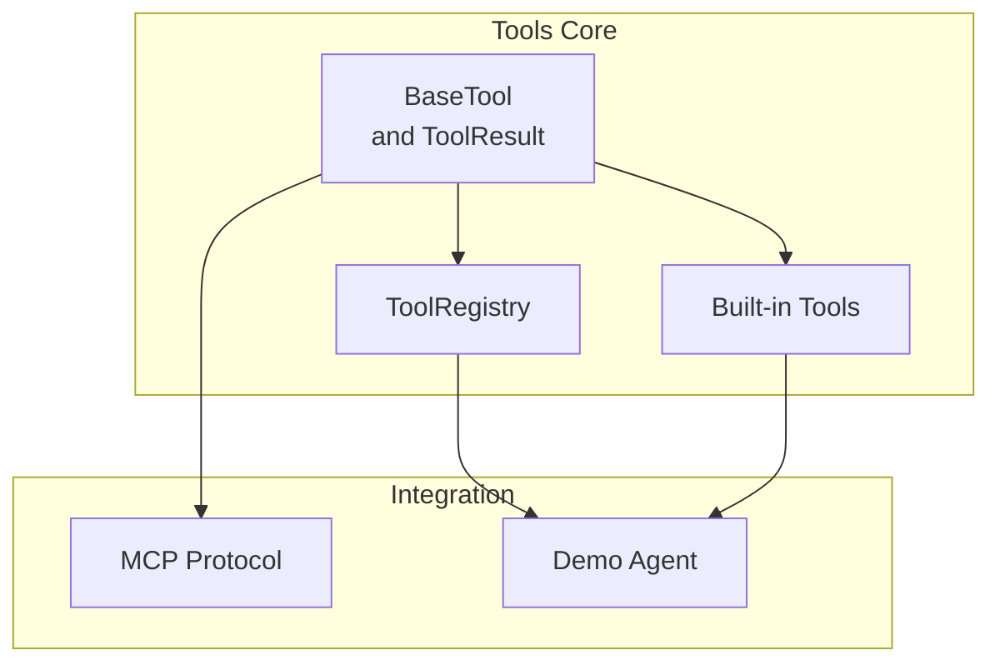
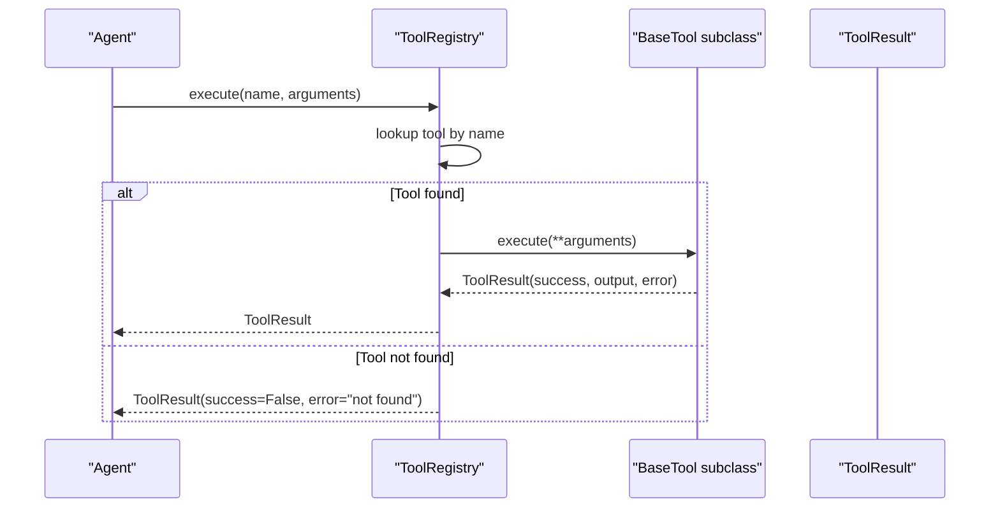
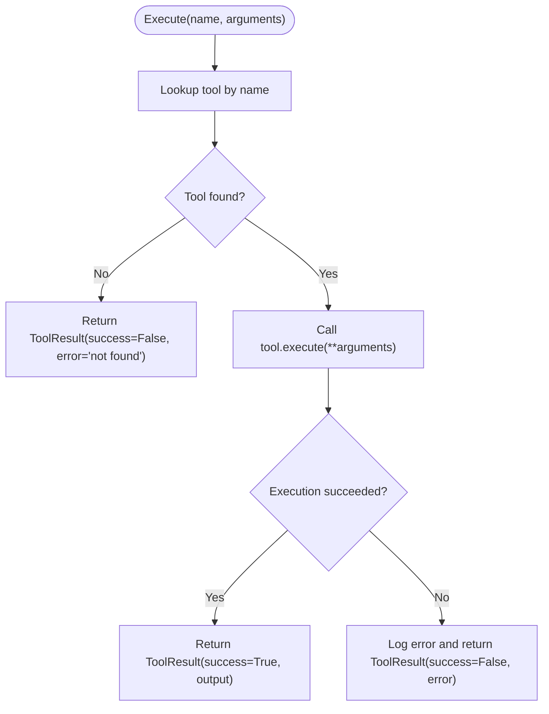
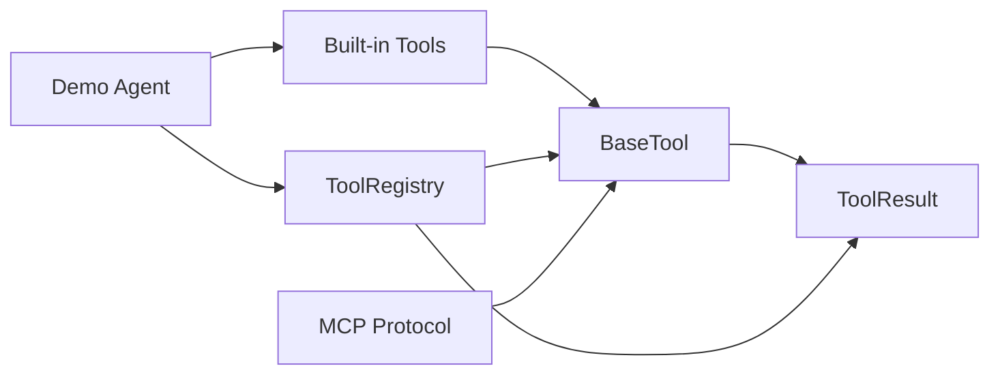

# Base Classes and Interfaces

<cite>
**Referenced Files in This Document**
- [base.py](file://harness/tools/base.py)
- [builtin.py](file://harness/tools/builtin.py)
- [registry.py](file://harness/tools/registry.py)
- [protocol.py](file://harness/mcp/protocol.py)
- [demo_agent.py](file://demos/demo_agent.py)
</cite>

## Table of Contents
1. [Introduction](#introduction)
2. [Project Structure](#project-structure)
3. [Core Components](#core-components)
4. [Architecture Overview](#architecture-overview)
5. [Detailed Component Analysis](#detailed-component-analysis)
6. [Dependency Analysis](#dependency-analysis)
7. [Performance Considerations](#performance-considerations)
8. [Troubleshooting Guide](#troubleshooting-guide)
9. [Conclusion](#conclusion)
10. [Appendices](#appendices)

## Introduction
This document explains the Tool System base classes and interfaces that enable agents to call external capabilities. It focuses on:
- The abstract BaseTool class design, including its core attributes (name, description, parameters) and required method execute
- The ToolResult dataclass structure with success, output, and error fields
- The to_description() method for generating human-readable tool descriptions
- The to_schema() method for JSON schema generation
- Concrete examples showing how to subclass BaseTool to create custom tools
- Parameter validation patterns and proper error handling in execute methods
- Best practices for tool naming conventions, description writing, and parameter schema design

## Project Structure
The Tool System is implemented under harness/tools with supporting usage in demos and MCP integration:
- harness/tools/base.py defines the abstract BaseTool and ToolResult
- harness/tools/builtin.py provides concrete tool implementations demonstrating best practices
- harness/tools/registry.py manages tool registration, lookup, execution, and prompt generation
- harness/mcp/protocol.py shows dynamic tool creation by subclassing BaseTool
- demos/demo_agent.py demonstrates registering built-in tools and using them via an agent

**Diagram sources**
- [base.py:16-67](file://harness/tools/base.py#L16-L67)
- [builtin.py:13-83](file://harness/tools/builtin.py#L13-L83)
- [registry.py:17-74](file://harness/tools/registry.py#L17-L74)
- [protocol.py:193-210](file://harness/mcp/protocol.py#L193-L210)
- [demo_agent.py:21-24](file://demos/demo_agent.py#L21-L24)

**Section sources**
- [base.py:1-67](file://harness/tools/base.py#L1-L67)
- [builtin.py:1-83](file://harness/tools/builtin.py#L1-L83)
- [registry.py:1-74](file://harness/tools/registry.py#L1-L74)
- [protocol.py:190-210](file://harness/mcp/protocol.py#L190-L210)
- [demo_agent.py:1-40](file://demos/demo_agent.py#L1-L40)

## Core Components
- BaseTool: Abstract base class defining the contract for all tools
  - Attributes: name (str), description (str), parameters (dict)
  - Methods:
    - execute(**kwargs) -> ToolResult (abstract; must be implemented)
    - to_description() -> str (human-readable description for prompts)
    - to_schema() -> dict (JSON schema-like representation)
- ToolResult: Dataclass representing execution outcomes
  - Fields: success (bool), output (str), error (Optional[str])
- ToolRegistry: Central catalog for tool management
  - register(tool), get(name), list_tools(), execute(name, arguments), get_tools_description()
- Built-in Tools: Examples of concrete implementations
  - CalculatorTool, DateTimeTool, FileOpsTool
- MCP Integration: Dynamic tool creation by subclassing BaseTool

Key responsibilities:
- BaseTool standardizes tool metadata and execution interface
- ToolResult unifies success/failure reporting
- ToolRegistry centralizes discovery and invocation
- Built-ins demonstrate validation and error handling patterns

**Section sources**
- [base.py:16-67](file://harness/tools/base.py#L16-L67)
- [registry.py:17-74](file://harness/tools/registry.py#L17-L74)
- [builtin.py:13-83](file://harness/tools/builtin.py#L13-L83)

## Architecture Overview
The Tool System follows a clear separation of concerns:
- BaseTool defines the interface and common utilities
- Concrete tools implement domain-specific logic with robust validation and error handling
- ToolRegistry orchestrates tool lifecycle and execution
- Agents or higher-level components use the registry to invoke tools based on model decisions

**Diagram sources**
- [registry.py:43-61](file://harness/tools/registry.py#L43-L61)
- [base.py:30-67](file://harness/tools/base.py#L30-L67)

**Section sources**
- [registry.py:17-74](file://harness/tools/registry.py#L17-L74)
- [base.py:30-67](file://harness/tools/base.py#L30-L67)

## Detailed Component Analysis

### BaseTool and ToolResult
- BaseTool
  - name: Identifier used by models to reference the tool
  - description: Human-readable explanation for when and why to use the tool
  - parameters: Schema describing accepted arguments (used by to_description and to_schema)
  - execute(**kwargs): Abstract method returning ToolResult
  - to_description(): Produces a concise string summarizing parameters and purpose for system prompts
  - to_schema(): Returns a dict with name, description, parameters suitable for JSON schema consumers
- ToolResult
  - success: Indicates whether execution succeeded
  - output: String result shown to the model on success
  - error: Optional error message on failure

Best practices derived from implementation:
- Keep name short, lowercase, and descriptive
- Write descriptions that clarify purpose and acceptable inputs
- Define parameters clearly so models can generate correct arguments
- Always return ToolResult; never raise exceptions out of execute

**Section sources**
- [base.py:16-67](file://harness/tools/base.py#L16-L67)

### Built-in Tools: Validation and Error Handling Patterns
- CalculatorTool
  - Validates input characters to prevent unsafe expressions
  - Normalizes operators (e.g., caret to power)
  - Returns ToolResult with success=True and numeric result or success=False with error messages
- DateTimeTool
  - Accepts query parameter to format current date/time
  - Returns formatted strings on success
- FileOpsTool
  - Supports list and read operations with path checks
  - Enforces read-only behavior and caps content size
  - Returns appropriate ToolResult for errors (invalid paths, unknown operations)

These examples illustrate:
- Input validation before processing
- Defensive checks for file system access
- Consistent error reporting via ToolResult

**Section sources**
- [builtin.py:13-83](file://harness/tools/builtin.py#L13-L83)

### ToolRegistry: Orchestration and Prompt Generation
- Registration and lookup
  - register(tool) stores tools by name; warns on overwrite
  - get(name) returns tool instance if present
- Execution
  - execute(name, arguments) invokes tool.execute(**arguments)
  - Handles missing tools and exceptions, returning ToolResult with success=False and informative error
- Prompt generation
  - get_tools_description() aggregates tool.to_description() for system prompts
- Utility
  - list_tools(), __len__(), __contains__() support introspection

**Diagram sources**
- [registry.py:43-61](file://harness/tools/registry.py#L43-L61)

**Section sources**
- [registry.py:17-74](file://harness/tools/registry.py#L17-L74)

### MCP Dynamic Tool Creation
- Dynamically creates subclasses of BaseTool per remote tool definition
- Maps server/tool metadata into name, description, parameters
- Wraps remote calls and converts responses/errors into ToolResult

This pattern shows how to adapt external tool definitions to the local BaseTool contract.

**Section sources**
- [protocol.py:193-210](file://harness/mcp/protocol.py#L193-L210)

### Usage in Demos
- Demonstrates creating a ToolRegistry, registering default tools, and passing it to an agent
- Shows how the agent uses tools during task execution

**Section sources**
- [demo_agent.py:21-24](file://demos/demo_agent.py#L21-L24)

## Dependency Analysis
- BaseTool has no internal dependencies beyond standard library types
- Built-in tools depend on BaseTool and ToolResult
- ToolRegistry depends on BaseTool and ToolResult
- MCP protocol dynamically constructs BaseTool subclasses
- Demo agent depends on ToolRegistry and built-in tool registration

**Diagram sources**
- [base.py:16-67](file://harness/tools/base.py#L16-L67)
- [builtin.py:13-83](file://harness/tools/builtin.py#L13-L83)
- [registry.py:17-74](file://harness/tools/registry.py#L17-L74)
- [protocol.py:193-210](file://harness/mcp/protocol.py#L193-L210)
- [demo_agent.py:21-24](file://demos/demo_agent.py#L21-L24)

**Section sources**
- [base.py:16-67](file://harness/tools/base.py#L16-L67)
- [builtin.py:13-83](file://harness/tools/builtin.py#L13-L83)
- [registry.py:17-74](file://harness/tools/registry.py#L17-L74)
- [protocol.py:193-210](file://harness/mcp/protocol.py#L193-L210)
- [demo_agent.py:21-24](file://demos/demo_agent.py#L21-L24)

## Performance Considerations
- Keep execute methods lightweight and deterministic where possible
- Avoid heavy I/O inside execute; consider offloading long-running tasks
- Validate inputs early to fail fast and reduce unnecessary work
- Use ToolRegistry.execute to centralize error handling and logging
- For file operations, limit content size and restrict operations to safe subsets

[No sources needed since this section provides general guidance]

## Troubleshooting Guide
Common issues and resolutions:
- Tool not found
  - Ensure the tool is registered before use
  - Check tool names match exactly (case-sensitive)
- Invalid parameters
  - Validate inputs in execute and return ToolResult(success=False, error=...)
  - Use parameter schemas to guide model argument generation
- Exceptions in execute
  - Wrap risky operations in try/except and return ToolResult with error details
  - Log unexpected errors at the registry level for visibility
- Overwritten tools
  - Avoid registering multiple tools with the same name; registry logs warnings on overwrite

**Section sources**
- [registry.py:28-61](file://harness/tools/registry.py#L28-L61)
- [builtin.py:19-31](file://harness/tools/builtin.py#L19-L31)
- [builtin.py:58-74](file://harness/tools/builtin.py#L58-L74)

## Conclusion
The Tool System centers around a simple, extensible contract:
- BaseTool defines a uniform interface for tools with metadata and execution
- ToolResult standardizes success/failure reporting
- ToolRegistry provides centralized management and safe invocation
- Built-in tools and MCP integration demonstrate practical patterns for validation, error handling, and dynamic adaptation
Following the recommended naming, description, and schema practices ensures reliable tool discovery and effective model-driven tool calling.

[No sources needed since this section summarizes without analyzing specific files]

## Appendices

### How to Subclass BaseTool: Step-by-Step
- Define class attributes:
  - name: a unique, lowercase identifier
  - description: a concise explanation of what the tool does and when to use it
  - parameters: a dict describing accepted arguments (types and constraints)
- Implement execute(**kwargs) -> ToolResult:
  - Validate inputs and handle edge cases
  - Perform the tool’s logic
  - Return ToolResult(success=True, output=...) on success
  - Return ToolResult(success=False, output="", error=...) on failure
- Register your tool with ToolRegistry and use it via the agent

Examples in code:
- See built-in tools for concrete patterns of validation and error handling
- See MCP protocol for dynamic subclassing based on external tool definitions

**Section sources**
- [builtin.py:13-83](file://harness/tools/builtin.py#L13-L83)
- [protocol.py:193-210](file://harness/mcp/protocol.py#L193-L210)

### Best Practices Summary
- Naming:
  - Use lowercase, hyphenated or underscore-separated identifiers
  - Keep names short and meaningful
- Descriptions:
  - Explain purpose, inputs, and expected outputs
  - Include constraints and examples implicitly through parameter descriptions
- Parameters:
  - Be explicit about required vs optional fields
  - Provide clear type hints and constraints in parameter descriptions
- Error handling:
  - Fail fast with clear error messages
  - Never swallow exceptions silently; always report via ToolResult
- Security:
  - Validate and sanitize inputs rigorously
  - Restrict file system and network access to safe subsets

[No sources needed since this section provides general guidance]