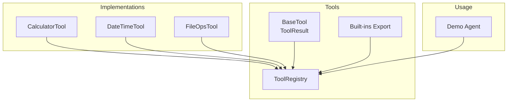
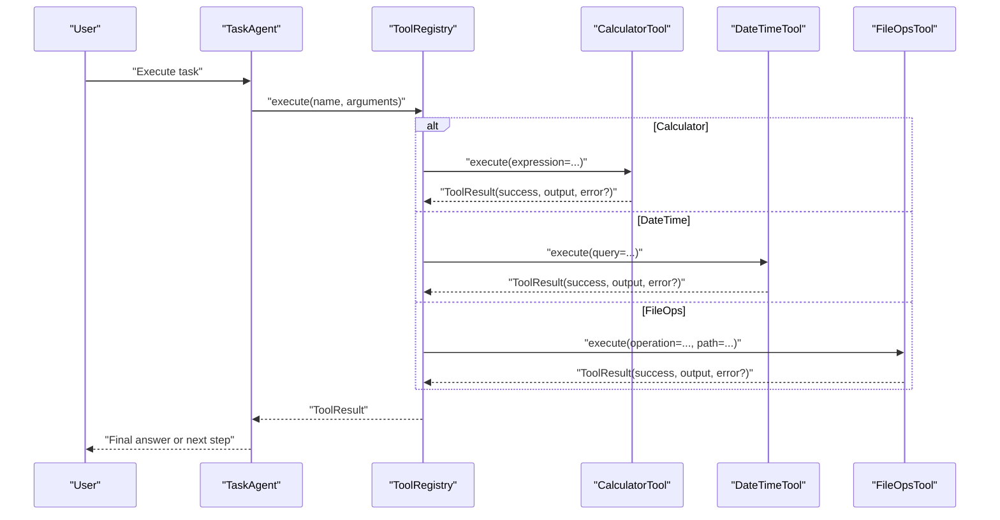
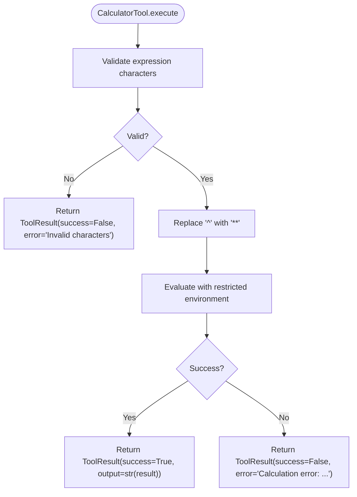
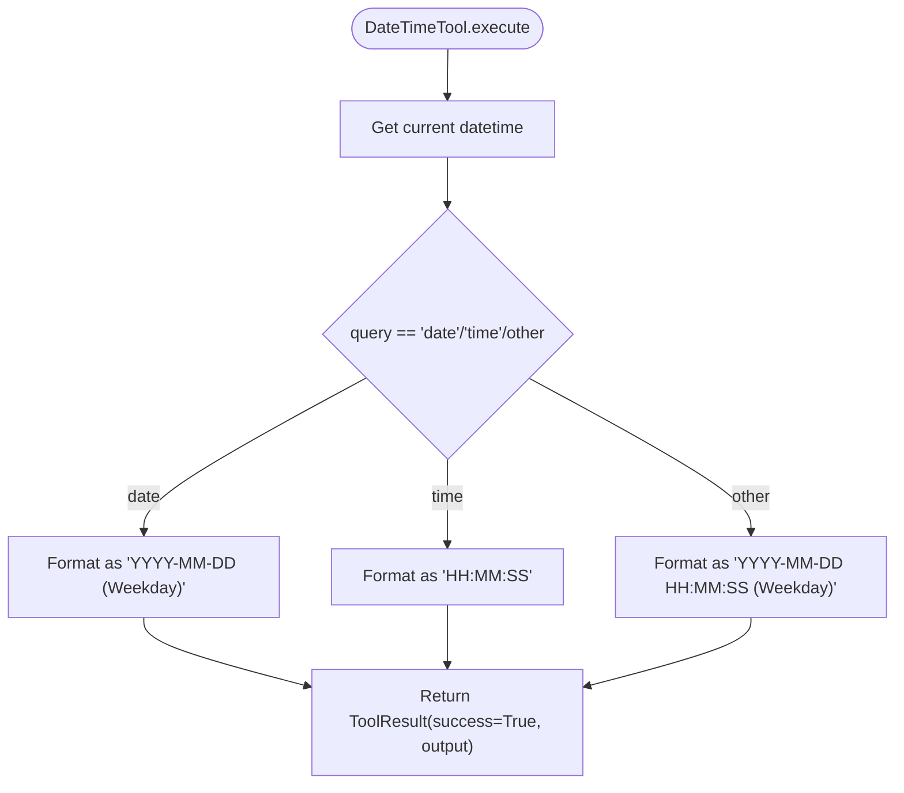
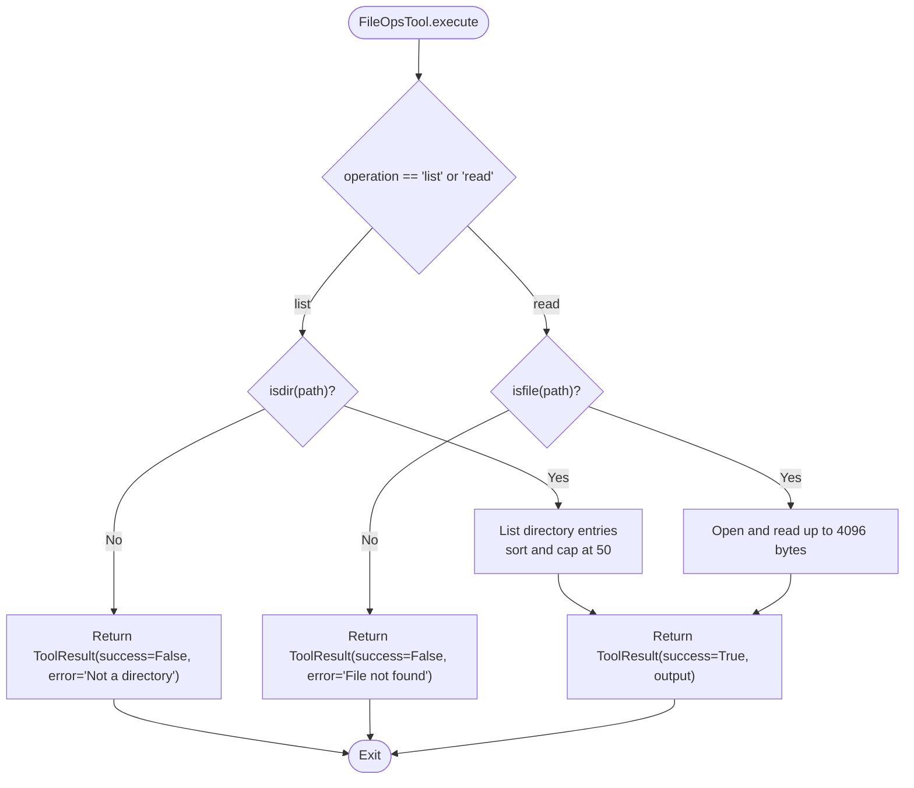
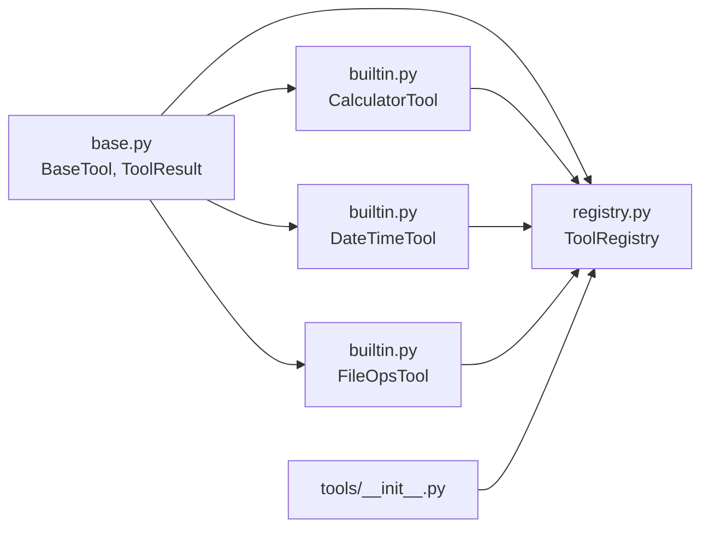

# Built-in Tools

<cite>
**Referenced Files in This Document**
- [builtin.py](file://harness/tools/builtin.py)
- [base.py](file://harness/tools/base.py)
- [registry.py](file://harness/tools/registry.py)
- [__init__.py](file://harness/tools/__init__.py)
- [demo_agent.py](file://demos/demo_agent.py)
- [README.md](file://README.md)
</cite>

## Table of Contents
1. Introduction
2. Project Structure
3. Core Components
4. Architecture Overview
5. Detailed Component Analysis
6. Dependency Analysis
7. Performance Considerations
8. Troubleshooting Guide
9. Conclusion
10. Appendices

## Introduction
This document explains the built-in tools provided by the HarnessAIDemo project. It focuses on three core tools:
- Calculator: safe mathematical expression evaluation
- DateTime: current date and time retrieval
- FileOps: read-only file system operations (list directory, read file)

For each tool, we describe its purpose, available methods, parameter schemas, return value formats, and practical usage examples. We also cover limitations, error conditions, security considerations for file operations, and guidance on when to use built-in tools versus creating custom tools.

## Project Structure
The tooling subsystem is organized under harness/tools with a clear separation of concerns:
- Base abstractions define how tools are structured and reported
- A registry manages tool registration, discovery, and execution
- Built-in implementations provide ready-to-use capabilities
- Demos show how to wire tools into an agent loop

**Diagram sources**
- [base.py:16-67](file://harness/tools/base.py#L16-L67)
- [registry.py:17-74](file://harness/tools/registry.py#L17-L74)
- [builtin.py:13-83](file://harness/tools/builtin.py#L13-L83)
- [__init__.py:1-8](file://harness/tools/__init__.py#L1-L8)
- [demo_agent.py:10-24](file://demos/demo_agent.py#L10-L24)

**Section sources**
- [README.md:194-213](file://README.md#L194-L213)
- [__init__.py:1-8](file://harness/tools/__init__.py#L1-L8)

## Core Components
- BaseTool and ToolResult define the contract every tool must implement and the standard result envelope returned to callers.
- ToolRegistry centralizes tool registration, lookup, listing, and execution with consistent error handling.
- Built-in tools implement concrete functionality for math, time, and file operations.

Key responsibilities:
- BaseTool: name, description, parameters schema, execute method, and helpers to generate descriptions and schemas.
- ToolRegistry: register tools, get tools list/descriptions, execute by name with robust error wrapping.
- Built-ins: CalculatorTool, DateTimeTool, FileOpsTool.

**Section sources**
- [base.py:16-67](file://harness/tools/base.py#L16-L67)
- [registry.py:17-74](file://harness/tools/registry.py#L17-L74)
- [builtin.py:13-83](file://harness/tools/builtin.py#L13-L83)

## Architecture Overview
The tool system integrates with the agent loop via the registry. The demo wires up a TaskAgent with a ToolRegistry that includes all built-in tools. When the LLM decides to call a tool, the registry executes it and returns a ToolResult that feeds back into the context.

**Diagram sources**
- [demo_agent.py:10-24](file://demos/demo_agent.py#L10-L24)
- [registry.py:43-67](file://harness/tools/registry.py#L43-L67)
- [builtin.py:13-83](file://harness/tools/builtin.py#L13-L83)

## Detailed Component Analysis

### BaseTool and ToolResult
- BaseTool defines:
  - name: identifier used by the model to reference the tool
  - description: human-readable explanation shown to the model
  - parameters: schema describing accepted arguments
  - execute(**kwargs): abstract method returning ToolResult
  - to_description(): generates prompt-friendly text
  - to_schema(): returns a JSON-like schema dict
- ToolResult:
  - success: boolean indicating execution outcome
  - output: string payload for successful results
  - error: optional error message when success is False

These abstractions ensure consistent behavior across all tools and simplify integration with the agent loop.

**Section sources**
- [base.py:16-67](file://harness/tools/base.py#L16-L67)

### ToolRegistry
- Responsibilities:
  - register(tool): add tools to the catalog
  - get(name): retrieve a tool instance
  - list_tools(): enumerate registered tools
  - execute(name, arguments): invoke a tool safely and wrap exceptions
  - get_tools_description(): build combined tool descriptions for prompts
- Error handling:
  - Unknown tool names produce a descriptive error
  - Exceptions during execution are caught and converted to ToolResult with success=False

**Section sources**
- [registry.py:17-74](file://harness/tools/registry.py#L17-L74)

### Built-in Tools

#### CalculatorTool
- Purpose: Safely evaluate mathematical expressions.
- Parameters:
  - expression: string containing a math expression using digits, spaces, +, -, *, /, (, ), ., %, ^
- Behavior:
  - Validates characters against a strict whitelist
  - Replaces caret (^) with double-star (**) for power
  - Evaluates using a restricted environment without builtins
  - Returns numeric result as a string on success
- Return format:
  - ToolResult(success=True, output="<result>")
  - ToolResult(success=False, output="", error="...")
- Limitations:
  - Only supports basic arithmetic and parentheses; no function calls or imports
  - Division by zero will raise an exception and be wrapped as an error result
- Security considerations:
  - Input is sanitized; eval is run with empty globals and builtins disabled
  - Prevents arbitrary code execution

**Diagram sources**
- [builtin.py:13-31](file://harness/tools/builtin.py#L13-L31)

**Section sources**
- [builtin.py:13-31](file://harness/tools/builtin.py#L13-L31)

#### DateTimeTool
- Purpose: Retrieve current date/time information.
- Parameters:
  - query: string, one of "date", "time", or "datetime"
- Behavior:
  - Gets current datetime
  - Formats based on query:
    - "date": "YYYY-MM-DD (Weekday)"
    - "time": "HH:MM:SS"
    - default/full: "YYYY-MM-DD HH:MM:SS (Weekday)"
- Return format:
  - ToolResult(success=True, output="<formatted string>")
- Limitations:
  - Uses local system timezone; no timezone conversion support
- Security considerations:
  - No external dependencies or filesystem access

**Diagram sources**
- [builtin.py:33-47](file://harness/tools/builtin.py#L33-L47)

**Section sources**
- [builtin.py:33-47](file://harness/tools/builtin.py#L33-L47)

#### FileOpsTool
- Purpose: Perform read-only file system operations for safety.
- Parameters:
  - operation: string, either "list" or "read"
  - path: string, file or directory path
- Behavior:
  - "list": lists entries in a directory, sorted, capped at 50 items
  - "read": reads up to 4096 bytes from a file
- Return format:
  - On success: ToolResult(success=True, output="<entries>" or "<content>")
  - On failure: ToolResult(success=False, output="", error="...")
- Limitations:
  - Read-only: no write, delete, or move operations
  - Directory listing limited to first 50 entries
  - File read limited to 4096 bytes
- Error conditions:
  - Path not a directory for "list"
  - File not found for "read"
  - Any OS-level exceptions are captured and returned as errors
- Security considerations:
  - Read-only mode reduces risk
  - Size limits prevent excessive memory usage
  - No shell commands or subprocesses

**Diagram sources**
- [builtin.py:49-75](file://harness/tools/builtin.py#L49-L75)

**Section sources**
- [builtin.py:49-75](file://harness/tools/builtin.py#L49-L75)

### Usage Examples
Below are practical examples demonstrating common use cases. Replace placeholders with your actual values.

- Calculator
  - Arithmetic: compute (15 + 27) * 3
  - Power: compute 2 ^ 10 (internally treated as 2 ** 10)
  - Parentheses: compute (10 - 2) * (3 + 4)
  - Reference: [builtin.py:13-31](file://harness/tools/builtin.py#L13-L31)

- DateTime
  - Get today's date: query = "date"
  - Get current time: query = "time"
  - Get full datetime: query = "datetime"
  - Reference: [builtin.py:33-47](file://harness/tools/builtin.py#L33-L47)

- FileOps
  - List files in a directory: operation = "list", path = "/some/dir"
  - Read a small file: operation = "read", path = "/some/file.txt"
  - Reference: [builtin.py:49-75](file://harness/tools/builtin.py#L49-L75)

- Demo integration
  - See how tools are registered and used in an agent loop: [demo_agent.py:10-24](file://demos/demo_agent.py#L10-L24)

**Section sources**
- [builtin.py:13-75](file://harness/tools/builtin.py#L13-L75)
- [demo_agent.py:10-24](file://demos/demo_agent.py#L10-L24)

## Dependency Analysis
- Built-in tools depend on:
  - BaseTool and ToolResult for interface and result structure
  - Standard library modules: os, datetime, re
- ToolRegistry depends on:
  - BaseTool and ToolResult
  - Logging for diagnostics
- The module exports enable easy registration of all built-ins through a single call.

**Diagram sources**
- [base.py:16-67](file://harness/tools/base.py#L16-L67)
- [registry.py:17-74](file://harness/tools/registry.py#L17-L74)
- [builtin.py:13-83](file://harness/tools/builtin.py#L13-L83)
- [__init__.py:1-8](file://harness/tools/__init__.py#L1-L8)

**Section sources**
- [registry.py:17-74](file://harness/tools/registry.py#L17-L74)
- [builtin.py:13-83](file://harness/tools/builtin.py#L13-L83)
- [__init__.py:1-8](file://harness/tools/__init__.py#L1-L8)

## Performance Considerations
- Calculator
  - Expression validation is O(n) over input length
  - Evaluation uses Python’s eval with a restricted environment; avoid extremely large expressions
- DateTime
  - Constant-time operations; negligible overhead
- FileOps
  - Directory listing is bounded to 50 entries to limit output size
  - File reading is capped at 4096 bytes to prevent large memory allocations
- Registry
  - Execution wraps exceptions to avoid crashes; logging can be tuned for verbosity

[No sources needed since this section provides general guidance]

## Troubleshooting Guide
Common issues and resolutions:

- Calculator invalid characters
  - Symptom: ToolResult(success=False, error="Invalid characters in expression")
  - Cause: Expression contains disallowed symbols or functions
  - Fix: Use only digits, spaces, and operators (+, -, *, /, (, ), ., %, ^)
  - Reference: [builtin.py:19-30](file://harness/tools/builtin.py#L19-L30)

- Calculator evaluation error
  - Symptom: ToolResult(success=False, error="Calculation error: ...")
  - Cause: Runtime error such as division by zero or malformed expression
  - Fix: Correct the expression or handle zero denominators before calling
  - Reference: [builtin.py:19-30](file://harness/tools/builtin.py#L19-L30)

- FileOps unknown operation
  - Symptom: ToolResult(success=False, error="Unknown operation: ...")
  - Cause: operation is not "list" or "read"
  - Fix: Use exactly "list" or "read"
  - Reference: [builtin.py:58-74](file://harness/tools/builtin.py#L58-L74)

- FileOps path errors
  - Symptom: ToolResult(success=False, error="Not a directory" or "File not found")
  - Cause: Invalid path type or missing file
  - Fix: Ensure path exists and matches expected type for the operation
  - Reference: [builtin.py:58-74](file://harness/tools/builtin.py#L58-L74)

- Registry tool not found
  - Symptom: ToolResult(success=False, error="Tool '...' not found. Available: [...]")
  - Cause: Tool name misspelled or not registered
  - Fix: Verify tool registration and correct name
  - Reference: [registry.py:43-60](file://harness/tools/registry.py#L43-L60)

**Section sources**
- [builtin.py:19-74](file://harness/tools/builtin.py#L19-L74)
- [registry.py:43-60](file://harness/tools/registry.py#L43-L60)

## Conclusion
The built-in tools provide a safe, minimal set of capabilities for common tasks:
- Calculator enables secure math evaluation with strict input validation
- DateTime offers simple, formatted access to current date/time
- FileOps provides read-only file operations with size limits and error handling

Use these tools for straightforward scenarios where their scope fits. For complex logic, integrations with external APIs, or domain-specific workflows, create custom tools by subclassing BaseTool and registering them via ToolRegistry.

[No sources needed since this section summarizes without analyzing specific files]

## Appendices

### When to Use Built-in Tools vs Custom Tools
- Use built-in tools when:
  - You need quick math, time, or read-only file operations
  - You want to minimize setup and maintainability overhead
- Create custom tools when:
  - You need to interact with external services, databases, or proprietary systems
  - You require complex business logic, multi-step workflows, or specialized formatting
  - You need fine-grained control over inputs, outputs, and error handling

Guidance:
- Start with built-ins to validate your workflow
- Extend with custom tools as needs evolve
- Follow the BaseTool pattern for consistency and compatibility

[No sources needed since this section provides general guidance]