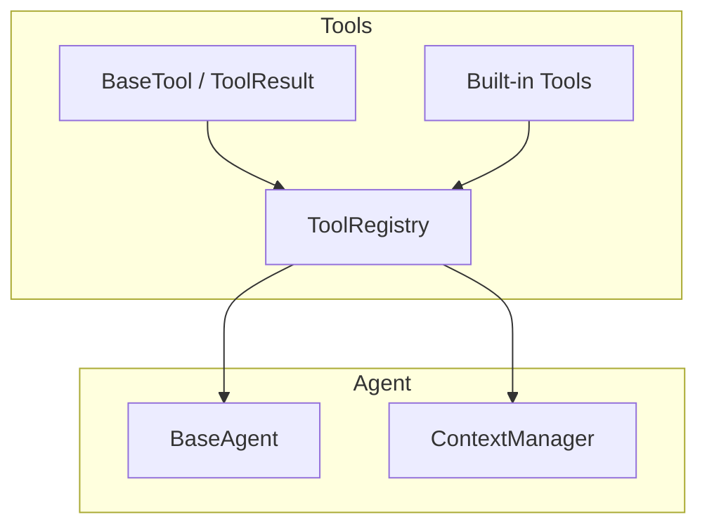
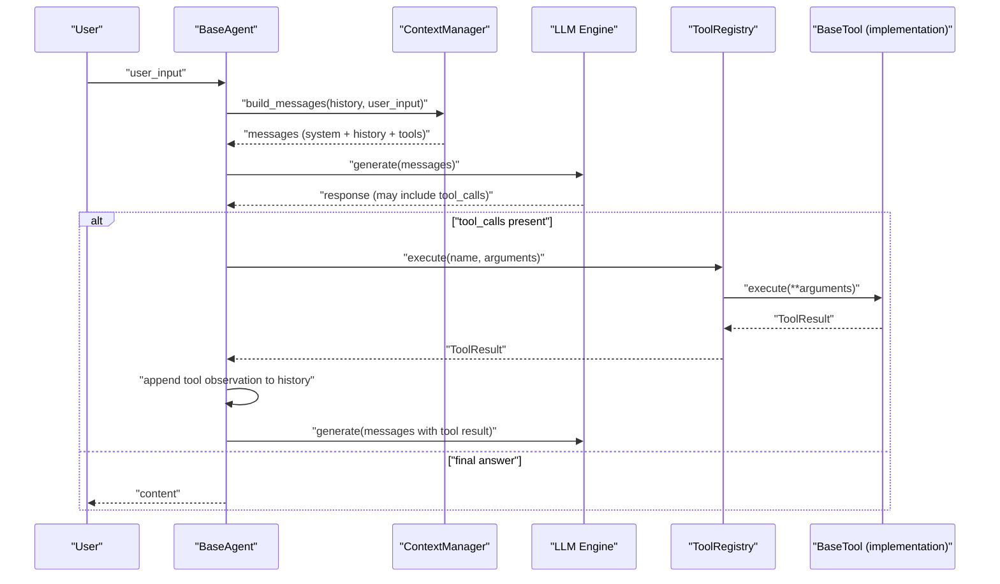
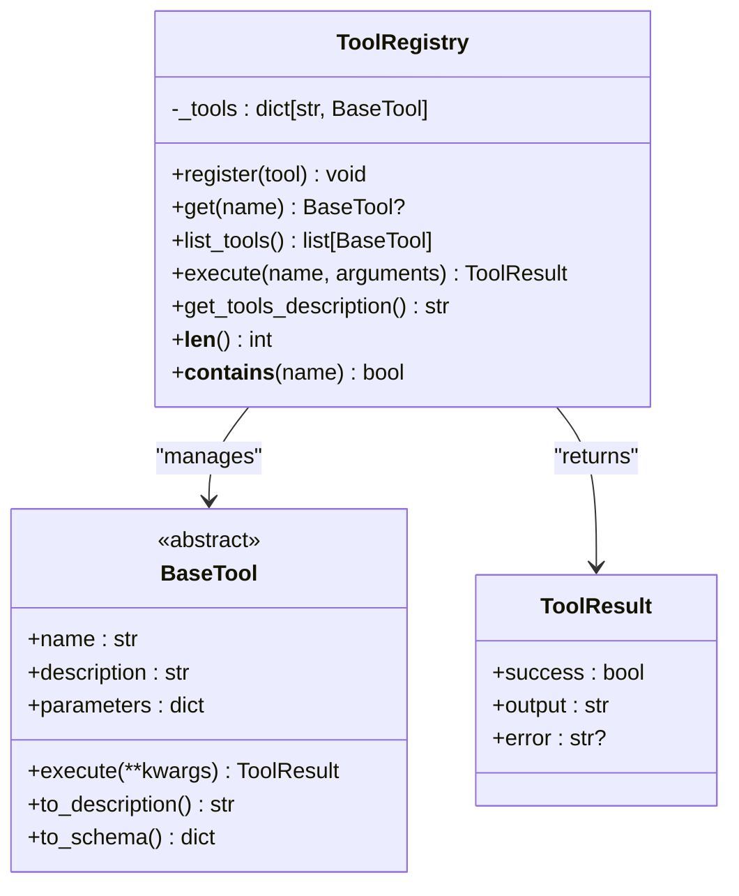
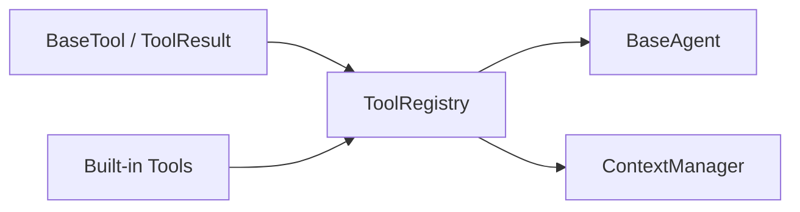

# Tool Registry and Discovery

<cite>
**Referenced Files in This Document**
- [registry.py](file://harness/tools/registry.py)
- [base.py](file://harness/tools/base.py)
- [builtin.py](file://harness/tools/builtin.py)
- [__init__.py](file://harness/tools/__init__.py)
- [manager.py](file://harness/context/manager.py)
- [base.py](file://harness/agent/base.py)
- [orchestrator.py](file://harness/agent/orchestrator.py)
- [demo_agent.py](file://demos/demo_agent.py)
</cite>

## Table of Contents
1. [Introduction](#introduction)
2. [Project Structure](#project-structure)
3. [Core Components](#core-components)
4. [Architecture Overview](#architecture-overview)
5. [Detailed Component Analysis](#detailed-component-analysis)
6. [Dependency Analysis](#dependency-analysis)
7. [Performance Considerations](#performance-considerations)
8. [Troubleshooting Guide](#troubleshooting-guide)
9. [Conclusion](#conclusion)
10. [Appendices](#appendices)

## Introduction
This document explains the ToolRegistry system that centralizes tool registration, discovery, and execution within the agent framework. It covers how tools are registered and discovered, how conflicts are handled, how lookup and execution work, and how the registry integrates with agents and context management to enable tool-calling loops. It also provides guidance for organizing complex tool ecosystems, performance considerations for large collections, caching strategies, and thread safety aspects.

## Project Structure
The tool subsystem is organized around a small set of focused modules:
- Base definitions for tools and results
- A central registry for managing tools
- Built-in tools demonstrating the interface
- Integration points with the agent loop and context manager
- Demos showing programmatic usage

**Diagram sources**
- [base.py:16-67](file://harness/tools/base.py#L16-L67)
- [registry.py:17-74](file://harness/tools/registry.py#L17-L74)
- [builtin.py:13-83](file://harness/tools/builtin.py#L13-L83)
- [base.py:63-165](file://harness/agent/base.py#L63-L165)
- [manager.py:41-118](file://harness/context/manager.py#L41-L118)

**Section sources**
- [registry.py:1-74](file://harness/tools/registry.py#L1-L74)
- [base.py:1-67](file://harness/tools/base.py#L1-L67)
- [builtin.py:1-83](file://harness/tools/builtin.py#L1-L83)
- [manager.py:1-118](file://harness/context/manager.py#L1-L118)
- [base.py:1-165](file://harness/agent/base.py#L1-L165)

## Core Components
- BaseTool and ToolResult define the contract for all tools and their outcomes.
- ToolRegistry maintains an in-memory map of tool names to instances, supports registration, listing, description generation, and safe execution.
- Built-in tools demonstrate concrete implementations and provide a helper to register defaults.
- ContextManager injects tool descriptions into the system prompt so the LLM can call tools.
- BaseAgent orchestrates the agent loop, invoking ToolRegistry.execute when the model requests tool calls.

Key responsibilities:
- Registration: add or overwrite tools by name
- Discovery: list available tools and generate descriptions for prompts
- Execution: resolve tool by name and run it with arguments, returning standardized results
- Integration: expose tool capabilities to the LLM via context assembly

**Section sources**
- [base.py:16-67](file://harness/tools/base.py#L16-L67)
- [registry.py:17-74](file://harness/tools/registry.py#L17-L74)
- [builtin.py:13-83](file://harness/tools/builtin.py#L13-L83)
- [manager.py:41-118](file://harness/context/manager.py#L41-L118)
- [base.py:63-165](file://harness/agent/base.py#L63-L165)

## Architecture Overview
The ToolRegistry sits at the center of the tooling ecosystem. Agents build messages using ContextManager, which includes tool descriptions from the registry. When the LLM decides to call a tool, the agent executes it through the registry, which resolves and runs the correct tool implementation and returns a standardized result.

**Diagram sources**
- [base.py:97-160](file://harness/agent/base.py#L97-L160)
- [manager.py:61-104](file://harness/context/manager.py#L61-L104)
- [registry.py:43-67](file://harness/tools/registry.py#L43-L67)
- [base.py:42-67](file://harness/tools/base.py#L42-L67)

## Detailed Component Analysis

### ToolRegistry
Responsibilities:
- Maintain a dictionary mapping tool names to instances
- Register tools; warn on overwrites
- Provide lookup by name
- List all tools
- Generate combined tool descriptions for prompts
- Execute tools safely with error handling and standardized results

Conflict handling:
- If a tool with the same name is registered again, the new instance overwrites the old one and a warning is logged. This enables dynamic replacement but requires careful naming to avoid accidental overrides.

Lookup and execution:
- get(name) returns None if not found
- execute(name, arguments) returns ToolResult(success=False) with an informative error when the tool is missing or raises an exception during execution

Prompt integration:
- get_tools_description() concatenates each tool’s to_description() output, enabling the LLM to understand available capabilities and parameters

Thread safety:
- The registry uses a plain dict without locks. Concurrent reads/writes from multiple threads may cause race conditions. For multi-threaded environments, wrap operations with appropriate synchronization or use a single-threaded event loop.

Caching:
- Descriptions are generated on demand. For large tool sets, consider memoizing the combined description or per-tool descriptions to reduce repeated string construction.

**Diagram sources**
- [registry.py:17-74](file://harness/tools/registry.py#L17-L74)
- [base.py:16-67](file://harness/tools/base.py#L16-L67)

**Section sources**
- [registry.py:17-74](file://harness/tools/registry.py#L17-L74)

### BaseTool and ToolResult
- BaseTool defines the contract: name, description, parameters schema, and execute method. It also provides to_description() for human-readable prompt text and to_schema() for structured metadata.
- ToolResult standardizes execution outcomes with success flag, output content, and optional error message.

Complexity:
- to_description() iterates parameters once; O(P) where P is number of parameters
- to_schema() builds a dict; O(1) plus parameter iteration

Error handling:
- Implementations should return ToolResult(success=False, ...) for errors rather than raising exceptions, allowing callers to handle failures uniformly.

**Section sources**
- [base.py:16-67](file://harness/tools/base.py#L16-L67)

### Built-in Tools
Demonstrate practical implementations:
- CalculatorTool: validates expressions and evaluates safely
- DateTimeTool: returns formatted date/time based on query
- FileOpsTool: read-only file operations with basic validation

Registration helper:
- register_default_tools(registry) registers calculator, datetime, and file_ops tools

These serve as templates for custom tools and show how to integrate with the registry.

**Section sources**
- [builtin.py:13-83](file://harness/tools/builtin.py#L13-L83)

### Agent Integration
- BaseAgent constructs a ContextManager with the provided ToolRegistry. During each iteration, it builds messages including tool descriptions, calls the LLM, and executes any requested tools via ToolRegistry.execute. Results are appended as observations and the loop continues until a final answer is produced or max iterations are reached.

Execution flow highlights:
- Tool calls are parsed from LLM responses
- Each tool call is executed through the registry
- Observations are fed back to the LLM for further reasoning

**Section sources**
- [base.py:63-165](file://harness/agent/base.py#L63-L165)

### Context Manager Integration
- ContextManager composes the system prompt and appends tool instructions and descriptions obtained from ToolRegistry.get_tools_description(). This ensures the LLM knows what tools exist and how to call them.

Token awareness:
- The manager estimates token counts and can be tuned via max_context_tokens to fit model limits.

**Section sources**
- [manager.py:41-118](file://harness/context/manager.py#L41-L118)

### Programmatic Registration and Dynamic Loading
Examples of registering tools programmatically:
- Create a ToolRegistry instance
- Instantiate built-in tools or custom BaseTool subclasses
- Call registry.register(...) for each tool
- Optionally use register_default_tools to quickly populate common tools

Dynamic loading patterns:
- Discover tool classes at runtime (e.g., via importlib scanning) and register them
- Use MCP-style wrappers to dynamically create BaseTool instances from remote tool schemas and register them into the local registry

Conflict resolution strategy:
- Later registrations overwrite earlier ones with the same name; log warnings to track replacements
- To prevent accidental overwrites, implement a strict mode that raises on duplicate names

**Section sources**
- [demo_agent.py:21-24](file://demos/demo_agent.py#L21-L24)
- [builtin.py:77-83](file://harness/tools/builtin.py#L77-L83)
- [registry.py:28-33](file://harness/tools/registry.py#L28-L33)

## Dependency Analysis
The tool system has clear separation of concerns:
- BaseTool and ToolResult are foundational and have no internal dependencies
- ToolRegistry depends on BaseTool and ToolResult
- Built-in tools depend on BaseTool and standard libraries
- Agent and ContextManager depend on ToolRegistry to integrate tools into the agent loop and prompts

**Diagram sources**
- [base.py:16-67](file://harness/tools/base.py#L16-L67)
- [registry.py:17-74](file://harness/tools/registry.py#L17-L74)
- [builtin.py:13-83](file://harness/tools/builtin.py#L13-L83)
- [base.py:63-165](file://harness/agent/base.py#L63-L165)
- [manager.py:41-118](file://harness/context/manager.py#L41-L118)

**Section sources**
- [registry.py:17-74](file://harness/tools/registry.py#L17-L74)
- [base.py:63-165](file://harness/agent/base.py#L63-L165)
- [manager.py:41-118](file://harness/context/manager.py#L41-L118)

## Performance Considerations
For large tool collections:
- Description generation cost: get_tools_description() iterates all tools to build strings. Cache the combined description per registry instance and invalidate when tools change.
- Lookup cost: Dictionary lookups are O(1). Ensure tool names are unique and stable.
- Execution overhead: Minimize heavy initialization in tool constructors; defer expensive setup to first use or lazily initialize resources.
- Prompt size: Tool descriptions contribute to system prompt length. Consider selective inclusion (e.g., only relevant tools per task) to stay within token limits.

Caching strategies:
- Memoize per-tool to_description() outputs
- Cache the combined description string in ToolRegistry with invalidation on register()
- For remote/MCP tools, cache tool schemas after discovery

Thread safety:
- The current registry is not thread-safe. In multi-threaded contexts, protect register/get/list/execute with locks or confine usage to a single thread/event loop.

Memory usage:
- Keep tool instances lightweight. Avoid holding large objects in tool state unless necessary.

**Section sources**
- [registry.py:28-67](file://harness/tools/registry.py#L28-L67)
- [manager.py:61-104](file://harness/context/manager.py#L61-L104)

## Troubleshooting Guide
Common issues and resolutions:
- Tool not found: execute returns ToolResult with success=False and lists available tools. Verify the tool was registered and the name matches exactly.
- Tool execution errors: Exceptions are caught and returned as ToolResult with error details. Inspect tool.execute logic and input validation.
- Conflicting tool names: Overwriting triggers a warning. Ensure unique names or intentionally replace tools with updated versions.
- Prompt too long: Reduce tool count or trim descriptions. Consider selective tool injection based on task domain.

Debugging tips:
- Enable verbose logging in agents to see tool calls and results
- Use agent traces to inspect iteration steps and tool interactions
- Validate tool schemas and parameters before registration

**Section sources**
- [registry.py:43-60](file://harness/tools/registry.py#L43-L60)
- [base.py:97-160](file://harness/agent/base.py#L97-L160)

## Conclusion
The ToolRegistry provides a simple, effective foundation for tool management in the agent system. It centralizes registration, discovery, and execution while integrating seamlessly with the agent loop and context manager. By following the patterns shown here—clear naming, robust error handling, and thoughtful performance tuning—you can scale to complex tool ecosystems with confidence.

## Appendices

### Organizing Complex Tool Ecosystems
- Group tools by domain (e.g., math, time, filesystem) and register them in dedicated registries per agent or feature area
- Use a top-level aggregator registry that delegates to specialized registries
- Adopt naming conventions to avoid conflicts across modules
- Version your tools and support upgrades by replacing entries with explicit version checks

### Example Workflows

#### Programmatic Tool Registration
- Create a registry
- Register built-in or custom tools
- Pass the registry to an agent

**Section sources**
- [demo_agent.py:21-24](file://demos/demo_agent.py#L21-L24)
- [builtin.py:77-83](file://harness/tools/builtin.py#L77-L83)

#### Dynamic Tool Loading
- Discover tool schemas remotely (e.g., via MCP) and instantiate wrapper tools that conform to BaseTool
- Register discovered tools into the local registry for immediate use by agents

**Section sources**
- [orchestrator.py:21-27](file://harness/agent/orchestrator.py#L21-L27)
- [registry.py:17-74](file://harness/tools/registry.py#L17-L74)