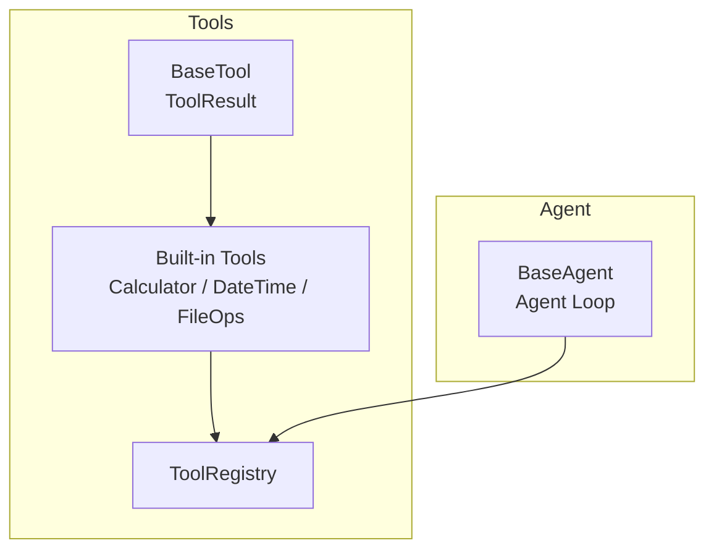
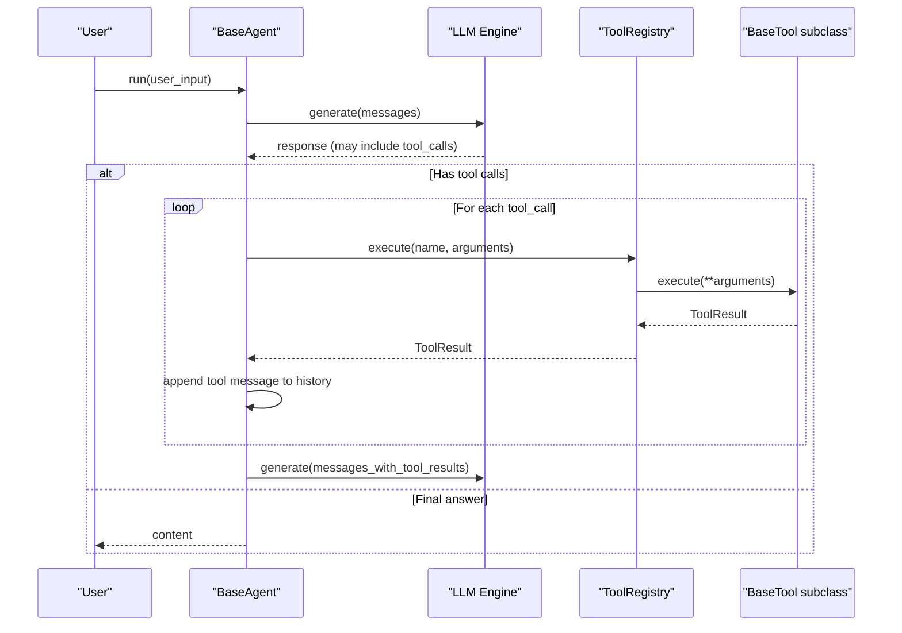
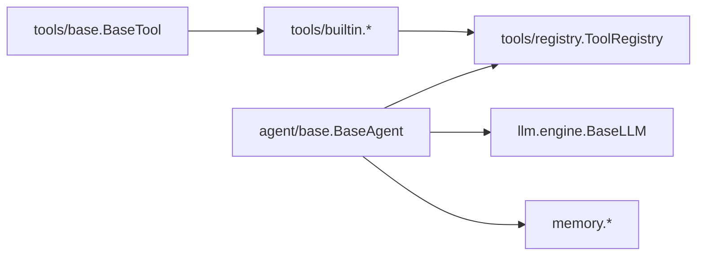

# Tool System

<cite>
**Referenced Files in This Document**
- [base.py](file://harness/tools/base.py)
- [builtin.py](file://harness/tools/builtin.py)
- [registry.py](file://harness/tools/registry.py)
- [__init__.py](file://harness/tools/__init__.py)
- [base.py](file://harness/agent/base.py)
- [config.py](file://harness/config.py)
- [demo_agent.py](file://demos/demo_agent.py)
</cite>

## Table of Contents
1. [Introduction](#introduction)
2. [Project Structure](#project-structure)
3. [Core Components](#core-components)
4. [Architecture Overview](#architecture-overview)
5. [Detailed Component Analysis](#detailed-component-analysis)
6. [Dependency Analysis](#dependency-analysis)
7. [Performance Considerations](#performance-considerations)
8. [Troubleshooting Guide](#troubleshooting-guide)
9. [Conclusion](#conclusion)
10. [Appendices](#appendices)

## Introduction
This document explains the Tool System sub-component that provides an extensible function-calling framework for agents. It covers the BaseTool abstract class, built-in tools (Calculator, DateTime, FileOps), the ToolRegistry for registration and discovery, and the tool execution pipeline integrated with agents. It also includes guidance on custom tool development, parameter validation, result formatting, configuration options, security controls, and common issues such as conflicts, parsing errors, and performance considerations.

## Project Structure
The Tool System is implemented under harness/tools and integrates with agents via harness/agent. The key files are:
- harness/tools/base.py: Abstract base classes for tools and results
- harness/tools/builtin.py: Built-in tools and default registration helper
- harness/tools/registry.py: Central registry for tool management and execution
- harness/tools/__init__.py: Public exports for easy imports
- harness/agent/base.py: Agent loop that invokes tools through the registry
- harness/config.py: Configuration dataclasses used by agents and other components
- demos/demo_agent.py: Example usage showing how to set up a registry and run an agent with tools

**Diagram sources**
- [base.py:1-67](file://harness/tools/base.py#L1-L67)
- [builtin.py:1-83](file://harness/tools/builtin.py#L1-L83)
- [registry.py:1-74](file://harness/tools/registry.py#L1-L74)
- [base.py:63-165](file://harness/agent/base.py#L63-L165)

**Section sources**
- [__init__.py:1-8](file://harness/tools/__init__.py#L1-L8)
- [base.py:1-67](file://harness/tools/base.py#L1-L67)
- [builtin.py:1-83](file://harness/tools/builtin.py#L1-L83)
- [registry.py:1-74](file://harness/tools/registry.py#L1-L74)
- [base.py:63-165](file://harness/agent/base.py#L63-L165)

## Core Components
- BaseTool and ToolResult define the contract for all tools and their outputs.
- Built-in tools demonstrate safe implementations for math evaluation, date/time retrieval, and read-only file operations.
- ToolRegistry centralizes tool registration, discovery, and execution with error handling.
- Agents use the registry to execute tools during the agent loop and feed results back to the LLM.

Key responsibilities:
- BaseTool: declare name, description, parameters; implement execute; provide schema/description helpers.
- Built-in tools: implement secure logic and return ToolResult instances.
- ToolRegistry: register tools, list them, generate descriptions, and execute with robust error handling.
- Agent loop: call registry.execute for each tool invocation and integrate results into conversation history.

**Section sources**
- [base.py:16-67](file://harness/tools/base.py#L16-L67)
- [builtin.py:13-83](file://harness/tools/builtin.py#L13-L83)
- [registry.py:17-74](file://harness/tools/registry.py#L17-L74)
- [base.py:97-160](file://harness/agent/base.py#L97-L160)

## Architecture Overview
The tool system follows a clear separation of concerns:
- Tools encapsulate capabilities and expose a uniform interface.
- Registry manages lifecycle and dispatch.
- Agent orchestrates interactions between LLM and tools.

**Diagram sources**
- [base.py:97-160](file://harness/agent/base.py#L97-L160)
- [registry.py:43-67](file://harness/tools/registry.py#L43-L67)
- [base.py:30-67](file://harness/tools/base.py#L30-L67)

## Detailed Component Analysis

### BaseTool and ToolResult
- BaseTool defines:
  - name, description, parameters as class attributes
  - execute(**kwargs) -> ToolResult
  - to_description() for human-readable prompt text
  - to_schema() for JSON-like schema generation
- ToolResult is a dataclass with success, output, and optional error fields.

Design notes:
- Parameters are documented as strings describing expected types and examples.
- to_description formats parameters for system prompts to guide the LLM.
- to_schema exposes a minimal structure suitable for model tool definitions.

**Section sources**
- [base.py:16-67](file://harness/tools/base.py#L16-L67)

### Built-in Tools
- CalculatorTool:
  - Validates expression characters using a strict regex before evaluation.
  - Replaces caret with exponentiation operator.
  - Evaluates safely with restricted globals.
  - Returns ToolResult with success or error messages.
- DateTimeTool:
  - Supports queries for date, time, or full datetime.
  - Formats current time accordingly and returns success results.
- FileOpsTool:
  - Provides list and read operations.
  - Enforces read-only behavior and limits output size for safety.
  - Returns appropriate ToolResult for valid/invalid paths and operations.

Security considerations:
- Calculator restricts allowed characters to prevent arbitrary code execution.
- FileOpsTool avoids write/delete operations and caps read length.

**Section sources**
- [builtin.py:13-83](file://harness/tools/builtin.py#L13-L83)

### ToolRegistry
Responsibilities:
- register(tool): adds or overwrites tools by name with logging.
- get(name): retrieves a tool instance.
- list_tools(): returns all registered tools.
- execute(name, arguments): locates and executes a tool, returning ToolResult even on exceptions.
- get_tools_description(): builds combined tool descriptions for prompts.
- Implements __len__ and __contains__ for convenience.

Error handling:
- Missing tools produce a descriptive ToolResult indicating available tools.
- Exceptions during execution are caught and returned as failures with error details.

**Section sources**
- [registry.py:17-74](file://harness/tools/registry.py#L17-L74)

### Agent Integration and Execution Pipeline
- BaseAgent constructs a ContextManager with the tool registry and runs a loop:
  - Build messages including tool descriptions from the registry.
  - Call LLM; if tool_calls are present, iterate and execute via registry.execute.
  - Append tool results as messages and continue until final answer or max_iterations.
- max_iterations prevents infinite loops when tools fail or the model keeps calling tools.

Configuration points:
- max_iterations: controls maximum tool-call cycles per turn.
- verbose: enables detailed logs and prints for debugging.

**Section sources**
- [base.py:63-165](file://harness/agent/base.py#L63-L165)
- [config.py:47-69](file://harness/config.py#L47-L69)

### Custom Tool Development Examples
To create a custom tool:
- Subclass BaseTool and set name, description, parameters.
- Implement execute(**kwargs) returning ToolResult.
- Register the tool via ToolRegistry.register or use register_default_tools pattern.

Parameter validation:
- Validate inputs inside execute and return ToolResult(success=False, error=...) for invalid cases.
- Use Python typing hints and docstrings to clarify expectations.

Result formatting:
- Keep output concise and informative.
- Use ToolResult.success to signal success/failure; include error messages when needed.

Registration example reference:
- See demo setup where a ToolRegistry is created and default tools are registered before constructing an agent.

**Section sources**
- [base.py:30-67](file://harness/tools/base.py#L30-L67)
- [builtin.py:13-83](file://harness/tools/builtin.py#L13-L83)
- [registry.py:28-41](file://harness/tools/registry.py#L28-L41)
- [demo_agent.py:21-24](file://demos/demo_agent.py#L21-L24)

### Configuration Options
- Agent-level:
  - max_iterations: maximum number of tool-call iterations per user turn.
  - verbose: toggles detailed logging and console output.
- LLM and memory configurations exist but do not directly control tool behavior.
- Tool discovery:
  - Tools are discovered via explicit registration; there is no auto-discovery mechanism in the provided code.
- Security controls:
  - Built-in tools implement safety measures (restricted eval, read-only file ops).
  - For custom tools, apply similar constraints (input validation, resource limits, sandboxing).

**Section sources**
- [config.py:47-69](file://harness/config.py#L47-L69)
- [builtin.py:13-83](file://harness/tools/builtin.py#L13-L83)
- [registry.py:28-41](file://harness/tools/registry.py#L28-L41)

## Dependency Analysis
- BaseTool has no external dependencies beyond standard library.
- Built-in tools depend on standard libraries (os, datetime, re).
- ToolRegistry depends on BaseTool and logging.
- BaseAgent depends on ToolRegistry, LLM engine, and memory/context managers.

**Diagram sources**
- [base.py:1-67](file://harness/tools/base.py#L1-L67)
- [builtin.py:1-83](file://harness/tools/builtin.py#L1-L83)
- [registry.py:1-74](file://harness/tools/registry.py#L1-L74)
- [base.py:63-165](file://harness/agent/base.py#L63-L165)

**Section sources**
- [base.py:1-67](file://harness/tools/base.py#L1-L67)
- [builtin.py:1-83](file://harness/tools/builtin.py#L1-L83)
- [registry.py:1-74](file://harness/tools/registry.py#L1-L74)
- [base.py:63-165](file://harness/agent/base.py#L63-L165)

## Performance Considerations
- Limit tool output sizes (e.g., FileOpsTool caps reads) to avoid bloating context.
- Prefer deterministic tools to reduce variability and improve reliability.
- Use max_iterations to bound expensive multi-step tool chains.
- Cache repeated computations within tools if applicable.
- Avoid heavy I/O in tight loops; batch operations where possible.
- Log only necessary details to reduce overhead in high-throughput scenarios.

[No sources needed since this section provides general guidance]

## Troubleshooting Guide
Common issues and resolutions:
- Tool conflicts:
  - Symptom: Overwriting warnings when registering duplicate names.
  - Resolution: Ensure unique tool names; review registration order.
  - Reference: Registry logs warnings on overwrite and stores last-registered tool.
- Parameter parsing errors:
  - Symptom: Tool receives unexpected argument types or missing required fields.
  - Resolution: Validate parameters in execute; return ToolResult with descriptive errors; ensure LLM passes correct arguments based on tool schema.
  - Reference: Built-in tools validate inputs and return structured errors.
- Tool not found:
  - Symptom: Execution fails with “tool not found” and lists available tools.
  - Resolution: Verify tool registration and correct name casing.
  - Reference: Registry.execute returns a failure ToolResult with available tools.
- Excessive tool calls:
  - Symptom: Agent reaches max_iterations without final answer.
  - Resolution: Increase max_iterations cautiously; refine tool descriptions and schemas to guide the LLM; add guardrails in tools to fail fast on invalid inputs.
  - Reference: Agent loop enforces max_iterations and appends fallback message.

Operational tips:
- Enable verbose mode during development to inspect tool calls and results.
- Use ToolRegistry.get_tools_description to verify what the LLM sees about available tools.
- Inspect AgentTrace steps for tool_call and tool_result entries to debug flows.

**Section sources**
- [registry.py:28-67](file://harness/tools/registry.py#L28-L67)
- [builtin.py:13-83](file://harness/tools/builtin.py#L13-L83)
- [base.py:97-160](file://harness/agent/base.py#L97-L160)

## Conclusion
The Tool System provides a clean, extensible framework for equipping agents with capabilities through well-defined tools. BaseTool establishes a consistent interface, built-in tools demonstrate safe and practical implementations, and ToolRegistry centralizes management and execution. Agents integrate seamlessly by invoking tools during their loop and feeding results back to the LLM. By following the patterns shown here—parameter validation, secure execution, and thoughtful configuration—you can build robust, scalable tool-heavy applications.

[No sources needed since this section summarizes without analyzing specific files]

## Appendices

### Quick Start: Using Tools with an Agent
- Create a ToolRegistry and register tools (built-in or custom).
- Initialize an agent with the registry.
- Run tasks; the agent will call tools as needed and return answers.

Reference example:
- See demo setup that creates a registry, registers default tools, and runs a TaskAgent.

**Section sources**
- [demo_agent.py:21-24](file://demos/demo_agent.py#L21-L24)