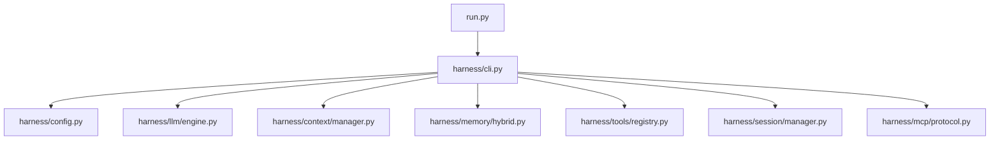
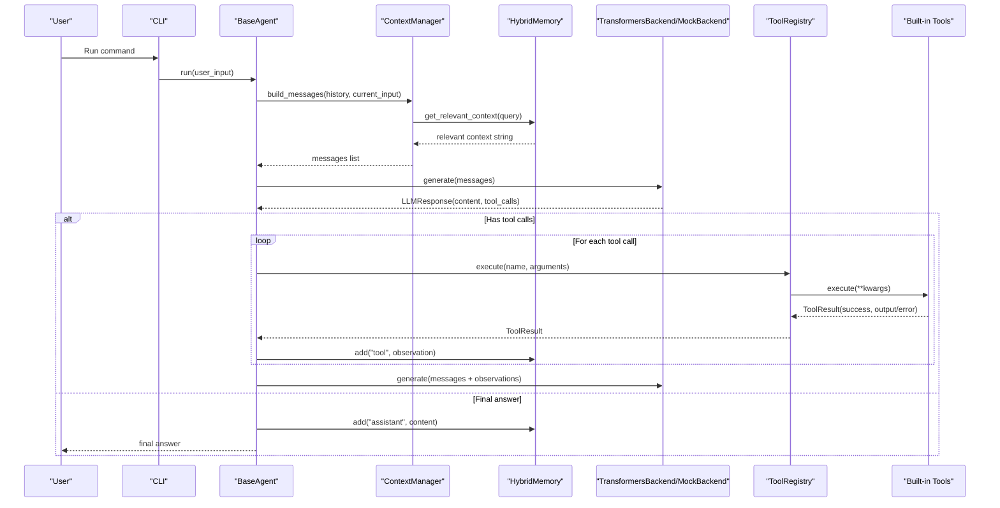
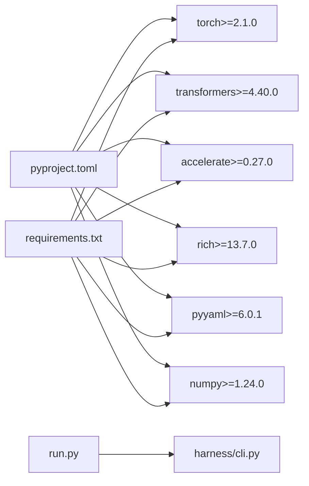

# Troubleshooting and FAQ

<cite>
**Referenced Files in This Document**
- [README.md](file://README.md)
- [pyproject.toml](file://pyproject.toml)
- [requirements.txt](file://requirements.txt)
- [run.py](file://run.py)
- [harness/config.py](file://harness/config.py)
- [harness/llm/engine.py](file://harness/llm/engine.py)
- [harness/context/manager.py](file://harness/context/manager.py)
- [harness/memory/hybrid.py](file://harness/memory/hybrid.py)
- [harness/memory/long_term.py](file://harness/memory/long_term.py)
- [harness/tools/builtin.py](file://harness/tools/builtin.py)
- [harness/tools/registry.py](file://harness/tools/registry.py)
- [harness/session/manager.py](file://harness/session/manager.py)
- [harness/mcp/protocol.py](file://harness/mcp/protocol.py)
- [harness/cli.py](file://harness/cli.py)
</cite>

## Table of Contents
1. Introduction
2. Project Structure
3. Core Components
4. Architecture Overview
5. Detailed Component Analysis
6. Dependency Analysis
7. Performance Considerations
8. Troubleshooting Guide
9. Conclusion
10. Appendices

## Introduction
This document provides comprehensive troubleshooting guidance for the HarnessAIDemo framework, focusing on common issues such as model loading failures, memory overflow, tool execution errors, context window limitations, and performance bottlenecks. It includes diagnostic steps, log analysis techniques, resolution strategies, FAQs about design decisions, compatibility notes across Python versions and hardware, and debugging workflows with profiling recommendations.

## Project Structure
The project is organized into a core harness library and demo scripts:
- harness/: Core framework modules (LLM engine, tools, memory, context, sessions, MCP protocol, CLI, configuration)
- demos/: Example scripts demonstrating chat, agent, multi-agent, MCP, skills, and session management
- run.py: Main entry point that delegates to the CLI
- Configuration via environment variables and dataclasses

**Diagram sources**
- [run.py:1-28](file://run.py#L1-L28)
- [harness/cli.py:1-36](file://harness/cli.py#L1-L36)
- [harness/config.py:1-70](file://harness/config.py#L1-L70)
- [harness/llm/engine.py:1-421](file://harness/llm/engine.py#L1-L421)
- [harness/context/manager.py:1-118](file://harness/context/manager.py#L1-L118)
- [harness/memory/hybrid.py:1-84](file://harness/memory/hybrid.py#L1-L84)
- [harness/tools/registry.py:1-74](file://harness/tools/registry.py#L1-L74)
- [harness/session/manager.py:1-146](file://harness/session/manager.py#L1-L146)
- [harness/mcp/protocol.py:1-224](file://harness/mcp/protocol.py#L1-L224)

**Section sources**
- [README.md:73-131](file://README.md#L73-L131)
- [run.py:1-28](file://run.py#L1-L28)

## Core Components
Key components involved in typical issues:
- LLM Engine: Abstract interface, TransformersBackend, MockBackend, ToolCallParser
- Context Manager: Assembles system prompt, tool descriptions, memory context, history, current input
- Memory System: HybridMemory combining ShortTermMemory and LongTermMemory (TF-IDF retrieval)
- Tools: Built-in tools (calculator, datetime, file_ops), registry for registration and execution
- Sessions: Multi-session isolation and persistence
- MCP Protocol: In-process server/client for standardized tool access

**Section sources**
- [harness/llm/engine.py:1-421](file://harness/llm/engine.py#L1-L421)
- [harness/context/manager.py:1-118](file://harness/context/manager.py#L1-L118)
- [harness/memory/hybrid.py:1-84](file://harness/memory/hybrid.py#L1-L84)
- [harness/memory/long_term.py:1-109](file://harness/memory/long_term.py#L1-L109)
- [harness/tools/builtin.py:1-83](file://harness/tools/builtin.py#L1-L83)
- [harness/tools/registry.py:1-74](file://harness/tools/registry.py#L1-L74)
- [harness/session/manager.py:1-146](file://harness/session/manager.py#L1-L146)
- [harness/mcp/protocol.py:1-224](file://harness/mcp/protocol.py#L1-L224)

## Architecture Overview
The end-to-end flow from user input to response involves context assembly, LLM inference, tool execution, and memory updates.

**Diagram sources**
- [harness/agent/base.py:97-160](file://harness/agent/base.py#L97-L160)
- [harness/context/manager.py:61-104](file://harness/context/manager.py#L61-L104)
- [harness/memory/hybrid.py:46-73](file://harness/memory/hybrid.py#L46-L73)
- [harness/llm/engine.py:206-241](file://harness/llm/engine.py#L206-L241)
- [harness/tools/registry.py:43-60](file://harness/tools/registry.py#L43-L60)
- [harness/tools/builtin.py:19-74](file://harness/tools/builtin.py#L19-L74)

## Detailed Component Analysis

### LLM Engine
Responsibilities:
- Define Message, ToolCall, LLMResponse types
- Parse tool calls from free-form text using multiple patterns
- Provide BaseLLM interface
- Implement TransformersBackend (model loading, device selection, generation)
- Implement MockBackend (pattern-based tool invocation for testing)
- Factory create_llm(config) selects backend based on config.backend

Common issues:
- Model loading failures due to missing dependencies or network issues
- Device selection misconfiguration leading to OOM or slow inference
- Tool call parsing failures when model outputs unexpected formats

Diagnostics:
- Check logs for model loading and device selection
- Verify environment variables for backend and model name
- Inspect raw_output to understand tool call extraction

Resolutions:
- Install required packages (torch, transformers, accelerate)
- Set HARNESS_LLM_BACKEND=mock for quick tests without GPU
- Adjust HARNESS_MAX_TOKENS and temperature for stability
- Use verbose logging to trace tool call parsing

**Section sources**
- [harness/llm/engine.py:21-123](file://harness/llm/engine.py#L21-L123)
- [harness/llm/engine.py:151-249](file://harness/llm/engine.py#L151-L249)
- [harness/llm/engine.py:254-399](file://harness/llm/engine.py#L254-L399)
- [harness/llm/engine.py:404-421](file://harness/llm/engine.py#L404-L421)

### Context Manager
Responsibilities:
- Assemble system prompt with tool instructions and descriptions
- Inject relevant long-term memory context
- Include conversation history and current user input
- Estimate tokens for context window management

Common issues:
- Excessive context size causing token limit exceeded errors
- Missing tool descriptions leading to failed tool calls
- Memory retrieval returning irrelevant or duplicate content

Diagnostics:
- Log message lengths and estimated tokens
- Review system prompt composition
- Validate memory retrieval results

Resolutions:
- Reduce short-term capacity or long-term top_k
- Improve query phrasing for better memory retrieval
- Ensure tool registry is populated before building context

**Section sources**
- [harness/context/manager.py:1-118](file://harness/context/manager.py#L1-L118)

### Memory System
Responsibilities:
- HybridMemory combines short-term buffer and long-term persistent storage
- LongTermMemory uses TF-IDF for keyword-based retrieval and JSON persistence
- ShortTermMemory maintains recent messages with bounded capacity

Common issues:
- Memory file corruption or permission errors
- Slow retrieval due to large long-term store
- Duplicate or irrelevant memories polluting context

Diagnostics:
- Check memory_store.json integrity and permissions
- Monitor retrieval scores and top_k settings
- Inspect recent vs relevant context composition

Resolutions:
- Clear or rotate memory files periodically
- Tune similarity_threshold and top_k
- Use HybridMemory for balanced context

**Section sources**
- [harness/memory/hybrid.py:1-84](file://harness/memory/hybrid.py#L1-L84)
- [harness/memory/long_term.py:1-109](file://harness/memory/long_term.py#L1-L109)

### Tools and Registry
Responsibilities:
- Built-in tools: calculator (safe eval), datetime, file_ops (read-only)
- ToolRegistry manages registration, lookup, and execution with error handling
- Tool descriptions injected into system prompt

Common issues:
- Tool not found or overwritten during registration
- Tool execution exceptions (e.g., invalid expressions, file not found)
- Security concerns with eval usage

Diagnostics:
- Review registry warnings and errors
- Inspect ToolResult for success status and error messages
- Validate tool parameters and inputs

Resolutions:
- Register tools once at startup
- Sanitize inputs and use safe evaluation contexts
- Handle exceptions gracefully in custom tools

**Section sources**
- [harness/tools/builtin.py:1-83](file://harness/tools/builtin.py#L1-L83)
- [harness/tools/registry.py:1-74](file://harness/tools/registry.py#L1-L74)

### Sessions
Responsibilities:
- Manage multiple independent conversations with persistence
- Create, switch, list, delete sessions
- Store session metadata and message history

Common issues:
- Session not found when switching
- File I/O errors during load/save
- Active session confusion

Diagnostics:
- Check session IDs and storage directory
- Validate JSON format of session files
- Log session creation and deletion events

Resolutions:
- Ensure storage directory exists and is writable
- Handle missing or corrupted session files gracefully
- Use unique titles and track active session

**Section sources**
- [harness/session/manager.py:1-146](file://harness/session/manager.py#L1-L146)

### MCP Protocol
Responsibilities:
- In-process MCP server and client for standardized tool access
- JSON-RPC 2.0 request/response handling
- Demo server with simulated tools and resources

Common issues:
- Tool schema mismatches between client and server
- Request formatting errors
- Handler exceptions

Diagnostics:
- Inspect MCPRequest and MCPResponse JSON structures
- Validate tool schemas and handlers
- Log method calls and parameters

Resolutions:
- Ensure consistent tool definitions across client/server
- Handle malformed requests with appropriate error responses
- Test with demo server first

**Section sources**
- [harness/mcp/protocol.py:1-224](file://harness/mcp/protocol.py#L1-L224)

## Dependency Analysis
External dependencies are defined in pyproject.toml and requirements.txt, including torch, transformers, accelerate, rich, pyyaml, numpy. The CLI sets up logging and routes commands to various demos.

**Diagram sources**
- [pyproject.toml:1-27](file://pyproject.toml#L1-L27)
- [requirements.txt:1-14](file://requirements.txt#L1-L14)
- [run.py:1-28](file://run.py#L1-L28)

**Section sources**
- [pyproject.toml:1-27](file://pyproject.toml#L1-L27)
- [requirements.txt:1-14](file://requirements.txt#L1-L14)
- [harness/cli.py:1-36](file://harness/cli.py#L1-L36)

## Performance Considerations
- Use MockBackend for fast iteration without model downloads
- Limit max_new_tokens to reduce inference time and memory usage
- Optimize memory retrieval by tuning top_k and similarity_threshold
- Prefer CPU for small models or MPS/CUDA if available for acceleration
- Profile tool execution to identify bottlenecks in external operations

[No sources needed since this section provides general guidance]

## Troubleshooting Guide

### Model Loading Failures
Symptoms:
- ImportError for transformers or torch
- Network errors downloading models
- Device mismatch or OOM during model load

Diagnostic Steps:
- Verify environment variables HARNESS_LLM_BACKEND and HARNESS_MODEL_NAME
- Check logs for model loading messages and device selection
- Confirm internet connectivity and HuggingFace Hub access
- Validate installed package versions match requirements

Resolution Strategies:
- Install dependencies: pip install torch transformers accelerate
- Use HARNESS_LLM_BACKEND=mock for immediate testing
- Set HARNESS_DEVICE to cpu, cuda, or mps explicitly
- Reduce model size or use quantization if memory constrained

Log Analysis Techniques:
- Enable INFO level logging to see model loading progress
- Look for ImportError traces and dependency hints
- Check device detection logs for auto-selection outcomes

**Section sources**
- [harness/llm/engine.py:171-204](file://harness/llm/engine.py#L171-L204)
- [harness/config.py:25-34](file://harness/config.py#L25-L34)
- [README.md:28-58](file://README.md#L28-L58)

### Memory Overflow Issues
Symptoms:
- OutOfMemoryError during model inference
- Slow context assembly due to large memory stores
- Token limit exceeded errors from LLM

Diagnostic Steps:
- Monitor memory usage during agent loops
- Inspect context size estimates and actual token counts
- Check short-term capacity and long-term top_k settings
- Review tool call frequency and result sizes

Resolution Strategies:
- Reduce HARNESS_MAX_TOKENS to limit response length
- Decrease short_term_capacity in MemoryConfig
- Lower long-term top_k and increase similarity_threshold
- Use MockBackend to avoid heavy model loads
- Clear or prune memory files periodically

Log Analysis Techniques:
- Log message lengths and estimated tokens in ContextManager
- Track memory item counts and retrieval scores
- Monitor tool result sizes and frequencies

**Section sources**
- [harness/context/manager.py:110-118](file://harness/context/manager.py#L110-L118)
- [harness/memory/hybrid.py:25-31](file://harness/memory/hybrid.py#L25-L31)
- [harness/memory/long_term.py:40-68](file://harness/memory/long_term.py#L40-L68)

### Tool Execution Errors
Symptoms:
- Tool not found errors
- Invalid parameter errors
- Exceptions during tool execution (e.g., file not found, calculation errors)

Diagnostic Steps:
- Check ToolRegistry for registered tools and names
- Validate tool parameters against expected schemas
- Inspect ToolResult for success status and error messages
- Review built-in tool implementations for safety checks

Resolution Strategies:
- Ensure tools are registered before agent runs
- Sanitize inputs and use safe evaluation contexts
- Handle exceptions gracefully in custom tools
- Use try-except blocks in tool execute methods

Log Analysis Techniques:
- Watch for WARNING logs when overwriting tools
- Capture ERROR logs from tool execution failures
- Print ToolResult details for debugging

**Section sources**
- [harness/tools/registry.py:28-60](file://harness/tools/registry.py#L28-L60)
- [harness/tools/builtin.py:19-74](file://harness/tools/builtin.py#L19-L74)

### Context Window Limitations
Symptoms:
- Truncated responses or incomplete tool calls
- Token limit exceeded errors
- Poor relevance in retrieved memories

Diagnostic Steps:
- Estimate tokens using ContextManager.estimate_tokens
- Review system prompt length and tool descriptions
- Analyze memory retrieval results for relevance
- Check conversation history size

Resolution Strategies:
- Reduce system prompt verbosity
- Limit tool descriptions to essential information
- Tune memory retrieval parameters (top_k, similarity_threshold)
- Use shorter responses and iterative refinement

Log Analysis Techniques:
- Log context composition steps and token estimates
- Track memory retrieval scores and selected items
- Monitor conversation history growth

**Section sources**
- [harness/context/manager.py:61-104](file://harness/context/manager.py#L61-L104)
- [harness/memory/hybrid.py:46-73](file://harness/memory/hybrid.py#L46-L73)

### Performance Bottlenecks
Symptoms:
- Slow inference times
- High CPU/GPU utilization
- Long tool execution times

Diagnostic Steps:
- Profile LLM generation time and memory usage
- Measure tool execution durations
- Analyze context assembly overhead
- Check device utilization and caching behavior

Resolution Strategies:
- Use MockBackend for development speed
- Optimize model parameters (temperature, max_new_tokens)
- Cache frequently used tool results
- Leverage GPU/MPS acceleration when available
- Batch operations where possible

Log Analysis Techniques:
- Add timing logs around key operations
- Monitor resource usage with system tools
- Track iteration counts and tool call frequencies

**Section sources**
- [harness/llm/engine.py:206-241](file://harness/llm/engine.py#L206-L241)
- [harness/tools/builtin.py:19-74](file://harness/tools/builtin.py#L19-L74)

### Frequently Asked Questions

Q: Why does my model fail to load on CPU?
A: Ensure torch is installed and compatible with your system. Set HARNESS_DEVICE=cpu explicitly and verify sufficient disk space for model downloads.

Q: How do I test without downloading a model?
A: Set HARNESS_LLM_BACKEND=mock to use pattern-based responses for rapid iteration.

Q: What causes infinite tool call loops?
A: The agent loop has max_iterations to prevent infinite cycles. Increase max_iterations cautiously and ensure tools provide clear observations to guide the LLM.

Q: How can I improve memory retrieval accuracy?
A: Tune similarity_threshold and top_k in MemoryConfig. Use more specific queries and maintain clean, descriptive memory entries.

Q: Is eval() safe for calculator tool?
A: The calculator tool restricts allowed characters and removes builtins to minimize risk. Avoid using eval() for untrusted inputs in production.

Q: How do I handle session persistence issues?
A: Ensure the .sessions directory exists and is writable. Validate JSON format of session files and handle load errors gracefully.

Q: Can I use different devices for different components?
A: Device selection applies to the LLM backend. Tools and memory operate on CPU unless explicitly configured otherwise.

**Section sources**
- [harness/config.py:8-34](file://harness/config.py#L8-L34)
- [harness/llm/engine.py:171-204](file://harness/llm/engine.py#L171-L204)
- [harness/memory/long_term.py:40-68](file://harness/memory/long_term.py#L40-L68)
- [harness/tools/builtin.py:19-30](file://harness/tools/builtin.py#L19-L30)
- [harness/session/manager.py:74-88](file://harness/session/manager.py#L74-L88)

### Compatibility Issues

Python Versions:
- Requires Python >=3.11 per pyproject.toml
- Ensure virtual environment uses compatible Python version

Hardware Requirements:
- CPU-only: Use MockBackend or smaller models
- GPU: CUDA-enabled PyTorch installation recommended
- MPS: Apple Silicon support available via torch.backends.mps

Dependency Conflicts:
- Pin versions in requirements.txt to avoid conflicts
- Use virtual environments to isolate dependencies
- Upgrade torch/transformers together for compatibility

**Section sources**
- [pyproject.toml:5-20](file://pyproject.toml#L5-L20)
- [requirements.txt:1-14](file://requirements.txt#L1-L14)
- [harness/llm/engine.py:181-204](file://harness/llm/engine.py#L181-L204)

### Debugging Workflows and Profiling Tools

Debugging Workflow:
1. Start with MockBackend to validate logic without model overhead
2. Enable verbose logging in agents and tools
3. Inspect ToolCallParser output for tool call extraction
4. Monitor memory usage and context sizes
5. Gradually switch to real models and optimize

Profiling Tools:
- Use cProfile to profile function call times
- Monitor memory with tracemalloc or psutil
- Track GPU usage with nvidia-smi or htop
- Log iteration counts and tool call frequencies

Best Practices:
- Keep tool outputs concise to save context
- Use structured logging for consistent debugging
- Implement retry logic for transient failures
- Validate inputs at tool boundaries

**Section sources**
- [harness/llm/engine.py:61-123](file://harness/llm/engine.py#L61-L123)
- [harness/cli.py:19-25](file://harness/cli.py#L19-L25)

## Conclusion
This troubleshooting guide addresses common issues in the HarnessAIDemo framework, providing actionable diagnostics and resolutions for model loading, memory management, tool execution, context limitations, and performance optimization. By following the recommended workflows and leveraging logging and profiling tools, users can effectively debug and enhance their AI agent applications.

[No sources needed since this section summarizes without analyzing specific files]

## Appendices

### Environment Variables Reference
- HARNESS_LLM_BACKEND: Selects mock or transformers backend
- HARNESS_MODEL_NAME: Specifies HuggingFace model identifier
- HARNESS_MAX_TOKENS: Controls maximum generated tokens
- HARNESS_TEMPERATURE: Adjusts sampling randomness
- HARNESS_DEVICE: Sets execution device (cpu, cuda, mps, auto)

**Section sources**
- [harness/config.py:25-34](file://harness/config.py#L25-L34)
- [README.md:288-298](file://README.md#L288-L298)

### Quick Start Commands
- python run.py chat: Interactive chat
- python run.py agent: Single agent with tools
- python run.py multi-agent: Multi-agent orchestration
- python run.py mcp: MCP protocol demo
- python run.py skills: Skill system demo
- python run.py session: Multi-session management

**Section sources**
- [run.py:1-28](file://run.py#L1-L28)
- [README.md:34-69](file://README.md#L34-L69)